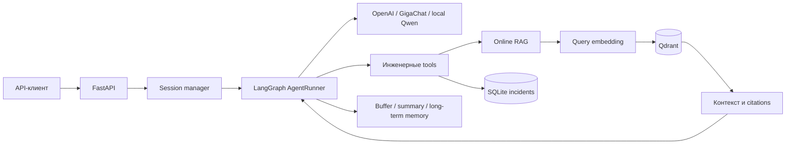

# Пайплайн подготовки данных для RAG

Подготовка данных для RAG без чанкинга, embeddings и vector DB.

Пайплайн делает только подготовительные этапы:

1. загрузка источников через LlamaIndex `SimpleDirectoryReader`;
2. парсинг `pdf`, `txt`, `html` через Unstructured и строковый парсинг `csv` через структурированный CSV parser;
3. очистка текста regex-правилами;
4. нормализация Unicode/регистра и sentence statistics через spaCy;
5. дедупликация exact hash + near-duplicate MinHash LSH через datasketch;
6. структурирование в `text + metadata` и LlamaIndex `Document`;
7. экспорт в JSON и JSONL;
8. оркестрация через Prefect и логирование артефактов/метрик в MLflow.

Выходной формат подготовлен для следующих этапов RAG: чанкинга, embeddings и vector DB. Эти этапы здесь намеренно не реализованы, но metadata уже содержит lineage, hierarchy и quality signals, чтобы следующие процессы могли сохранять связь чанков с исходниками и элементами.

## Быстрый запуск

Зависимости и локальный пакет уже установлены в глобальный Python. Запуск из корня проекта:

```powershell
rag-prep --config config/default.yaml
```

Прямой запуск без Prefect, но с теми же классами этапов:

```powershell
rag-prep --config config/default.yaml --no-prefect
```

Результаты пишутся в `data/prepared/`:

- `documents.json`
- `documents.jsonl`
- `manifest.json`

MLflow tracking по умолчанию пишется в `mlruns/` относительно корня проекта, определённого по расположению YAML-конфига. Запуск CLI из другого рабочего каталога не создаёт отдельное хранилище экспериментов.
В `manifest.json` сохраняются параметры запуска, числовые счётчики и диагностический блок `parse_failures` для файлов, которые не удалось разобрать при `parser.fail_on_error: false`.
JSON, JSONL и manifest сначала полностью формируются во временной директории, а затем заменяются как согласованный набор. При ошибке записи или замены предыдущая версия всех артефактов восстанавливается, поэтому новый JSON не смешивается со старым JSONL или manifest.

Посмотреть запуски, параметры, метрики и артефакты в MLflow UI можно из корня проекта:

```powershell
mlflow ui --backend-store-uri ./mlruns --host 127.0.0.1 --port 5000
```

Интерфейс будет доступен на `http://127.0.0.1:5000`. Команда запускает долгоживущий локальный сервер MLflow и работает до `Ctrl+C`; открывать интерфейс нужно в браузере, а следующие команды выполнять во втором терминале.

## Установка

Проект рассчитан на установку в текущий глобальный Python, без создания отдельного окружения. Команды нужно выполнять из корня проекта.

Обновить зависимости:

```powershell
python -m pip install --upgrade -r requirements.txt
```

Установить локальный пакет в editable-режиме, чтобы команда `rag-prep` была доступна после изменения исходников:

```powershell
python -m pip install -e . --no-deps
```

Флаг `--no-deps` уместен, если зависимости уже установлены через `requirements.txt`. Если проект переносится на новую машину, сначала ставится `requirements.txt`, затем локальный пакет.

Метаданные локального пакета разделяют зависимости по назначению: базовая установка содержит сервис агента, LLM, RAG и протоколы, extra `data-preparation` содержит парсинг и подготовку данных, `fine-tuning` - зависимости обучения, а `full` объединяет оба набора. Поэтому вместо `requirements.txt` допустима установка `python -m pip install -e ".[full]"`; основной сценарий этого репозитория с глобальным окружением по-прежнему использует две команды выше и точные версии из `requirements.txt`.

При первой установке создать рабочий `.env` из примера:

```powershell
Copy-Item .env.example .env
```

Команда нужна только пока `.env` ещё не существует. После копирования замените placeholders ключами выбранных providers и задайте `SUPPORT_AGENT_CONFIG` и `VECTOR_STORE_CONFIG` для Docker-сценария. Рабочий `.env` содержит секреты, уже исключён из Git и не должен публиковаться; `.env.example` хранит только безопасный шаблон.

Проверить целостность глобального окружения:

```powershell
python -m pip check
```

На Windows для Unstructured дополнительно установлен `python-magic-bin`, чтобы `unstructured.partition.auto` корректно определял типы файлов. Для OCR-режимов PDF могут понадобиться системные Tesseract и Poppler, но для текстовых PDF достаточно `parser.strategy: fast`.
Команда `rag-prep` перед запуском Prefect добавляет `localhost`, `127.0.0.1` и `::1` в `NO_PROXY`, чтобы локальный временный сервер Prefect не ломался из-за системных proxy-настроек. Для локальных CLI-запусков также отключается Prefect EventsWorker: это не мешает оркестрации, но не даёт процессу зависать на websocket-событиях временного сервера. Внешние API, включая OpenAI, при этом не отключаются от системного proxy. Импорт `rag_prep.flow` сам по себе переменные окружения не меняет.

## Команды rag-prep, rag-index и rag-support

Три консольные команды решают разные задачи:

- `rag-prep` запускает конечный batch-пайплайн, сохраняет артефакты и завершает процесс;
- `rag-index` загружает уже готовые embeddings в Qdrant без запуска остальных offline-пайплайнов;
- `rag-support` запускает долгоживущий HTTP API поверх уже подготовленной Qdrant collection;
- Docker Compose запускает тот же `rag-support` внутри контейнера, поэтому после deploy сервисом можно пользоваться через порт `8000`.

### rag-prep

Форма команды:

```powershell
rag-prep <этап> --config <yaml> [--no-prefect]
```

Доступные этапы:

| Команда | Что делает | Что не делает |
|---|---|---|
| `prepare` | Загружает, парсит, очищает и структурирует исходные документы | Не создаёт чанки и vectors |
| `chunk` | Делит prepared documents на чанки | Не вызывает embedding API |
| `embed` | Рассчитывает embeddings для готовых чанков | Не создаёт Qdrant collection |
| `vector-store` | Загружает готовые embeddings в Qdrant и проверяет поиск | Не пересчитывает embeddings |

Полная последовательность для OpenAI embeddings:

```powershell
rag-prep prepare --config config/default.yaml --no-prefect
rag-prep chunk --config config/chunking_openai.yaml --no-prefect
rag-prep embed --config config/embeddings_openai.yaml --no-prefect
rag-prep vector-store --config config/vector_store_openai.yaml --no-prefect
```

Для локального E5 меняются только три provider-specific конфига:

```powershell
rag-prep prepare --config config/default.yaml --no-prefect
rag-prep chunk --config config/chunking_local.yaml --no-prefect
rag-prep embed --config config/embeddings_local.yaml --no-prefect
rag-prep vector-store --config config/vector_store_local.yaml --no-prefect
```

Для GigaChat embeddings используются `chunking_gigachat.yaml`, `embeddings_gigachat.yaml` и `vector_store_gigachat.yaml`. Расчёт OpenAI или GigaChat embeddings вызывает соответствующий внешний API; повторно запускать `embed` при наличии актуального JSONL не нужно.

Без `--no-prefect` тот же этап оркестрируется Prefect. С `--no-prefect` выполняются те же stage-классы напрямую, что удобнее для локальной отладки. Команды `chunk`, `embed` и `vector-store` требуют явный `--config`; `prepare` использует `config/default.yaml`, если путь не передан.

Справка:

```powershell
rag-prep --help
rag-prep embed --help
```

### rag-index

Форма команды:

```powershell
rag-index --config <vector-store.yaml>
```

`rag-index` читает готовый `embeddings.jsonl`, создаёт или обновляет выбранную Qdrant collection, валидирует количество и размерность vectors, выполняет smoke similarity search и сохраняет те же отчёты vector-store stage. Он не запускает подготовку, чанкинг, расчёт embeddings, Prefect или MLflow.

Для embedded Qdrant на Windows host:

```powershell
rag-index --config config/vector_store_openai.yaml
rag-index --config config/vector_store_local.yaml
```

Это лёгкая альтернатива `rag-prep vector-store --config ... --no-prefect` для уже подготовленных embeddings. Docker-конфиги содержат hostname `qdrant`, доступный только внутри Compose-сети, поэтому `config/vector_store_docker_*.yaml` запускаются через сервис `indexer`, а не командой `rag-index` непосредственно на Windows host:

```powershell
docker compose --profile indexing run --rm indexer
```

Справка:

```powershell
rag-index --help
```

### rag-support

Форма команды:

```powershell
rag-support --config <support-agent.yaml> [--host HOST] [--port PORT]
```

Команда запускает Uvicorn/FastAPI в текущем терминале и работает до `Ctrl+C`. После сообщения `Uvicorn running on ...` терминал занят сервером ожидаемо: это HTTP-сервис, а не интерактивный консольный чат. Swagger или Postman открываются отдельно, а `Invoke-RestMethod` и другие команды выполняются во втором окне PowerShell. Сервис подключает LLM, tools, memory и online RAG, но не запускает `prepare`, `chunk`, `embed` или индексацию. Поэтому перед стартом должна существовать Qdrant collection, соответствующая `rag_profile` выбранного support-конфига.

Пример host-запуска с OpenAI:

```powershell
rag-support --config config/support_agent_openai.yaml
```

Вместо аргумента путь можно записать в `.env` в корне проекта или экспортировать в окружение:

```dotenv
SUPPORT_AGENT_CONFIG=config/support_agent_gigachat_local_embeddings.yaml
```

При запуске из корня проекта достаточно:

```powershell
rag-support
```

Эквивалентный вариант через переменную текущего PowerShell:

```powershell
$env:SUPPORT_AGENT_CONFIG = "config/support_agent_gigachat_local_embeddings.yaml"
rag-support
```

Явный `--config` имеет приоритет над значением из `.env` или окружения.

`--host` и `--port` переопределяют только адрес прослушивания из YAML:

```powershell
rag-support --config config/support_agent_openai.yaml --host 0.0.0.0 --port 8080
```

Host-сервис и Docker-контейнер нельзя одновременно привязать к одному host-порту. Если Docker уже публикует `8000`, используйте только контейнер, остановите его через `docker compose down` либо запустите локальный сервер на другом порту:

```powershell
rag-support --config config/support_agent_openai.yaml --port 8001
```

В последнем случае base URL, Swagger и API меняются на `http://127.0.0.1:8001`, `http://127.0.0.1:8001/docs` и `http://127.0.0.1:8001/v1/chat` соответственно.

После запуска доступны `/health`, `/ready`, `/docs`, `/redoc`, `/openapi.json`, `/metrics` и API `/v1/*`. Host-presets не требуют `X-API-Key`; Docker-presets требуют его через `SUPPORT_SERVICE_API_KEY`.

Справка:

```powershell
rag-support --help
```

## Примеры входных данных

В `data/raw/` лежат русскоязычные примеры, похожие на реальные документы организации:

- `sample.txt` - регламент обработки заявок в ИТ-службе;
- `sample.html` - инструкция по передаче документов в электронный архив;
- `sample.csv` - табличный реестр этапов service desk, где каждая строка становится отдельным элементом, а в конце есть exact и near-дубли для проверки дедупликации;
- `sample.pdf` - памятка по подготовке комплекта документов к архивированию.

Эти файлы нужны для smoke-проверки пайплайна. Для своих данных можно заменить содержимое `data/raw/` или указать другой `paths.input_dir` в `config/default.yaml`.

## Формат результата

Каждая запись:

```json
{
  "text": "...",
  "metadata": {
    "id": "stable-document-id",
    "source": "absolute/path/to/file",
    "source_key": "relative/path/to/file",
    "section": "full_document",
    "file_name": "sample.txt",
    "file_type": "txt",
    "source_hash": "...",
    "text_hash": "...",
    "parent_ids": ["source-id"],
    "origin_element_ids": ["element-id-1", "element-id-2"],
    "lineage": {
      "source_id": "source-id",
      "source_key": "relative/path/to/file",
      "source_hash": "...",
      "origin_element_ids": ["element-id-1", "element-id-2"],
      "element_range": [0, 3],
      "pipeline_stage": "prepared_document"
    },
    "hierarchy": {
      "section_path": ["Раздел", "Подраздел"],
      "section_depth": 2,
      "document_order": 0
    },
    "element_start": 0,
    "element_end": 3,
    "element_types": ["NarrativeText", "Title"],
    "page_number": null,
    "char_count": 100,
    "word_count": 16,
    "sentence_count": 2,
    "pipeline_run_id": "...",
    "parsed_at": "...",
    "extra": {}
  }
}
```

`source` хранит фактический абсолютный путь для диагностики текущего запуска, а `source_key` - путь относительно входной директории. Stable IDs источника, элементов и документа строятся по SHA-256 содержимого и позиции элемента, поэтому перенос проекта, переименование или размещение того же файла в другом каталоге не меняет идентификаторы.

## Готовность к следующим этапам

Поля, которые нужны следующим этапам без реализации самих этапов:

- `metadata.id` - стабильный идентификатор подготовленного документа;
- `metadata.parent_ids` - родительские сущности, сейчас это идентификатор source;
- `metadata.origin_element_ids` - элементы парсинга, из которых собран документ;
- `metadata.lineage` - цепочка `source -> parsed elements -> prepared document`;
- `metadata.hierarchy.section_path` - путь секции для будущего document tree;
- `metadata.hierarchy.document_order` - порядок документа внутри исходника;
- `metadata.extra.quality` - диагностические scores для boilerplate/OCR garbage/menu leftovers.

Quality scoring не удаляет документы сам по себе. Он даёт сигнал будущим этапам чанкинга/retrieval, чтобы можно было фильтровать мусор, расследовать retrieval misses и объяснять происхождение ответа.

## Конфигурация

Основные параметры находятся в `config/default.yaml`:

- `paths.input_dir` и `paths.output_dir`;
- `loader.allowed_extensions`;
- `parser.strategy`: `fast`, `auto`, `hi_res`, `ocr_only`;
- `parser.fail_on_error`: `false` пропускает проблемный файл и пишет failure в manifest, `true` останавливает пайплайн;
- `cleaning.drop_patterns` для удаления boilerplate;
- `normalization.spacy_language`;
- `deduplication.threshold`, `num_perm`, `shingle_size`;
- `structuring.group_by_section`;
- `logging.mlflow_enabled`.

Относительные пути в `paths.*` считаются относительно корня проекта, если конфиг лежит в папке `config/`. Если конфиг расположен в другой папке, относительные пути считаются относительно папки этого YAML-файла.

Для OCR PDF на Windows могут дополнительно понадобиться системные Tesseract/Poppler. Для текстовых PDF используется `strategy: fast`.

## Композиция конфигураций

Provider-specific параметры не копируются между пайплайнами. Канонические RAG-профили находятся в:

- `config/profiles/rag/openai.yaml`;
- `config/profiles/rag/local.yaml`;
- `config/profiles/rag/gigachat.yaml`.

LLM identity и provider-specific connection settings аналогично находятся в `config/profiles/agent/openai.yaml`, `config/profiles/agent/gigachat.yaml` и `config/profiles/agent/local.yaml`. Их используют и обычные `agent_*.yaml`, и support-presets.

Каждый профиль в одном месте связывает tokenizer, embedding provider/model/dimensions и Qdrant contract: `collection_name`, `vector_size`, `distance`, `local_storage_path`. Конфиги chunking, embeddings, vector-store и support-agent указывают только `rag_profile`, а loader проецирует профиль в нужную Pydantic-схему.

Support-presets собираются через `extends` из независимых слоёв `config/profiles/support/`: общая конфигурация, LLM, runtime RAG, state и deployment. Например:

```yaml
extends:
  - profiles/support/base.yaml
  - profiles/support/agent_gigachat.yaml
  - profiles/support/rag_runtime_local.yaml
  - profiles/support/state_gigachat_local.yaml
  - profiles/support/deployment_docker_local_embeddings.yaml

rag_profile: profiles/rag/local.yaml
```

Родители применяются в указанном порядке, затем применяется текущий файл. Словари объединяются рекурсивно, списки и скаляры заменяются целиком. Ссылки `extends` разрешаются относительно YAML, в котором они объявлены; циклические ссылки и отсутствующие файлы останавливают загрузку. Пути данных после композиции по-прежнему разрешаются относительно корня проекта для конфигов из `config/`.

Чтобы изменить модель или размерность во всех этапах, редактируйте соответствующий `profiles/rag/*.yaml`. Параметры конкретного запуска, например batch size, MLflow или `recreate_collection`, остаются в конфиге своего пайплайна.

# Пайплайн чанкинга для RAG

Второй пайплайн делает только чанкинг подготовленных документов. Он не считает embeddings, не пишет vector DB и не запускает retrieval.

Вход берётся из результата первого пайплайна:

- `data/prepared/documents.jsonl` - структурированные документы `text + metadata`;
- lineage, hierarchy, source metadata и quality signals переносятся в каждый чанк.

Выход разделён по целевой embedding-модели: `data/chunks_openai/`, `data/chunks_local/` или `data/chunks_gigachat/`:

- `chunks.json`
- `chunks.jsonl`
- `manifest.json`

## Стек чанкинга

- LlamaIndex `SentenceSplitter` - основной семантически ориентированный splitter, который старается не резать текст внутри предложений;
- LlamaIndex `TokenTextSplitter` - альтернативная стратегия для строгого token-based режима;
- `tiktoken` - подсчёт токенов по явно выбранной модели или encoding;
- Pydantic - схема чанка и metadata;
- Prefect - воспроизводимая оркестрация;
- MLflow - параметры запуска, метрики размера чанков и артефакты экспорта.

## Логика чанкинга

Пайплайн не режет весь документ одной плоской строкой. Он работает в таком порядке:

1. читает `PreparedDocument` из первого пайплайна;
2. восстанавливает semantic blocks внутри секции по границам абзацев/элементов, которые были сохранены как `\n\n`;
3. упаковывает блоки в chunk до `chunk_size`;
4. применяет `chunk_overlap` только внутри текущей секции и не превышает заданный предел;
5. режет LlamaIndex splitter'ом только oversized-блок, который сам больше token budget;
6. считает chunk-level quality signals и сохраняет span metadata.

Так чанки не пересекают границы prepared document/section, а table/list/code-like блоки и повторяющиеся абзацы получают стабильные `semantic_block_ids`. Overlap переносит только целые semantic blocks: если ближайший блок больше лимита, фактическое перекрытие будет меньше заданного значения или нулевым, но никогда не превысит `chunk_overlap`. Для обычных block-aware чанков offsets берутся из заранее посчитанных block spans, без глобального `text.find()` по всему документу. Если fallback splitter не сможет точно найти подстроку для oversized-блока, чанк получит `offset_strategy` с `estimated_*`, warning в логах и отдельный `estimated_offsets_count` в validation.

## Запуск чанкинга

Перед запуском чанкинга должен существовать файл `data/prepared/documents.jsonl`.

OpenAI-вариант через Prefect:

```powershell
rag-prep chunk --config config/chunking_openai.yaml
```

Прямой запуск без Prefect:

```powershell
rag-prep chunk --config config/chunking_openai.yaml --no-prefect
rag-prep chunk --config config/chunking_local.yaml --no-prefect
rag-prep chunk --config config/chunking_gigachat.yaml --no-prefect
```

Старые команды подготовки данных остаются рабочими:

```powershell
rag-prep prepare --config config/default.yaml
rag-prep prepare --config config/default.yaml --no-prefect
```

Legacy-форма тоже сохранена:

```powershell
rag-prep --config config/default.yaml
```

## Конфигурация чанкинга

Параметры запуска находятся в `config/chunking_openai.yaml`, `config/chunking_local.yaml` или `config/chunking_gigachat.yaml`. Поля tokenizer и будущей embedding-модели подставляются из указанного там `rag_profile`:

- `paths.input_jsonl` - JSONL из первого пайплайна;
- `paths.output_dir` - директория экспорта чанков;
- `chunking.strategy` - `sentence` или `token`;
- `chunking.chunk_size` - целевой размер чанка в токенах;
- `chunking.chunk_overlap` - максимальный overlap в токенах, должен быть меньше `chunk_size`; при сохранении целых semantic blocks фактическое перекрытие может быть меньше;
- `chunking.tokenizer_model` - модель или encoding `tiktoken` из RAG-профиля;
- `chunking.embedding_model` - модель будущих embeddings из того же профиля, записывается в metadata, сами embeddings не считаются;
- `chunking.preserve_section_boundaries` - не смешивать разные prepared documents/sections;
- `chunking.preserve_block_boundaries` - сначала упаковывать semantic blocks и резать только oversized-блоки;
- `chunking.max_chunk_tokens` - validation guardrail перед embeddings;
- `chunking.min_quality_score` - порог для диагностического счётчика low-quality chunks;
- `chunking.fail_on_validation_error` - останавливать пайплайн при пустых, слишком маленьких, слишком больших, low-quality чанках, estimated offsets или проблемах lineage.

## Формат Чанка

Каждая запись в `chunks.jsonl` готова к следующему embeddings-пайплайну:

```json
{
  "text": "...",
  "metadata": {
    "id": "stable-chunk-id",
    "document_id": "prepared-document-id",
    "source": "absolute/path/to/file",
    "section": "Раздел",
    "position": 0,
    "chunk_start_char": 0,
    "chunk_end_char": 430,
    "chunk_token_count": 128,
    "chunk_size": 220,
    "chunk_overlap": 40,
    "chunking_strategy": "sentence",
    "tokenizer_model": "text-embedding-3-small",
    "embedding_model": "text-embedding-3-small",
    "semantic_block_ids": ["semantic-block-id-1"],
    "semantic_block_start": 0,
    "semantic_block_end": 0,
    "offset_strategy": "semantic_block_span",
    "parent_ids": ["prepared-document-id"],
    "origin_element_ids": ["element-id-1"],
    "lineage": {
      "document_id": "prepared-document-id",
      "chunk_id": "stable-chunk-id",
      "chunk_position": 0,
      "semantic_block_ids": ["semantic-block-id-1"],
      "semantic_block_range": [0, 0],
      "pipeline_stage": "chunk"
    },
    "hierarchy": {
      "section_path": ["Раздел"],
      "document_order": 0,
      "chunk_position": 0,
      "semantic_block_count": 1,
      "semantic_block_range": [0, 0]
    },
    "source_hash": "...",
    "document_text_hash": "...",
    "text_hash": "...",
    "file_name": "sample.txt",
    "file_type": "txt",
    "quality": {
      "token_density": 0.37,
      "language_confidence": 0.99,
      "ocr_noise_score": 0.0,
      "structure_score": 0.82,
      "unique_token_ratio": 0.74,
      "semantic_block_count": 1,
      "is_low_quality_chunk": false
    },
    "chunked_at": "..."
  }
}
```

`position`, `chunk_start_char`, `chunk_end_char`, `semantic_block_ids`, `parent_ids`, `origin_element_ids` и `lineage` нужны для отладки retrieval misses, hallucinations и обратной трассировки ответа к исходному документу. `embedding_model` фиксируется заранее, чтобы следующий этап мог проверить совместимость чанков с выбранной моделью embeddings.

# Пайплайн embeddings для RAG

Третий пайплайн считает embeddings для готовых чанков. Он не создаёт vector DB, не индексирует данные и не запускает retrieval.

Вход:

- `data/chunks_openai/chunks.jsonl`, `data/chunks_local/chunks.jsonl` или `data/chunks_gigachat/chunks.jsonl` - чанки для выбранной embedding-модели.

Выход:

- `data/embeddings_openai/embeddings.json`
- `data/embeddings_openai/embeddings.jsonl`
- `data/embeddings_openai/manifest.json`

Для локального конфига `config/embeddings_local.yaml` результат пишется отдельно в `data/embeddings_local/`, чтобы не смешивать 1536-мерные OpenAI vectors и 384-мерные локальные vectors. GigaChat как chat-модель может работать поверх любого уже построенного vector store; пересчитывать embeddings только из-за смены LLM не нужно.

## Стек embeddings

- OpenAI Python SDK - вызов `client.embeddings.create` для `text-embedding-3-small`;
- `langchain-gigachat` - опциональный provider для GigaChat embeddings;
- `transformers` + `torch` - локальный расчёт embeddings для локального сценария;
- локальная embedding-модель `intfloat/multilingual-e5-small`, скачанная в `data/models/hf/multilingual-e5-small`;
- mean pooling по encoder hidden states для локальной модели;
- L2-нормализация vectors для локального cosine search;
- `tiktoken` - контроль token limits и token budget для OpenAI batch;
- `tenacity` - retry/backoff при временных ошибках OpenAI API;
- `numpy` - расчёт нормы и опциональная L2-нормализация vectors;
- Pydantic - строгие схемы `embedding + metadata`;
- Prefect - оркестрация;
- MLflow - параметры, метрики и артефакты запуска.

## Запуск embeddings

Способ расчёта embeddings выбирается конфигом и должен соответствовать модели, которую вы используете в сценарии:

- `config/embeddings_openai.yaml` - OpenAI-вариант: `text-embedding-3-small`, размерность `1536`, нужен `OPENAI_API_KEY`;
- `config/embeddings_local.yaml` - локальный вариант: `multilingual-e5-small`, размерность `384`, OpenAI API не вызывается;
- `config/embeddings_gigachat.yaml` - опциональный GigaChat-вариант: явно задана `Embeddings-2`, размерность `1024`, нужен `GIGACHAT_AUTH_KEY`.

В проекте нет provider-а embeddings по умолчанию: команды `rag-prep chunk`, `rag-prep embed`, `rag-prep vector-store` и `rag-agent` без `--config` завершатся ошибкой. Для `rag-support` путь задаётся через `--config` или `SUPPORT_AGENT_CONFIG`.

OpenAI-вариант:

```powershell
rag-prep embed --config config/embeddings_openai.yaml --no-prefect
```

Локальный вариант перед первым запуском требует скачать embedding-модель:

```powershell
python scripts/download_hf_model.py --model-id intfloat/multilingual-e5-small --local-dir data/models/hf/multilingual-e5-small --dry-run
```

После проверки скачать E5:

```powershell
python scripts/download_hf_model.py --model-id intfloat/multilingual-e5-small --local-dir data/models/hf/multilingual-e5-small
```

Если модель скачана вручную, положите файлы Hugging Face repo в эту же папку:

```text
data/models/hf/multilingual-e5-small
```

Внутри должны быть `config.json`, веса модели (`model.safetensors` или `pytorch_model.bin`) и tokenizer-файлы. После этого повторно скачивать модель не нужно: `config/embeddings_local.yaml` читает её локально через `local_files_only: true`.

Затем локальный расчёт:

```powershell
rag-prep embed --config config/embeddings_local.yaml --no-prefect
```

Перед запуском должен существовать соответствующий JSONL: `data/chunks_openai/chunks.jsonl`, `data/chunks_local/chunks.jsonl` или `data/chunks_gigachat/chunks.jsonl`.

Каждый embeddings-конфиг читает provider-specific набор чанков. Это фиксирует token budget и целевую embedding-модель ещё на этапе чанкинга; при расчёте фактическая модель и provider записываются в metadata embedding-записи.

Через Prefect используются те же конфиги без `--no-prefect`:

```powershell
rag-prep embed --config config/embeddings_openai.yaml
rag-prep embed --config config/embeddings_local.yaml
```

## Конфигурация embeddings

Параметры batch-запуска находятся в `config/embeddings_openai.yaml`, `config/embeddings_local.yaml` или `config/embeddings_gigachat.yaml`. Provider contract берётся из их `rag_profile`:

- `paths.input_jsonl` - входной JSONL с чанками;
- `paths.output_dir` - директория экспорта embeddings;
- `embedding.provider`, `embedding.model`, `embedding.dimensions` - единый контракт из `config/profiles/rag/*.yaml`;
- `embedding.batch_size` - количество чанков в одном batch;
- `embedding.max_batch_tokens` - общий token budget batch;
- `embedding.max_input_tokens` - лимит одного текста;
- `embedding.local_device` - `auto`, `xpu`, `cuda` или `cpu`;
- `embedding.local_dtype` - `auto`, `bf16`, `fp16` или `fp32`;
- `embedding.local_files_only` - не скачивать модель во время расчёта embeddings;
- `embedding.pooling` - стратегия получения одного vector из encoder output;
- `embedding.passage_prefix` и `query_prefix` - префиксы E5-семейства для документов и запросов;
- `embedding.max_retries` и `timeout_seconds` - сетевые guardrails для OpenAI-режима;
- `embedding.normalize` - L2-нормализация vectors;
- `embedding.clear_no_proxy_for_openai` - создаёт OpenAI HTTP-клиент при очищенном `NO_PROXY/no_proxy`, но не меняет эти переменные во время самого API-запроса; это оставляет Prefect доступ к localhost и не ломает маршрут до OpenAI API;
- `embedding.gigachat_scope` - OAuth scope GigaChat, по умолчанию `GIGACHAT_API_PERS`;
- `embedding.gigachat_verify_ssl_certs` - проверка SSL-сертификатов для GigaChat SDK;
- `embedding.gigachat_chars_per_token` - оценка token budget для GigaChat batch без отдельного tokenizer API;
- `embedding.fail_on_validation_error` - останавливать пайплайн при ошибках validation.

## Формат записи embedding

Каждая строка в `embeddings.jsonl` готова к загрузке в vector store:

```json
{
  "text": "...",
  "embedding": [0.0123, -0.0456],
  "metadata": {
    "id": "chunk-id",
    "document_id": "prepared-document-id",
    "source": "absolute/path/to/file",
    "section": "Раздел",
    "position": 0,
    "chunk_token_count": 128,
    "embedding_provider": "openai",
    "embedding_model": "text-embedding-3-small",
    "embedding_dimensions": 1536,
    "embedding_vector_hash": "...",
    "embedding_norm": 1.02,
    "embedding_run_id": "...",
    "lineage": {},
    "hierarchy": {}
  }
}
```

Validation проверяет соответствие количества chunks и embeddings, множества chunk ids, текста и identity metadata, размерность vectors, `NaN/Infinity`, дубликаты chunk ids, наличие базовой metadata, соответствие модели и превышение token limit. `manifest.json` сохраняет config, counts и diagnostics, чтобы результат был воспроизводимым и пригодным для следующего этапа загрузки в Chroma, Qdrant, FAISS, pgvector или другую vector DB.

# Пайплайн vector store для RAG

Четвёртый пайплайн создаёт локальное векторное хранилище, загружает уже готовые embeddings и выполняет smoke-проверку similarity search. Embeddings здесь повторно не считаются.

Выбран **Qdrant**, потому что он даёт полноценную коллекцию с vectors + payload metadata, умеет filtering/search и при этом может работать локально без Docker через embedded storage.

Вход:

- `data/embeddings_openai/embeddings.jsonl` - результат OpenAI embeddings pipeline.

Выход:

- `data/vector_store_openai/manifest.json`
- `data/vector_store_openai/validation.json`
- `data/vector_store_openai/search_results.json`
- `data/qdrant_storage_openai/` - локальное embedded-хранилище Qdrant для OpenAI vectors.

Для локальных embeddings используется отдельный набор путей: `data/vector_store_local/` и `data/qdrant_storage_local/`. Для опциональных GigaChat embeddings используется `data/vector_store_gigachat/` и `data/qdrant_storage_gigachat/`.

Embedded local mode удобен для локальной разработки, но это режим одного процесса. Пайплайн берёт OS-lock на `.rag_prep.lock` внутри выбранного `vector_store.local_storage_path` и остановит второй локальный запуск с понятной ошибкой. Сам файл lock может остаться после аварийного завершения, но блокировка держится операционной системой и освобождается при завершении процесса. Для конкурентных запусков лучше поднять Qdrant server и переключить `vector_store.mode: http`.

## Стек vector store

- `qdrant-client` - создание коллекции, upsert vectors, similarity search;
- Qdrant local mode - локальное хранилище без отдельного сервера;
- Pydantic - схемы результатов indexing/validation/search;
- Prefect - оркестрация;
- MLflow - параметры, метрики и артефакты проверки.

## Запуск vector store

Перед запуском должен существовать JSONL выбранного provider-а, например `data/embeddings_openai/embeddings.jsonl`.

Для OpenAI embeddings используется отдельный provider-конфиг:

```powershell
rag-prep vector-store --config config/vector_store_openai.yaml --no-prefect
```

Для локальных embeddings используется отдельный конфиг:

```powershell
rag-prep vector-store --config config/vector_store_local.yaml --no-prefect
```

Для опциональных GigaChat embeddings используется отдельный конфиг:

```powershell
rag-prep vector-store --config config/vector_store_gigachat.yaml --no-prefect
```

Через Prefect используются те же конфиги без `--no-prefect`:

```powershell
rag-prep vector-store --config config/vector_store_openai.yaml
rag-prep vector-store --config config/vector_store_local.yaml
rag-prep vector-store --config config/vector_store_gigachat.yaml
```

## Конфигурация vector store

Параметры индексации находятся в `config/vector_store_openai.yaml`, `config/vector_store_local.yaml` и `config/vector_store_gigachat.yaml`. Контракт коллекции подставляется из `rag_profile`:

- `paths.input_jsonl` - готовые embeddings;
- `paths.output_dir` - директория отчётов;
- `vector_store.provider` - сейчас `qdrant`, задаётся RAG-профилем;
- `vector_store.mode` - `local` для embedded Qdrant или `http` для внешнего Qdrant server;
- `vector_store.collection_name`, `vector_store.vector_size`, `vector_store.distance`, `vector_store.local_storage_path` - единый vector contract из `config/profiles/rag/*.yaml`;
- `vector_store.recreate_collection` - пересоздавать коллекцию для воспроизводимого запуска; в кодовом дефолте это `false`, а в provider-конфигах учебного локального запуска явно стоит `true`;
- `vector_store.batch_size` - размер upsert batch;
- `vector_store.search_limit` - количество результатов на тестовый запрос;
- `vector_store.test_queries_count` - сколько готовых embeddings использовать как тестовые запросы;
- `vector_store.validation_sample_size` - сколько точек проверить через scroll;
- `vector_store.fail_on_validation_error` - останавливать пайплайн при некорректном индексе.

## Что загружается в Qdrant

Vector сохраняется как Qdrant vector, а payload содержит:

```json
{
  "text": "...",
  "chunk_id": "stable-chunk-id",
  "document_id": "prepared-document-id",
  "source": "absolute/path/to/file",
  "section": "Раздел",
  "position": 0,
  "file_name": "sample.txt",
  "file_type": "txt",
  "embedding_model": "text-embedding-3-small",
  "embedding_provider": "openai",
  "embedding_dimensions": 1536,
  "metadata": {}
}
```

Qdrant point id строится детерминированно как UUID5 от `collection_name + chunk_id`, потому что исходный `metadata.id` не обязан быть UUID. Оригинальный chunk id сохраняется в `payload.chunk_id` и `payload.metadata.id`. Перед upsert pipeline проверяет дубликаты chunk ids и сгенерированных point ids, чтобы случайный повтор не перезаписал точку молча.

## Проверки

Пайплайн проверяет:

- количество points в коллекции совпадает с количеством embeddings;
- направление расхождения counts сохраняется в `count_delta`, `extra_points_count` и `missing_points_count`;
- размерность коллекции и vectors соответствует `vector_size`;
- точки без возвращённого vector считаются отдельно в `missing_vector_count`, а не смешиваются с неправильной размерностью;
- несовпадение размерности коллекции и отдельных point vectors логируется раздельно через `collection_vector_size_mismatch_count` и `point_vector_size_mismatch_count`;
- distance metric соответствует конфигу;
- payload содержит `text`;
- payload содержит полную `metadata`;
- обязательные поля metadata присутствуют;
- similarity search возвращает результаты;
- для smoke-запросов ближайший результат обычно совпадает с исходным chunk.

`search_results.json` сохраняет тестовые запросы и найденные hits. Это не production retrieval, а базовая проверка корректности записи/чтения индекса перед следующим этапом RAG.

# Интеграция GigaChat

Проект поддерживает GigaChat как отдельный provider для chat-модели агента. Это не меняет уже построенный RAG-индекс: LLM, которая отвечает пользователю, и embedding-модель, которая строит vector store, являются разными компонентами.

Практический сценарий:

1. посчитать embeddings через `config/embeddings_openai.yaml` или `config/embeddings_local.yaml`;
2. загрузить их в Qdrant через `config/vector_store_openai.yaml` или `config/vector_store_local.yaml`;
3. использовать `config/agent_gigachat.yaml` как генеративную модель агента с tools и памятью.

Для работы нужен Authorization key в `.env`:

```powershell
GIGACHAT_AUTH_KEY=...
```

Ключ передаётся в GigaChat SDK как `credentials`, а SDK сам получает и обновляет access token через OAuth. В коде не нужно вручную вызывать `/api/v2/oauth`.

## GigaChat для агента

Конфиг:

```text
config/agent_gigachat.yaml
```

Запуск одноразового запроса:

```powershell
rag-agent --config config/agent_gigachat.yaml --message "Сколько будет 128 * 47? Используй калькулятор."
```

Запуск сценариев MVP-агента:

```powershell
rag-agent --config config/agent_gigachat.yaml --run-scenarios --scenario-report data/agent/scenario_report_gigachat.json
```

В `config/agent_gigachat.yaml` основные параметры:

- `agent.provider: gigachat`;
- `agent.model` - по умолчанию `GigaChat-2`; для более сложных задач можно указать `GigaChat-2-Pro` или `GigaChat-2-Max`;
- `agent.gigachat_auth_key_env` - имя переменной с Authorization key;
- `agent.gigachat_scope` - scope для OAuth, по умолчанию `GIGACHAT_API_PERS`;
- `agent.gigachat_verify_ssl_certs` - проверка SSL-сертификатов SDK;
- `agent.max_new_tokens` - передаётся в GigaChat как `max_tokens`.

LangGraph остаётся тем же: `agent -> tools -> agent`. `langchain-gigachat` поддерживает `bind_tools`, поэтому backend выполняет tools так же, как в OpenAI-варианте: модель выбирает tool call, `ToolNode` исполняет Python-функцию, затем результат возвращается модели.

## GigaChat и готовый vector store

GigaChat chat-модель не требует, чтобы vectors были посчитаны GigaChat embeddings-моделью. Для неё подходят уже подготовленные индексы:

- OpenAI embeddings: `1536` координат, `config/vector_store_openai.yaml`;
- локальные embeddings: `384` координаты, `config/vector_store_local.yaml`.

Размерность vector store важна только для этапа индексации и поиска. Chat-модель получает уже найденный текстовый контекст, поэтому она не зависит от того, были vectors размерности `1536`, `384` или другой.

## Опциональные GigaChat embeddings

Конфиг:

```text
config/embeddings_gigachat.yaml
```

Запуск:

```powershell
rag-prep embed --config config/embeddings_gigachat.yaml --no-prefect
```

Результат пишется отдельно:

```text
data/embeddings_gigachat/
```

Поддерживаемые размерности GigaChat embeddings нужно согласовывать с `embedding.dimensions` и `vector_store.vector_size`:

- `Embeddings` - `1024`;
- `Embeddings-2` - `1024`;
- `EmbeddingsGigaR` - `2560`;
- `Embeddings-3B-2025-09` - `2048`.

Если в `config/embeddings_gigachat.yaml` указана известная модель и неверная размерность, конфиг не загрузится. Это защищает от ситуации, когда embeddings уже посчитаны в одной размерности, а Qdrant-коллекция создана под другую.

После расчёта GigaChat embeddings используется отдельный Qdrant-конфиг:

```powershell
rag-prep vector-store --config config/vector_store_gigachat.yaml --no-prefect
```

Для `Embeddings-2` профиль `config/profiles/rag/gigachat.yaml` связывает `embedding.dimensions: 1024` и `vector_store.vector_size: 1024`. При смене GigaChat embedding-модели обе части контракта меняются в этом одном файле.

## Файлы GigaChat-интеграции

- `config/agent_gigachat.yaml` - агент на GigaChat;
- `config/embeddings_gigachat.yaml` - расчёт GigaChat embeddings;
- `config/vector_store_gigachat.yaml` - Qdrant-индекс под GigaChat vectors;
- `src/agent_app/llm.py` - сборка `langchain_gigachat.chat_models.GigaChat`;
- `src/rag_prep/embedding_stages/embedding.py` - `GigaChatEmbeddingStage`;
- `.env.example` - пример переменной `GIGACHAT_AUTH_KEY`.

# Модуль агента с tools и памятью

Это модуль LangGraph-агента с tools и полноценной памятью.

## Что реализовано

- LangGraph workflow `agent -> tools -> agent` для OpenAI, GigaChat и локального Qwen backend;
- OpenAI chat-модель `gpt-4.1-nano` через явно выбранный `config/agent_openai.yaml`;
- GigaChat chat-модель через `config/agent_gigachat.yaml`;
- локальный backend `transformers` через `config/agent_local.yaml` для Qwen без OpenAI API;
- Qwen-style tool calling через chat template, XML-теги `<tool_call>` и parser в `AIMessage.tool_calls`;
- tools:
  - `calculator` для точных вычислений;
  - `current_datetime` для текущей даты и времени;
  - `get_weather` для OpenWeatherMap через `httpx2`;
  - `calculate_travel_budget` для расчёта бюджета поездки;
  - `advise_packing` для подбора вещей в поездку;
  - `create_project`, `create_task`, `update_task_status`, `list_project_tasks`, `summarize_project_state` для проектных сценариев;
  - `save_memory`;
  - `search_memory`;
  - `get_memory`;
  - `update_memory`;
  - `delete_memory`;
  - `list_memories`;
  - `clear_session_memory`;
- short-term buffer memory для текущей сессии;
- summary memory для сжатия длинного диалога;
- long-term memory в SQLite;
- сценарии MVP-агента в `config/agent_scenarios.yaml`;
- JSON-отчёт прохождения сценариев;
- CLI-команда `rag-agent`.

## Конфигурация агента

Параметры OpenAI-агента находятся в `config/agent_openai.yaml`; GigaChat и локальная модель используют отдельные provider-конфиги:

- `agent.provider` - `openai`, `gigachat` или `local`;
- `agent.model` - модель агента или путь к локальной модели;
- `agent.adapter_path` - необязательный путь к LoRA adapter для локального backend;
- `agent.temperature` - температура генерации;
- `agent.max_new_tokens` - лимит ответа локальной модели;
- `agent.gigachat_auth_key_env`, `gigachat_scope`, `gigachat_verify_ssl_certs` - параметры GigaChat provider;
- `agent.max_history_messages` - максимальный размер short-term buffer; при переполнении история делится только на границе полного хода `user -> assistant`;
- `agent.max_summary_chars` - ограничение summary memory;
- `agent.tool_error_retries` - количество повторов identical tool call после ошибочного результата, по умолчанию `1`;
- `memory.sqlite_path` - SQLite-файл долговременной памяти;
- `memory.default_user_id` и `default_session_id`; global-записи с `session_id=null` и записи конкретных сессий хранятся в независимых scope;
- `weather.api_key_env` - имя переменной окружения с OpenWeatherMap API-ключом;
- `weather.default_city`;
- `weather.default_units`.

В `.env` должны быть:

```powershell
OPENAI_API_KEY=...
OPENWEATHER_API_KEY=...
GIGACHAT_AUTH_KEY=...
HF_TOKEN=hf_...
```

Пример без секретов лежит в `.env.example`.

## Запуск агента

Одноразовый запрос:

```powershell
rag-agent --config config/agent_openai.yaml --message "Сколько будет 128 * 47?"
```

Локальный вызов Qwen без OpenAI API:

```powershell
rag-agent --config config/agent_local.yaml --message "Кратко объясни, зачем нужен LoRA adapter."
```

Локальный вызов Qwen с tool:

```powershell
rag-agent --config config/agent_local.yaml --message "Сколько будет 128 * 47? Используй калькулятор."
```

Вызов GigaChat с tool:

```powershell
rag-agent --config config/agent_gigachat.yaml --message "Сколько будет 128 * 47? Используй калькулятор."
```

В `config/agent_local.yaml` можно указать уже обученный adapter:

```yaml
agent:
  adapter_path: data/models/lora/<run_id>
```

Локальный backend использует `transformers.apply_chat_template(..., tools=...)`, парсит `<tool_call>{...}</tool_call>`, передаёт вызов в LangGraph `ToolNode`, а затем возвращает результат модели через `<tool_response>`. Для Qwen2.5-1.5B-Instruct это рабочий учебный режим, но он менее надёжен, чем OpenAI function calling или более крупные Qwen-модели: маленькая модель может ошибаться в выборе tool, аргументах или финальной формулировке.

Интерактивный режим:

```powershell
rag-agent --config config/agent_openai.yaml
```

Выбрать область пользователя и сессии:

```powershell
rag-agent --user-id default --session-id lesson-1 --message "Запомни, что мой проект называется RAG Engineer Assistant"
```

Посмотреть память:

```powershell
rag-agent --list-memory
```

Очистить память текущей сессии:

```powershell
rag-agent --clear-session-memory
```

# MVP-агент: сценарии и проверка поведения

MVP-слой показывает не просто одиночный ответ LLM, а воспроизводимое поведение агента:

1. сценарий задаёт цель, пользовательский запрос и ожидаемый результат;
2. `test_case_id` связывает сценарий и каждый шаг с конкретным тест-кейсом;
3. шаги сценария фиксируют цепочку действий;
4. поля `llm_role`, `tools_role` и `memory_role` объясняют роли компонентов;
5. `action_chain`, `decision_points` и `transition_rules` описывают сценарную логику;
6. agent trace показывает стартовое состояние, tool calls, tool results, изменения памяти и финальное состояние;
7. evaluator проверяет критерии прохождения;
8. результат сохраняется в JSON-отчёт.

Основные файлы:

- `config/agent_scenarios.yaml` - сценарии, шаги и критерии прохождения;
- `src/agent_app/scenarios/models.py` - Pydantic-схемы сценариев и отчётов;
- `src/agent_app/scenarios/loading.py` - загрузка YAML;
- `src/agent_app/scenarios/runner.py` - запуск сценариев через реального `AgentRunner`;
- `src/agent_app/scenarios/evaluator.py` - проверка ответов, tools и памяти;
- `src/agent_app/graph.py` - LangGraph-агент и trace состояний;
- `src/agent_app/tools/` - tools агента;
- `src/agent_app/memory/` - short-term, summary и long-term memory.

Типы сценариев:

- `main` - основной рабочий сценарий;
- `alternative` - сценарий с неполными данными и допущениями;
- `error` - ошибочный сценарий, например попытка сохранить секрет;
- `recovery` - восстановление контекста из долговременной памяти;
- `tool_failure` - корректная обработка ошибки внешнего tool;
- `loop_guard` - проверка защиты от повторяющихся tool-вызовов.

Запустить все сценарии:

```powershell
rag-agent --config config/agent_openai.yaml --run-scenarios
```

Запустить один сценарий:

```powershell
rag-agent --config config/agent_openai.yaml --run-scenario project_manager
```

Сохранить отчёт в явный путь:

```powershell
rag-agent --config config/agent_openai.yaml --run-scenarios --scenario-report data/agent/scenario_report.json
```

Получить полный JSON в консоли:

```powershell
rag-agent --config config/agent_openai.yaml --run-scenario travel_planning --json
```

Проверить сценарий защиты от циклов:

```powershell
rag-agent --config config/agent_openai.yaml --run-scenario tool_loop_guard --scenario-report data/agent/scenario_report_loop_guard.json
```

В отчёте для каждого шага сохраняются:

- `test_case_id`;
- финальный ответ агента;
- вызванные tools;
- результаты tools;
- стартовое, промежуточные и финальное состояния;
- флаг `loop_guard_triggered`, если агент остановил повторяющийся tool loop;
- правила переходов и точки принятия решений;
- созданные, обновлённые и удалённые записи памяти;
- список checks с `passed=true/false`.

Сценарий считается пройденным, если прошли все step-level checks и scenario-level checks: ожидаемые tools были вызваны, запрещённые tools не использовались, нужные записи памяти появились, секреты не сохранились, а агент завершил ответ без зацикливания.

Команда возвращает exit code `0`, только если весь выбранный набор сценариев прошёл. При `failed` возвращается `1`, поэтому результат можно напрямую использовать в CI.

Связь сценариев с тест-кейсами:

- `TC-MVP-001` - основной сценарий планирования поездки;
- `TC-MVP-002` - альтернативный сценарий с неполными данными;
- `TC-MVP-003` - ошибочный сценарий с попыткой сохранить секрет;
- `TC-MVP-004` - основной сценарий project manager;
- `TC-MVP-005` - восстановление контекста из long-term memory;
- `TC-MVP-006` - fallback при ошибке внешнего weather tool;
- `TC-MVP-007` - защита от повторяющегося tool loop.

Отладка сценариев:

- если сценарий `failed`, сначала открыть `data/agent/scenario_report.json`;
- проверить failed checks внутри `step_results[].checks`;
- сверить `response.tool_calls` с `expected_tools` и `forbidden_tools`;
- посмотреть `response.trace.tool_results`, чтобы увидеть ошибку tool;
- посмотреть `response.trace.memory_created_ids`, `memory_updated_ids` и `memory_deleted_ids`;
- скорректировать либо критерии в `config/agent_scenarios.yaml`, либо поведение tools/graph в `src/agent_app/`.

Типовые сбои, которые уже покрыты кодом:

- попытка сохранить API-ключ останавливается secret guardrail до LLM/tools;
- ошибка weather API попадает в tool result и допускается только в сценарии `tool_failure`;
- `agent.recursion_limit` ограничивает переходы `agent -> tools -> agent`;
- после ошибочного tool result допускается не более `agent.tool_error_retries` повторов с теми же аргументами;
- после успешного результата или исчерпания retry loop guard останавливает identical tool call и закрывает отменённый вызов результатом `status=cancelled`;
- ошибка LLM-вызова summary memory не отменяет уже готовый ответ; short-term history обрезается до последних полных ходов;
- один LLM backend переиспользуется во всём наборе сценариев, поэтому локальная модель не загружается в XPU повторно для каждого кейса;
- `ScenarioRunner` ловит исключение шага и записывает failed check вместо аварийного обрыва всего запуска.

Deterministic проверка loop guard без реальных API-вызовов:

```powershell
python -m unittest discover -s tests -v
```

## Проверочные запросы

```text
Сколько будет 128 * 47?
```

```text
Какая сегодня дата?
```

```text
Какая погода в Екатеринбурге?
```

```text
Запомни, что мой проект называется RAG Engineer Assistant.
```

```text
Как называется мой проект?
```

```text
Что ты обо мне помнишь?
```

```text
Обнови название моего проекта на Engineer Support Agent.
```

```text
Забудь название моего проекта.
```

# LoRA/QLoRA/PEFT fine-tuning локальной LLM

Этот модуль готовит воспроизводимый fine-tuning локальной LLM через PEFT.

Основная модель для основного запуска:

- Hugging Face ID: `Qwen/Qwen2.5-1.5B-Instruct`;
- локальный путь после скачивания: `data/models/hf/Qwen2.5-1.5B-Instruct`;
- fallback для быстрых проверок: `Qwen/Qwen2.5-0.5B-Instruct`.

Для Intel(R) Arc(TM) 140T GPU 16GB базовый режим - `LoRA` через `torch.xpu`. QLoRA оставлен как опциональный режим, но не включён по умолчанию: 4-bit режимы через `bitsandbytes` исторически сильнее завязаны на CUDA, поэтому для Intel Arc надёжнее начинать с обычного LoRA, маленького batch size и gradient accumulation.

## Выбор метода

Критерии выбора:

- размер модели: чем больше base model, тем сильнее давление на память GPU/CPU;
- доступная память: на Intel Arc 140T 16GB безопаснее начинать с 0.5B-1.5B модели;
- требования к качеству: большая модель обычно даёт лучший baseline, но медленнее обучается;
- скорость итераций: для учебных запусков важнее быстрый цикл `данные -> обучение -> отчёт`, чем максимальный размер модели.

LoRA:

- базовая модель загружается в обычной точности `bf16`/`fp16`/`fp32`;
- обучаются только adapter-веса;
- режим проще и надёжнее для Intel Arc/XPU;
- выбран по умолчанию.

QLoRA:

- базовая модель загружается в 4-bit quantized режиме;
- экономит память, но добавляет зависимость от 4-bit backend;
- полезен для более крупных моделей при ограниченной памяти;
- в этом проекте включается только явно через `peft.method: qlora` и заранее проверяет поддержку.

## Что реализовано

- отдельный пакет `src/llm_tuning/`;
- конфиг `config/fine_tuning.yaml`;
- русскоязычные train/eval JSONL-датасеты в `data/fine_tuning/`;
- проверка датасета и пересечения train/eval id;
- auto-device выбор `xpu` / `cuda` / `cpu`;
- загрузка tokenizer и causal LM через `transformers`;
- PEFT LoRA adapter через `peft`;
- QLoRA-ветка с явной проверкой доступности;
- supervised chat tokenization с masking prompt-токенов через `-100`;
- запуск fine-tuning через `Trainer`;
- baseline evaluation до обучения;
- evaluation после обучения;
- сравнение baseline/tuned отчётов;
- сохранение adapter-а, manifest и JSON-отчётов;
- MLflow-логирование параметров, метрик и артефактов;
- CLI-команда `llm-tune`.

## Основные файлы

- `config/fine_tuning.yaml` - локальная Qwen-модель, LoRA/QLoRA, параметры обучения, пути и MLflow;
- `config/fine_tuning_smoke.yaml` - быстрый smoke-конфиг для проверки кода на маленькой модели;
- `data/fine_tuning/train.jsonl` - обучающие примеры;
- `data/fine_tuning/eval.jsonl` - проверочные примеры;
- `src/llm_tuning/config.py` - Pydantic-конфиг;
- `src/llm_tuning/dataset.py` - загрузка и валидация JSONL;
- `src/llm_tuning/device.py` - выбор `torch.xpu`, CUDA или CPU;
- `src/llm_tuning/modeling.py` - загрузка модели и подключение PEFT;
- `src/llm_tuning/tokenization.py` - токенизация chat-примеров;
- `src/llm_tuning/training.py` - fine-tuning через `Trainer`;
- `src/llm_tuning/evaluation.py` - генерация ответов и eval loss;
- `src/llm_tuning/comparison.py` - сравнение поведения до/после;
- `src/llm_tuning/pipeline.py` - ООП-фасад над этапами;
- `src/llm_tuning/cli.py` - CLI.

## Установка зависимостей

Проект рассчитан на глобальное окружение Python без отдельного venv:

```powershell
python -m pip install --upgrade -r requirements.txt
python -m pip install -e . --no-deps
```

Проверить окружение:

```powershell
python -m pip check
```

Если `torch.xpu.is_available()` возвращает `False`, нужно проверить установленную сборку PyTorch для Intel GPU и драйвер Intel Arc. На CPU модуль тоже запускается, но обучение будет заметно медленнее.

Для Intel Arc нужна XPU-сборка PyTorch. По официальной документации PyTorch для Intel GPU, после установки драйвера Intel GPU stable wheel ставится так:

```powershell
python -m pip install --upgrade torch torchvision torchaudio --index-url https://download.pytorch.org/whl/xpu
```

Проверка XPU:

```powershell
python -c "import torch; print(torch.__version__); print(torch.xpu.is_available())"
```

Если вывод `False`, обучение пойдёт на CPU. Это не ошибка кода fine-tuning, а признак того, что в текущем глобальном Python установлена CPU-сборка PyTorch или не готов драйвер Intel GPU.

Если Hugging Face зависает на Xet/CAS-загрузке больших файлов, в конфиге можно оставить:

```yaml
model:
  hub_disable_xet: true
  hub_disable_symlink_warning: true
```

Это переводит загрузку в более предсказуемый режим для локального учебного запуска.

## Команды без запуска обучения

Проверить датасет и выбранное устройство:

```powershell
llm-tune --config config/fine_tuning.yaml validate-data
```

Проверить только окружение:

```powershell
llm-tune --config config/fine_tuning.yaml inspect-env
```

Эти команды не загружают модель для обучения и не запускают fine-tuning.

Для быстрой проверки всего кода без скачивания большой instruct-модели есть smoke-конфиг:

```powershell
llm-tune --config config/fine_tuning_smoke.yaml train
```

Он использует `sshleifer/tiny-gpt2`, делает 2 training steps, сохраняет LoRA adapter, baseline/tuned reports, comparison и MLflow run. Этот режим проверяет работоспособность pipeline, но не предназначен для оценки качества русскоязычной модели.

## Скачивание локальной модели

Перед обучением основной модели можно заранее скачать `Qwen/Qwen2.5-1.5B-Instruct`. Команды выполняются из корня проекта:

```powershell
cd C:\Users\user\Desktop\rag
```

Проверить доступ к Hugging Face без скачивания весов:

```powershell
python scripts/download_hf_model.py --model-id Qwen/Qwen2.5-1.5B-Instruct --local-dir data/models/hf/Qwen2.5-1.5B-Instruct --dry-run
```

Скачать модель:

```powershell
python scripts/download_hf_model.py --model-id Qwen/Qwen2.5-1.5B-Instruct --local-dir data/models/hf/Qwen2.5-1.5B-Instruct
```

Скрипт не содержит модели или папки по умолчанию: `--model-id` и `--local-dir` обязательны для Qwen, E5 и любой другой Hugging Face модели. Он читает `HF_TOKEN` из `.env`, отключает Xet-загрузчик Hugging Face и сохраняет модель в указанную папку:

```text
data/models/hf/Qwen2.5-1.5B-Instruct
```

Если `Qwen/Qwen2.5-1.5B-Instruct` уже скачана вручную, структура такая же: файлы repo должны лежать в `data/models/hf/Qwen2.5-1.5B-Instruct`. Скрипт скачивания в этом случае запускать не нужно.

Основной `config/fine_tuning.yaml` уже настроен на локальную папку:

```yaml
model:
  model_id: data/models/hf/Qwen2.5-1.5B-Instruct
```

Локальные `model_id`, `tokenizer_id` и `fallback_model_id` разрешаются относительно корня проекта, определённого по расположению YAML-конфига. Поэтому `llm-tune` можно запускать из другого рабочего каталога, передав абсолютный путь к `config/fine_tuning.yaml`.

Если нужно брать модель напрямую с Hugging Face Hub, можно временно заменить это значение на:

```yaml
model:
  model_id: Qwen/Qwen2.5-1.5B-Instruct
```

## Локальный вызов модели

Проверить базовую локальную модель без OpenAI API:

```powershell
llm-tune --config config/fine_tuning.yaml generate --prompt "Кратко объясни, зачем нужен LoRA adapter." --max-new-tokens 80
```

Проверить ту же модель с обученным LoRA adapter:

```powershell
llm-tune --config config/fine_tuning.yaml generate --prompt "Кратко объясни, зачем нужен LoRA adapter." --adapter-path data/models/lora/<run_id> --max-new-tokens 80
```

Эта команда не запускает обучение. Она загружает локальную модель из `data/models/hf/Qwen2.5-1.5B-Instruct`, при необходимости подключает adapter и возвращает один JSON-ответ.

## Baseline, обучение и оценка

Снять baseline на базовой модели без обучения:

```powershell
llm-tune --config config/fine_tuning.yaml baseline
```

Запустить LoRA fine-tuning:

```powershell
llm-tune --config config/fine_tuning.yaml train
```

Команда `train` при текущем конфиге:

1. валидирует train/eval датасеты;
2. снимает baseline до обучения;
3. запускает LoRA fine-tuning;
4. сохраняет adapter в `data/models/lora/<run_id>/`;
5. оценивает adapter на том же eval-наборе;
6. сравнивает baseline и tuned-ответы;
7. пишет отчёты в `data/fine_tuning/reports/<run_id>/`, не перезаписывая результаты других запусков;
8. логирует параметры и метрики в MLflow.

Оценить уже обученный adapter отдельно:

```powershell
llm-tune --config config/fine_tuning.yaml evaluate --adapter-path data/models/lora/<run_id>
```

Сравнить два готовых отчёта:

```powershell
llm-tune --config config/fine_tuning.yaml compare --baseline-report data/fine_tuning/reports/<run_id>/baseline_report.json --tuned-report data/fine_tuning/reports/<run_id>/tuned_report.json
```

Оба пути для `compare` задаются явно. Метрики сравнения вычисляются только по общим `example_id`; отчёты без общих примеров отклоняются как несопоставимые.

## Ключевые параметры

- `model.model_id` - базовая локальная модель;
- `model.fallback_model_id` - резервная локальная или Hub-модель, которая используется, если основную модель невозможно загрузить; в отчётах сохраняется фактически загруженный `model_id`;
- `model.device` - `auto`, `xpu`, `cuda` или `cpu`;
- `model.dtype` - `auto`, `bf16`, `fp16` или `fp32`;
- `model.max_seq_length` - максимальная длина обучающего примера;
- `model.hub_disable_xet` - отключение Xet-загрузчика Hugging Face для более стабильного локального скачивания;
- `peft.method` - `lora` или `qlora`;
- `peft.r`, `lora_alpha`, `lora_dropout` - параметры LoRA;
- `peft.target_modules` - слои, куда вставляется adapter;
- `training.learning_rate` - learning rate;
- `training.per_device_train_batch_size` - batch size на устройство;
- `training.gradient_accumulation_steps` - накопление градиента;
- `training.num_train_epochs` - число эпох;
- `training.eval_strategy`, `save_strategy` - частота оценки и чекпоинтов.

Практический подход к настройке:

- если модель переобучается, уменьшить `learning_rate`, число эпох или увеличить dropout;
- если модель недообучается, увеличить число эпох, `r` или аккуратно поднять `learning_rate`;
- если не хватает памяти, уменьшить `per_device_train_batch_size`, `max_seq_length` или перейти на fallback-модель;
- если обучение нестабильно, снизить `learning_rate` и оставить `gradient_accumulation_steps` больше 1;
- каждую итерацию фиксировать в YAML-конфиге и MLflow, чтобы можно было сравнить runs.

## Метрики и выводы

В отчётах фиксируются:

- `train_loss`;
- `eval_loss`;
- `perplexity`;
- `pass_rate` по проверочным критериям;
- `log_history` с динамикой train/eval метрик;
- ответы baseline и tuned-модели;
- примеры, где качество улучшилось;
- примеры с регрессией;
- итоговый текстовый вывод.

Это позволяет сравнивать поведение модели до/после на одинаковых запросах, а не оценивать fine-tuning только по субъективному впечатлению.

# ИИ-агент поддержки инженера

Итоговый модуль объединяет существующие LLM, online RAG, Qdrant, tools и память в воспроизводимый FastAPI-сервис. Offline-пайплайны подготовки, chunking и document embeddings остаются отдельными: сервис читает уже построенную коллекцию и рассчитывает только один query embedding для каждого поискового запроса.

## Архитектура support-сервиса



Основные файлы:

- `src/agent_app/rag/` - query embeddings, retrieval, context packing и citations;
- `src/agent_app/tools/support.py` - поиск по knowledge base, анализ логов, incidents и диагностические чек-листы;
- `src/agent_app/support/` - user-scoped incident storage и удаление секретов;
- `src/agent_app/service/` - FastAPI, shared runtime, session cache, API security и метрики;
- `config/support_agent_openai.yaml` - OpenAI LLM и OpenAI embeddings с embedded Qdrant;
- `config/support_agent_docker_openai.yaml` - OpenAI в Docker с Qdrant server;
- `config/support_agent_gigachat_openai_embeddings.yaml` - GigaChat с существующей OpenAI-коллекцией;
- `config/support_agent_gigachat_local_embeddings.yaml` - GigaChat с локальными E5 embeddings без OpenAI;
- `config/support_agent_local.yaml` - локальные Qwen и E5 на host;
- `config/support_agent_docker_gigachat_openai_embeddings.yaml` - GigaChat в Docker с OpenAI query embeddings;
- `config/support_agent_docker_gigachat_local_embeddings.yaml` - GigaChat в Docker с локальными E5 embeddings;
- `config/support_agent_docker_local.yaml` - локальные Qwen и E5 в Docker на CPU;
- `config/support_scenarios.yaml` - десять проверочных сценариев;
- `Dockerfile` и `docker-compose.yaml` - контейнеризация и локальный deploy.

## Требования и критерии готовности

Функциональные требования:

- агент отвечает на инженерные запросы, использует LLM для выбора действий и формирования ответа;
- технические сведения извлекаются online из Qdrant и сопровождаются `source`, `section`, `chunk_id` и score;
- tools выполняют поиск документации, анализ логов, формирование чек-листа и операции с инцидентами;
- buffer, summary и long-term memory сохраняют контекст диалога и изолируют данные по `user_id`;
- API поддерживает обычный запрос, SSE, просмотр и очистку сессии, health/readiness и Prometheus metrics;
- Docker Compose воспроизводимо запускает Qdrant, индексатор готовых embeddings и support-сервис.

Системные требования и допущения:

- локальный запуск требует Python 3.13, установленных зависимостей и заранее построенной коллекции Qdrant;
- Docker-сценарий требует Docker Compose, `SUPPORT_SERVICE_API_KEY` и provider-ключи выбранного preset-а в `.env`;
- document embeddings повторно не рассчитываются при запуске агента, но query embedding должен быть создан той же embedding-моделью и иметь ту же размерность;
- SQLite и in-process session cache рассчитаны на один worker; горизонтальное масштабирование требует общего хранилища;
- `user_id` считается проверенным внешним gateway, а доступ к произвольному shell отсутствует.

Критерии готовности:

- `/health` и `/ready` возвращают HTTP 200 после deploy;
- основной RAG-сценарий возвращает содержательный ответ без служебной разметки tool call и с citations;
- запрос по отсутствующей сущности получает retrieval status `empty`, не содержит нерелевантных citations и не приводит к выдуманному ответу;
- основной, альтернативный, recovery и ошибочный сценарии проходят зафиксированные критерии;
- память и Qdrant сохраняются после перезапуска контейнеров;
- unit/integration-тесты, Ruff, проверка форматирования и Docker Compose завершаются успешно.

## Совместимость моделей

Chat LLM и embedding-модель выбираются независимо. Смена LLM не требует повторного расчёта document embeddings.

| Chat LLM                  | Query embeddings         | Коллекция Qdrant                    |
| ------------------------- | ------------------------ | ----------------------------------- |
| OpenAI                    | `text-embedding-3-small` | OpenAI vectors, 1536 координат      |
| GigaChat                  | `text-embedding-3-small` | та же OpenAI-коллекция              |
| GigaChat                  | `multilingual-e5-small`  | локальная коллекция, 384 координаты |
| Local Qwen / LoRA adapter | `multilingual-e5-small`  | локальная коллекция, 384 координаты |
| Local Qwen / LoRA adapter | `text-embedding-3-small` | OpenAI-коллекция                    |

Готовые support-presets:

| Конфиг                                                 | Chat LLM              | Query embeddings  | Qdrant                       | Нужные внешние ключи                                             |
| ------------------------------------------------------ | --------------------- | ----------------- | ---------------------------- | ---------------------------------------------------------------- |
| `support_agent_openai.yaml`                            | OpenAI                | OpenAI, 1536      | embedded `rag_chunks_openai` | `OPENAI_API_KEY`                                                 |
| `support_agent_gigachat_openai_embeddings.yaml`        | GigaChat              | OpenAI, 1536      | embedded `rag_chunks_openai` | `GIGACHAT_AUTH_KEY`, `OPENAI_API_KEY`                            |
| `support_agent_gigachat_local_embeddings.yaml`         | GigaChat              | локальный E5, 384 | embedded `rag_chunks_local`  | `GIGACHAT_AUTH_KEY`                                              |
| `support_agent_local.yaml`                             | локальный Qwen        | локальный E5, 384 | embedded `rag_chunks_local`  | не нужны во время inference                                      |
| `support_agent_docker_openai.yaml`                     | OpenAI                | OpenAI, 1536      | Qdrant server                | `OPENAI_API_KEY`, `SUPPORT_SERVICE_API_KEY`                      |
| `support_agent_docker_gigachat_openai_embeddings.yaml` | GigaChat              | OpenAI, 1536      | Qdrant server                | `GIGACHAT_AUTH_KEY`, `OPENAI_API_KEY`, `SUPPORT_SERVICE_API_KEY` |
| `support_agent_docker_gigachat_local_embeddings.yaml`  | GigaChat              | локальный E5, 384 | Qdrant server                | `GIGACHAT_AUTH_KEY`, `SUPPORT_SERVICE_API_KEY`                   |
| `support_agent_docker_local.yaml`                      | локальный Qwen на CPU | локальный E5, 384 | Qdrant server                | `SUPPORT_SERVICE_API_KEY`                                        |

`OPENWEATHER_API_KEY` опционален для каждого preset-а: `get_weather` включён в allowlist, но вызывается только для погодных запросов. `HF_TOKEN` нужен при скачивании Qwen/E5 с Hugging Face; при `local_files_only: true` уже скачанные модели работают без него.

Параметры `rag.embedding.model`, `rag.embedding.dimensions` и `rag.vector_store.vector_size` поступают из общего RAG-профиля. Readiness-проверка дополнительно останавливает retrieval до запроса, если фактическая коллекция ему не соответствует.

`rag.vector_store.score_threshold` отсекает слабые совпадения. Для OpenAI установлен порог `0.28`, для локального E5 - `0.70`. Порог нужно повторно оценивать на репрезентативном наборе запросов после изменения корпуса или embedding-модели.

## Online RAG

Для технического запроса агент:

1. определяет необходимость knowledge base;
2. вызывает `search_knowledge_base` или `find_runbook`;
3. считает query embedding выбранным provider;
4. выполняет similarity search в Qdrant;
5. удаляет повторяющиеся `chunk_id`;
6. ограничивает контекст параметром `rag.max_context_tokens`;
7. возвращает `citations`, retrieval diagnostics и ссылки `[Источник N]`;
8. не формирует неподтверждённый технический ответ, если retrieval недоступен или не вернул источники.

Фильтры `source` и `section` поддерживаются на уровне Qdrant payload. В API не возвращается полный служебный контекст, но возвращаются excerpt, score, source, section, document/chunk IDs.

## Инженерные tools

Support-конфиг включает:

- `search_knowledge_base` - технический поиск по Qdrant;
- `find_runbook` - поиск инструкции диагностики;
- `analyze_log_fragment` - детерминированный анализ timeout, OOM, network, auth и disk errors;
- `create_incident`, `get_incident`, `update_incident_status`, `list_incidents`;
- `build_diagnostic_checklist`;
- calculator, datetime и memory tools из предыдущих модулей.

Tools подключаются allowlist-списком `tools.enabled`. Произвольное выполнение shell-команд отсутствует. Log fragment ограничен `tools.max_log_chars`, а Bearer/Basic credentials, token, password, secret и API key маскируются до записи или ответа.

Incident storage изолирован по `user_id`. Чтение или изменение чужого incident ID возвращает `not_found`.

## Память и сессии

Для каждой пары `user_id + session_id` сервис кэширует один `AgentRunner`:

- buffer memory хранит последние полные ходы;
- summary memory сжимает длинную историю;
- long-term SQLite memory хранит факты, предпочтения и задачи;
- session scope отделяет текущее расследование;
- один shared LLM и один shared RAG runtime используются всеми сессиями процесса.

Размер кэша задаётся `service.session_cache_size`. После вытеснения short-term buffer освобождается, а summary и долговременная память остаются в SQLite.

## Локальный запуск API

Установить обновлённый локальный пакет:

```powershell
python -m pip install --upgrade -r requirements.txt
python -m pip install -e . --no-deps
```

Перед запуском `config/support_agent_openai.yaml` должна существовать коллекция `rag_chunks_openai` в `data/qdrant_storage_openai`. Её создаёт уже реализованный vector-store pipeline:

```powershell
rag-prep vector-store --config config/vector_store_openai.yaml --no-prefect
```

Запустить сервис:

```powershell
rag-support --config config/support_agent_openai.yaml
```

Оставьте это окно PowerShell работающим. После строки `Uvicorn running on http://127.0.0.1:8000` откройте второе окно PowerShell для проверочных HTTP-запросов либо браузер со Swagger `http://127.0.0.1:8000/docs`. Вводить пользовательские сообщения в терминал Uvicorn не нужно.

Запуск с GigaChat и существующими OpenAI embeddings:

```powershell
rag-support --config config/support_agent_gigachat_openai_embeddings.yaml
```

Для режима без OpenAI сначала должны быть построены локальные embeddings и коллекция:

```powershell
rag-prep embed --config config/embeddings_local.yaml --no-prefect
rag-prep vector-store --config config/vector_store_local.yaml --no-prefect
```

GigaChat с локальным retrieval:

```powershell
rag-support --config config/support_agent_gigachat_local_embeddings.yaml
```

Полностью локальные Qwen, E5 и Qdrant:

```powershell
rag-support --config config/support_agent_local.yaml
```

Локальные presets рассчитаны на запуск на Windows host: `local_device: auto` выбирает Intel XPU при наличии и CPU как fallback. Одновременно нельзя запускать два процесса с одним `data/qdrant_storage_local`.

Проверить состояние:

```powershell
Invoke-RestMethod http://127.0.0.1:8000/health
Invoke-RestMethod http://127.0.0.1:8000/ready
```

`/health` проверяет процесс, `/ready` дополнительно проверяет LLM, security configuration, Qdrant collection и размерность vectors. Readiness не отправляет платный запрос в LLM.

Типовые ситуации при запуске:

| Симптом | Причина и действие |
|---|---|
| Сервер запустился, но в текущем терминале нельзя вводить команды | Это штатная работа Uvicorn. Оставьте сервер запущенным и используйте второй терминал, Swagger или Postman |
| `WinError 10048` при bind на `127.0.0.1:8000` | Порт уже занят, часто Docker-контейнером. Остановите один из сервисов или передайте `--port 8001` |
| HTTP 401 | Docker preset требует правильный `X-API-Key`, равный `SUPPORT_SERVICE_API_KEY` из `.env` |
| HTTP 503 от `/ready` | Проверьте блок `details`: обычно отсутствует provider key или Qdrant collection либо не совпадает embedding model/vector size |
| Ошибка lock embedded Qdrant | Другой процесс уже открыл тот же `data/qdrant_storage_*`; завершите его и повторите запуск |
| Local Qwen/E5 перешёл на CPU или получил XPU OOM | Проверьте `torch.xpu.is_available()`, закройте другие процессы с моделью; CPU остаётся функциональным fallback |

## API

Основной запрос:

```powershell
$body = @{
  message = "Какие обязательные поля нужно указать в заявке и что делать, если данных недостаточно?"
  user_id = "engineer-1"
  session_id = "incident-42"
} | ConvertTo-Json

Invoke-RestMethod `
  -Method Post `
  -Uri http://127.0.0.1:8000/v1/chat `
  -ContentType "application/json" `
  -Body $body
```

Контракт ответа содержит:

```json
{
  "answer": "...",
  "user_id": "engineer-1",
  "session_id": "incident-42",
  "tool_calls": ["search_knowledge_base"],
  "citations": [
    {
      "reference": "[Источник 1]",
      "chunk_id": "...",
      "source": "...",
      "section": "...",
      "score": 0.91,
      "excerpt": "..."
    }
  ],
  "retrieval": {
    "status": "ok",
    "retrieved_count": 5,
    "used_count": 5,
    "context_tokens": 920
  },
  "request_id": "...",
  "duration_ms": 820.4
}
```

Endpoints:

- `POST /v1/chat` - обычный ответ;
- `POST /v1/chat/stream` - SSE events `started` и `result`;
- `GET /v1/sessions/{session_id}?user_id=...` - память и incidents сессии;
- `DELETE /v1/sessions/{session_id}?user_id=...` - очистка session memory и runner cache;
- `GET /health`;
- `GET /ready`;
- `GET /metrics` - Prometheus format.

Для API-key режима передаётся `X-API-Key`. Значение читается из `SUPPORT_SERVICE_API_KEY`; ключ не должен находиться в YAML или Docker image.

## Swagger, OpenAPI и ReDoc

После запуска сервиса доступны:

- Swagger UI: `http://127.0.0.1:8000/docs`;
- ReDoc: `http://127.0.0.1:8000/redoc`;
- OpenAPI 3 schema: `http://127.0.0.1:8000/openapi.json`.

Swagger содержит группы операций, схемы запросов и ответов, примеры, SSE-контракт и документированные ошибки. Для Docker-конфига нажмите **Authorize**, вставьте значение `SUPPORT_SERVICE_API_KEY` в схему `SupportApiKey`, затем выполняйте защищённые запросы через **Try it out**. `/health`, `/ready`, `/metrics` и документация доступны без сервисного ключа.

### Ключ доступа SUPPORT_SERVICE_API_KEY

`SUPPORT_SERVICE_API_KEY` - не ключ OpenAI, GigaChat или другого внешнего сервиса. Это собственный секрет проекта для ограничения доступа к HTTP API support-агента. Его не нужно получать на стороннем сайте: владелец сервиса генерирует значение самостоятельно и передаёт его доверенным API-клиентам.

Сгенерировать криптографически стойкое значение можно командой:

```powershell
python -c "import secrets; print(secrets.token_urlsafe(32))"
```

Полученную строку нужно записать в локальный `.env`:

```dotenv
SUPPORT_SERVICE_API_KEY=сгенерированная-строка
```

Во всех `config/support_agent_docker_*.yaml` установлено `security.require_api_key: true`. При запуске контейнера сервис читает ожидаемое значение из `SUPPORT_SERVICE_API_KEY` и сравнивает его со значением HTTP-заголовка `X-API-Key`. Запрос к защищённому endpoint без ключа или с другим значением получает HTTP 401.

Этот ключ нельзя заменять значением `OPENAI_API_KEY`, публиковать в README, сохранять в Postman collection или добавлять `.env` в Git. Для ротации сгенерируйте новое значение, обновите `.env` и пересоздайте контейнер `docker compose up -d --force-recreate support-agent`. Все API-клиенты после этого должны использовать новый ключ.

### Настройка Postman

OpenAPI-схему можно импортировать через **Import → Link → `http://127.0.0.1:8000/openapi.json`**. Postman создаст коллекцию запросов из актуального API-контракта.

После импорта проверьте переменную `baseUrl`. Значение `/` некорректно: с ним Postman формирует адреса вида `http:////metrics`. Установите collection variable или environment variable:

```text
baseUrl = http://127.0.0.1:8000
```

Итоговые адреса должны выглядеть так:

```text
{{baseUrl}}/v1/chat
{{baseUrl}}/v1/chat/stream
{{baseUrl}}/metrics
```

Названия ключа на стороне сервиса и Postman выполняют разные роли:

- `SUPPORT_SERVICE_API_KEY` - переменная в `.env`, из которой сервер получает ожидаемое значение ключа;
- `apiKey` - переменная Postman, в которую вручную помещается то же значение из `SUPPORT_SERVICE_API_KEY`;
- `X-API-Key` - HTTP-заголовок, через который Postman передаёт значение серверу.

Создайте переменную Postman без добавления ключа в экспортируемую коллекцию:

```text
apiKey = значение SUPPORT_SERVICE_API_KEY из .env
```

Для защищённых запросов задайте на уровне коллекции header:

```text
X-API-Key: {{apiKey}}
Content-Type: application/json
```

Таким образом, цепочка выглядит как `SUPPORT_SERVICE_API_KEY` в `.env` → `apiKey` в Postman → `X-API-Key` в HTTP-запросе. Endpoints `/health`, `/ready`, `/metrics`, `/docs`, `/redoc` и `/openapi.json` доступны без ключа.

## Docker Compose и deploy

Docker Compose читает рабочий `.env`. В нём обязательно должны быть `SUPPORT_SERVICE_API_KEY` и два selector-а:

```dotenv
SUPPORT_SERVICE_API_KEY=replace-with-random-secret
SUPPORT_AGENT_CONFIG=<один из config/support_agent_docker_*.yaml>
VECTOR_STORE_CONFIG=<config/vector_store_docker_openai.yaml или config/vector_store_docker_local.yaml>
```

Compose не содержит fallback на OpenAI: без `SUPPORT_AGENT_CONFIG` или `VECTOR_STORE_CONFIG` конфигурация считается неполной и запуск останавливается до создания контейнеров.

Остальные ключи нужны в зависимости от выбранного сценария:

| Переменная            | Когда нужна                                                          |
| --------------------- | -------------------------------------------------------------------- |
| `OPENAI_API_KEY`      | OpenAI chat LLM или query embeddings `text-embedding-3-small`        |
| `GIGACHAT_AUTH_KEY`   | GigaChat как chat LLM                                                |
| `OPENWEATHER_API_KEY` | Опциональный weather tool во всех presets                            |
| `HF_TOKEN`            | Скачивание Qwen/E5 на host; уже скачанные модели работают без токена |

Сначала собрать image и запустить общий Qdrant server:

```powershell
docker compose build
docker compose up -d qdrant
```

Host- и Docker-хранилища Qdrant независимы. Каталоги `data/qdrant_storage_openai`, `data/qdrant_storage_local` и `data/qdrant_storage_gigachat` относятся к embedded host-режиму и автоматически не попадают в Docker volume `qdrant_data`. Даже если host-индекс уже существует, при первом Docker-запуске соответствующие готовые `data/embeddings_*/embeddings.jsonl` нужно один раз загрузить через Compose-сервис `indexer`.

Image содержит CPU-сборку PyTorch и Transformers, а `data/models` монтируется read-only. Поэтому один image поддерживает все четыре Docker-сценария. Локальный Qwen в базовом Docker Compose работает на CPU; для Intel XPU используйте host-конфиг `support_agent_local.yaml`.

### Docker: OpenAI LLM и OpenAI embeddings

Значения в `.env`:

```dotenv
OPENAI_API_KEY=sk-...
SUPPORT_SERVICE_API_KEY=replace-with-random-secret
SUPPORT_AGENT_CONFIG=config/support_agent_docker_openai.yaml
VECTOR_STORE_CONFIG=config/vector_store_docker_openai.yaml
```

Загрузить готовые `data/embeddings_openai/embeddings.jsonl` в коллекцию `rag_chunks_openai` и запустить API:

```powershell
docker compose --profile indexing run --rm indexer
docker compose up -d --force-recreate support-agent
```

### Docker: GigaChat LLM и OpenAI embeddings

Этот режим переиспользует ту же 1536-мерную коллекцию `rag_chunks_openai`. Значения в `.env`:

```dotenv
GIGACHAT_AUTH_KEY=...
OPENAI_API_KEY=sk-...
SUPPORT_SERVICE_API_KEY=replace-with-random-secret
SUPPORT_AGENT_CONFIG=config/support_agent_docker_gigachat_openai_embeddings.yaml
VECTOR_STORE_CONFIG=config/vector_store_docker_openai.yaml
```

Если `rag_chunks_openai` уже загружена предыдущим сценарием, повторная индексация не нужна:

```powershell
docker compose up -d --force-recreate support-agent
```

### Docker: GigaChat LLM и локальные E5 embeddings

Этот режим не вызывает OpenAI. До запуска должны существовать `data/models/hf/multilingual-e5-small` и `data/embeddings_local/embeddings.jsonl`. Значения в `.env`:

```dotenv
GIGACHAT_AUTH_KEY=...
SUPPORT_SERVICE_API_KEY=replace-with-random-secret
SUPPORT_AGENT_CONFIG=config/support_agent_docker_gigachat_local_embeddings.yaml
VECTOR_STORE_CONFIG=config/vector_store_docker_local.yaml
```

Загрузить 384-мерные vectors в отдельную коллекцию `rag_chunks_local` и запустить API:

```powershell
docker compose --profile indexing run --rm indexer
docker compose up -d --force-recreate support-agent
```

### Docker: локальные Qwen и E5

Внешние LLM/embedding API не вызываются. Нужны локальные каталоги `data/models/hf/Qwen2.5-1.5B-Instruct`, `data/models/hf/multilingual-e5-small` и ранее загруженная `rag_chunks_local`. Значения в `.env`:

```dotenv
SUPPORT_SERVICE_API_KEY=replace-with-random-secret
SUPPORT_AGENT_CONFIG=config/support_agent_docker_local.yaml
VECTOR_STORE_CONFIG=config/vector_store_docker_local.yaml
```

Если локальная коллекция ещё не загружена, выполнить indexer, затем запустить API:

```powershell
docker compose --profile indexing run --rm indexer
docker compose up -d --force-recreate support-agent
```

### Использование сервиса после Docker Compose

Docker Compose здесь является не только примером сборки: он запускает рабочий FastAPI-сервис `support-agent` на `http://127.0.0.1:8000` и Qdrant на `http://127.0.0.1:6333`. После состояния `healthy` запросы отправляются в API так же, как при host-запуске `rag-support`.

Проверить контейнеры и готовность приложения:

```powershell
docker compose ps
Invoke-RestMethod http://127.0.0.1:8000/health
Invoke-RestMethod http://127.0.0.1:8000/ready
```

Compose читает сервисный ключ из `.env`, но не экспортирует его в текущий PowerShell. Для ручного запроса прочитайте значение в переменную:

```powershell
$apiKey = (
  Get-Content .env |
    Where-Object { $_ -match '^SUPPORT_SERVICE_API_KEY=' } |
    Select-Object -First 1
) -replace '^SUPPORT_SERVICE_API_KEY=', ''

$body = @{
  message = "Как инженер должен обработать заявку на сброс пароля?"
  user_id = "engineer-1"
  session_id = "incident-42"
} | ConvertTo-Json

Invoke-RestMethod `
  -Method Post `
  -Uri http://127.0.0.1:8000/v1/chat `
  -Headers @{ "X-API-Key" = $apiKey } `
  -ContentType "application/json" `
  -Body $body
```

Интерактивный вариант доступен в Swagger: откройте `http://127.0.0.1:8000/docs`, нажмите **Authorize**, укажите то же значение `SUPPORT_SERVICE_API_KEY` и выполните `POST /v1/chat` через **Try it out**. Для Postman импортируется `http://127.0.0.1:8000/openapi.json`; настройка `baseUrl`, `apiKey` и `X-API-Key` описана выше.

Логи работающего API:

```powershell
docker compose logs -f support-agent
```

После изменения `SUPPORT_AGENT_CONFIG` пересоздайте только API-контейнер:

```powershell
docker compose up -d --force-recreate support-agent
```

Indexer повторно нужен только при переходе на другую embedding collection или после обновления `data/embeddings_*`. Он не нужен для обычных запросов к уже загруженной коллекции.

Первый `/ready` и первый запрос выполняются дольше из-за загрузки Qwen и E5 в RAM. Для практической работы на Intel Arc быстрее запускать тот же стек на Windows host командой `rag-support --config config/support_agent_local.yaml`.

Qdrant одновременно хранит `rag_chunks_openai` и `rag_chunks_local`. `rag-index` не пересчитывает embeddings и выполняет idempotent upsert с deterministic point IDs; `recreate_collection: false` защищает существующие коллекции от удаления. После изменения `SUPPORT_AGENT_CONFIG` достаточно пересоздать `support-agent` без перезапуска Qdrant.

Qdrant и SQLite используют persistent volumes `qdrant_data` и `agent_data`. После `docker compose restart` индекс, память и incidents сохраняются.

Перед обновлением или переносом deployment volumes можно сохранить в архивы. Команды выполняются из корня проекта при уже созданных контейнерах:

```powershell
$backupDir = Join-Path $HOME "rag-backups"
New-Item -ItemType Directory -Force $backupDir | Out-Null

docker compose stop support-agent qdrant
$qdrantContainer = docker compose ps -aq qdrant
$agentContainer = docker compose ps -aq support-agent

docker run --rm --volumes-from $qdrantContainer `
  --mount "type=bind,source=$backupDir,target=/backup" `
  alpine:3.21 tar -czf /backup/qdrant_data.tar.gz -C /qdrant/storage .

docker run --rm --volumes-from $agentContainer `
  --mount "type=bind,source=$backupDir,target=/backup" `
  alpine:3.21 tar -czf /backup/agent_data.tar.gz -C /app/data/agent .

docker compose start qdrant support-agent
```

Архивы `$HOME/rag-backups/qdrant_data.tar.gz` и `$HOME/rag-backups/agent_data.tar.gz` содержат соответственно индекс и память/инциденты. Каталог выбран вне репозитория: backup может содержать пользовательские и служебные данные, поэтому его нельзя добавлять в Git. Для восстановления сначала остановите сервисы и убедитесь, что архивы относятся к совместимой версии приложения и Qdrant. Восстановление заменяет текущее содержимое volumes, поэтому перед ним сохраните отдельную резервную копию:

```powershell
docker compose stop support-agent qdrant
$qdrantContainer = docker compose ps -aq qdrant
$agentContainer = docker compose ps -aq support-agent
$backupDir = Join-Path $HOME "rag-backups"

docker run --rm --volumes-from $qdrantContainer `
  --mount "type=bind,source=$backupDir,target=/backup,readonly" `
  alpine:3.21 sh -c 'rm -rf /qdrant/storage/* /qdrant/storage/.[!.]* /qdrant/storage/..?*; tar -xzf /backup/qdrant_data.tar.gz -C /qdrant/storage'

docker run --rm --volumes-from $agentContainer `
  --mount "type=bind,source=$backupDir,target=/backup,readonly" `
  alpine:3.21 sh -c 'rm -rf /app/data/agent/* /app/data/agent/.[!.]* /app/data/agent/..?*; tar -xzf /backup/agent_data.tar.gz -C /app/data/agent'

docker compose start qdrant support-agent
Invoke-RestMethod http://127.0.0.1:8000/ready
```

Остановить сервисы:

```powershell
docker compose down
```

Команда не удаляет volumes. Их удаление через `docker compose down -v` необратимо удалит containerized Qdrant и память агента.

## Сценарии support-агента

Запустить десять сценариев на выбранной LLM:

```powershell
rag-agent `
  --config config/support_agent_openai.yaml `
  --scenarios-config config/support_scenarios.yaml `
  --run-scenarios `
  --json
```

Сценарии проверяют knowledge search, runbook, log analysis, session memory, incidents, diagnostic checklist, secret guard, отсутствие знаний и loop guard. Критерии `require_retrieval`, `require_retrieval_success` и `require_citations` проверяют структурированный результат, а не только слова в ответе.

## Тестирование

Полный локальный набор без внешних API:

```powershell
python -m unittest discover -s tests -v
python -m ruff check src tests scripts
python -m ruff format --check src tests scripts
```

Покрыты:

- query embedding contract, Qdrant retrieval, context budget и citations;
- интеграция retrieval в `AgentResponse`;
- user isolation memory и incidents;
- secret redaction и log analysis;
- FastAPI auth, chat, SSE, sessions, readiness и metrics;
- существующие preparation, chunking, embeddings, Qdrant, agent loop guard и fine-tuning reports.

Docker-проверка:

```powershell
docker compose config --quiet
docker compose build
docker compose up -d qdrant
docker compose --profile indexing run --rm indexer
docker compose up -d support-agent
```

Базовые образы Python и Qdrant закреплены по version tag и digest, а прямые зависимости service image - точными версиями в `requirements-service.txt`.

## Ограничения

- SQLite memory и incident storage рассчитаны на один API worker. `rag-support` отклоняет `service.workers != 1`.
- Для нескольких replicas память и incidents нужно перенести в PostgreSQL или другой общий transactional store.
- Embedded Qdrant используется только при локальном запуске одним процессом. Docker использует отдельный Qdrant server.
- Local Qwen загружается один раз на процесс. Запуск Transformers с Intel Arc XPU надёжнее выполнять на Windows host; passthrough Intel XPU в Linux Docker требует отдельного Intel GPU runtime и не включён в базовый Compose.
- SSE endpoint отдаёт события этапов и готовый результат, но не выполняет token-by-token streaming конкретного LLM provider.
- API key обеспечивает доступ к сервису, но не заменяет полноценную корпоративную идентификацию пользователя. `user_id` должен поступать из доверенного gateway при production deployment.

# Введение в ИИ-агентов и мультиагентные системы

Этот модуль продолжает существующий MVP-агент и добавляет supervisor-архитектуру, в которой координатор декомпозирует запрос, передаёт задания профильным агентам, собирает результаты, выполняет критическую проверку и формирует общий ответ. Отдельный проект не создаётся: реализация находится в `src/agent_app/multi_agent/`, а существующие LLM, RAG, tools, память, FastAPI и MLflow переиспользуются.

Обычный вызов LLM получает сообщения и возвращает продолжение. ИИ-агент дополнительно управляет состоянием, выбирает tools, использует память, проверяет условия переходов и завершения. Мультиагентная система добавляет явные роли, делегирование, протокол сообщений и контроль общего бюджета.

## Выбор фреймворка мультиагентной оркестрации

В проекте используется [LangGraph](https://docs.langchain.com/oss/python/langgraph/overview): это низкоуровневый runtime для явного графа состояний, ветвлений, циклов, долговременного выполнения и интеграции с LangChain tools. Такой уровень контроля подходит инженерному агенту, потому что переходы `decompose -> dispatch -> review -> synthesize`, лимиты повторов и аварийное завершение должны быть видны в коде и тестироваться отдельно.

| Фреймворк | Архитектурная модель | Оркестрация и состояние | Интеграция tools | Когда уместен |
|---|---|---|---|---|
| LangGraph | Граф узлов и переходов над типизированным state | Явные ветвления, циклы, параллельные ветви, checkpointing и human-in-the-loop | LangChain tools или собственные узлы; выбор и права доступа контролирует приложение | Когда критичны предсказуемые переходы, восстановление и точный контроль выполнения |
| [CrewAI](https://docs.crewai.com/en/introduction) | Ролевые команды `Crews` внутри управляемых `Flows` | Готовые sequential/hierarchical процессы и event-driven flows | Tools назначаются агентам и командам; поддерживается MCP | Когда важнее быстро описать роли, задачи и совместную работу на высоком уровне |
| [AutoGen](https://microsoft.github.io/autogen/stable/user-guide/core-user-guide/index.html) | Stateful agents и actor-подобный асинхронный обмен сообщениями | Event-driven runtime, request-response и распределённое выполнение | Tools, workbench, code executor и расширяемые model clients | Когда система строится вокруг диалогов агентов, событий и последующего распределённого исполнения |

CrewAI и AutoGen не являются зависимостями проекта: таблица нужна для архитектурного выбора, а не для одновременного использования нескольких orchestration runtime. Текущая реализация опирается на `StateGraph`, собственную типизированную шину сообщений, Pydantic-контракты, role-based tool allowlists и отдельные LLM-маршруты. Возможности persistence и conversational memory в LangGraph требуют явно настроенного checkpointer; сам факт использования `StateGraph` не сохраняет состояние между HTTP-запросами. Подробнее: [LangGraph persistence](https://docs.langchain.com/oss/python/langgraph/persistence).

## Архитектура и жизненный цикл

Реализованные роли:

- `coordinator` - определяет подзадачи, собирает отчёты и отвечает пользователю;
- `knowledge_agent` - выполняет online RAG и сохраняет citations;
- `diagnostics_agent` - анализирует логи и строит диагностический чек-лист;
- `incident_agent` - работает только с памятью и инцидентами текущего `user_id`;
- `critic_agent` - ищет противоречия, неподтверждённые утверждения и ошибки tools.

Жизненный цикл запуска фиксируется как проверяемая цепочка:

```text
received -> decomposed -> delegated -> running -> reviewing -> completed
                              ^              |
                              |--- retry ----|          \-> failed
```

Из `reviewing` повторно делегируются только задачи со статусом `failed` или `timed_out`. Недопустимые переходы отклоняются, а retry ограничен `max_rounds` и общим `max_delegations`, поэтому цикл не может стать бесконечным. Каждый запуск также ограничен `max_tasks`, `task_timeout_seconds`, TTL сообщений и резервируемым перед LLM-вызовом `token_budget`. Для локального Qwen выполнение принудительно остаётся последовательным, даже если в YAML выбран `parallel`: это предотвращает конкурирующие вызовы одной модели на XPU.

Декомпозиция использует три capabilities:

- `knowledge_retrieval` для документации, процедур и runbook;
- `technical_diagnostics` для ошибок, логов, timeout и OOM;
- `incident_context` для памяти, сессии и incident state.

В режиме `rules` маршрутизация детерминирована. `hybrid` сначала применяет правила и обращается к LLM только для незнакомого запроса. `llm` использует structured JSON-планировщик и затем валидирует capabilities по registry. Простому вопросу разрешено не создавать ни одной specialist-задачи: координатор отвечает напрямую и не создаёт искусственную multi-agent стоимость.

## Обмен сообщениями

`AsyncMessageBus` поддерживает:

- request-response между координатором и специалистом;
- publish-subscribe для lifecycle events;
- `message_id`, `correlation_id` и `causation_id`;
- TTL, timeout, дедупликацию и idempotent response cache;
- dead-letter журнал для недоставленных и просроченных сообщений.

Агенты передают структурированные задания, наблюдения, результаты tools и artifacts. Скрытые рассуждения модели между агентами не сохраняются и не экспортируются.

Локальная симуляция не вызывает LLM или внешние API:

```powershell
rag-agent `
  --config config/multi_agent_openai.yaml `
  --simulate-protocols `
  --json
```

Команда показывает request-response, публикацию события, журнал шины и преобразование legacy ACP message в A2A message.

## A2A, MCP и ACP

A2A используется для взаимодействия независимых агентных приложений. Реализация основана на официальном `a2a-sdk==1.1.1` и предоставляет:

- Agent Card: `GET /.well-known/agent-card.json`;
- JSON-RPC: `POST /a2a`;
- HTTP+JSON REST binding под `/a2a/v1`;
- задачи, messages, artifacts, чтение списка и состояния tasks;
- `A2A-Version: 1.0` и официальный protobuf/JSON contract.

Пример A2A JSON-RPC-запроса:

```powershell
$body = @{
  jsonrpc = "2.0"
  id = "request-1"
  method = "SendMessage"
  params = @{
    message = @{
      messageId = "message-1"
      contextId = "incident-42"
      role = "ROLE_USER"
      parts = @(@{ text = "Найди runbook и диагностируй timeout." })
      metadata = @{
        userId = "engineer-1"
        sessionId = "incident-42"
      }
    }
  }
} | ConvertTo-Json -Depth 10

Invoke-RestMethod `
  -Method Post `
  -Uri http://127.0.0.1:8000/a2a `
  -Headers @{ "A2A-Version" = "1.0" } `
  -ContentType "application/json" `
  -Body $body
```

Для Docker preset дополнительно передаётся `X-API-Key`. Agent Card остаётся публичной discovery-информацией и не содержит credentials или внутренних prompts.

MCP предназначен не для agent-to-agent делегирования, а для стандартизованного доступа к tools, resources и prompts. Официальный `mcp==1.28.1` используется в двух направлениях:

- собственный MCP-сервер проекта смонтирован на `/mcp/` и предоставляет безопасные tools `analyze_log_fragment`, `build_diagnostic_checklist` и resource `agent://roles`;
- MCP-клиент проекта подключает внешние серверы по `stdio` или Streamable HTTP, обнаруживает их tools и передаёт разрешённые инструменты single-agent и multi-agent runtime.

Произвольный shell, память пользователя и incident mutation через собственный MCP-сервер не экспортируются. Для внешних серверов обязательно задаётся доверенный endpoint/command, а `tool_allowlist` ограничивает доступные агенту операции. Application-код по-прежнему использует `httpx2`; обычный `httpx` устанавливается только как транзитивная зависимость официальных A2A/MCP SDK.

Пример внешнего локального MCP-сервера, запускаемого как дочерний процесс:

```yaml
tools:
  mcp_servers:
    - name: filesystem
      transport: stdio
      command: npx
      args: ["-y", "@modelcontextprotocol/server-filesystem", "C:/work/docs"]
      cwd: .
      required: false
      tool_allowlist: ["read_file", "list_directory"]
      tool_prefix: external_fs
      timeout_seconds: 30
      max_output_chars: 12000
```

`stdio`-сервер наследует только безопасные системные переменные, которые отбирает официальный MCP SDK. Поле `env` задаёт несекретные значения, а `env_from_host` перечисляет имена переменных с credentials, которые нужно безопасно взять из `.env` или окружения, не записывая значения в YAML. Для каждого включённого сервера `tool_allowlist` обязателен; значение `["*"]` явно разрешает все опубликованные сервером tools и подходит только для полностью доверенного endpoint.

Пример удалённого Streamable HTTP endpoint:

```yaml
tools:
  mcp_servers:
    - name: company_docs
      transport: streamable_http
      url: https://mcp.example.org/mcp
      required: true
      verify_ssl: true
      headers:
        Accept-Language: ru
      header_env:
        Authorization: COMPANY_MCP_AUTHORIZATION
      tool_allowlist: ["search_docs", "get_document"]
      tool_prefix: company
      timeout_seconds: 30
```

В этом примере `.env` содержит уже готовое значение заголовка, например `COMPANY_MCP_AUTHORIZATION=Bearer ...`. `required: true` запрещает запуск с недоступной обязательной интеграцией; необязательный сервер записывает ошибку в readiness и не блокирует остальные tools. Имена, доступные LLM, получают префикс: `company_search_docs`, `company_get_document`. Это предотвращает коллизии между локальными и внешними инструментами.

Проверить discovery без вызова LLM:

```powershell
rag-agent --config config/multi_agent_openai.yaml --list-mcp-tools
```

Детерминированно вызвать внешний tool без LLM:

```powershell
rag-agent `
  --config config/multi_agent_openai.yaml `
  --call-mcp-tool company_search_docs `
  --mcp-arguments '{"query":"регламент сброса пароля"}'
```

После discovery внешние tools автоматически входят в общий registry. Если `tools.enabled` непустой, prefixed-имена внешних tools нужно добавить и в этот список. Для multi-agent режима их дополнительно нужно назначить конкретной роли через `multi_agent.role_tool_allowlists`, иначе specialist не получит инструмент. Состояние подключений, список tools и ошибки необязательных серверов доступны в поле `external_mcp` ответа `/ready`.

При запуске агента в Docker команда `stdio`-сервера и её runtime должны существовать внутри image; например, `npx` потребует отдельного Node.js-слоя в Dockerfile. Для MCP-сервера, запущенного на Windows host, из контейнера используйте Streamable HTTP URL с `host.docker.internal` вместо `127.0.0.1`. Для сервера из того же Compose укажите DNS-имя его service.

ACP официально объединён с A2A под Linux Foundation, поэтому новый отдельный ACP server не создаётся. Это зафиксировано в [репозитории ACP](https://github.com/i-am-bee/acp) и в [официальном объявлении команды ACP](https://github.com/orgs/i-am-bee/discussions/5). `ACPProtocolAdapter` оставлен как учебный legacy-adapter: он показывает старый envelope и его преобразование в актуальный A2A message. Актуальные спецификации: [A2A](https://a2a-protocol.org/latest/specification) и [MCP](https://modelcontextprotocol.io/specification/latest).

## Конфигурация и запуск

Явные host-конфиги:

| Конфиг | Chat LLM | Retrieval | Выполнение specialists |
|---|---|---|---|
| `config/multi_agent_openai.yaml` | OpenAI | OpenAI embeddings | parallel |
| `config/multi_agent_gigachat.yaml` | GigaChat | локальный E5 | parallel |
| `config/multi_agent_local.yaml` | локальный Qwen | локальный E5 | sequential |
| `config/multi_agent_mixed.yaml` | OpenAI + GigaChat + локальный Qwen | OpenAI embeddings | sequential из-за локальной роли |

Общие лимиты, протоколы и параметры MLflow находятся в `config/profiles/support/multi_agent.yaml`. Provider-presets переопределяют только время ожидания, режим выполнения, каталог артефактов и имя эксперимента; копии общего блока по YAML-файлам не расходятся.

### Отдельная LLM для каждой роли

По умолчанию все роли используют общий `agent` из выбранного support-конфига. Для произвольного назначения моделей создаются именованные `multi_agent.llm_profiles`, после чего `multi_agent.role_llm_profiles` связывает профиль с ролью. Поддерживаются роли `planner`, `knowledge_agent`, `diagnostics_agent`, `incident_agent`, `critic_agent` и `coordinator`; каждый профиль может использовать `openai`, `gigachat` или `local` и все параметры соответствующего `AgentConfig`.

```yaml
multi_agent:
  llm_profiles:
    openai_coordination:
      provider: openai
      model: gpt-4.1-nano
      max_new_tokens: 350
      input_cost_per_million: 0.0
      output_cost_per_million: 0.0
    gigachat_review:
      provider: gigachat
      model: GigaChat-2
      gigachat_auth_key_env: GIGACHAT_AUTH_KEY
    local_incidents:
      provider: local
      model: data/models/hf/Qwen2.5-1.5B-Instruct
      local_device: auto
      local_files_only: true
  role_llm_profiles:
    planner: openai_coordination
    coordinator: openai_coordination
    critic_agent: gigachat_review
    incident_agent: local_incidents
```

Готовая карта находится в `config/profiles/support/multi_agent_llm_mixed.yaml` и переиспользуется host-конфигом `config/multi_agent_mixed.yaml` и Docker-конфигом `config/multi_agent_docker_mixed.yaml`. Роли без записи в `role_llm_profiles` используют базовую модель `agent`; один профиль, назначенный нескольким ролям, создаёт один LLM client и не дублирует локальную модель в памяти.

Запуск смешанной конфигурации:

```powershell
rag-agent `
  --config config/multi_agent_mixed.yaml `
  --multi-agent `
  --message "Проверь текущий инцидент, выполни диагностику и сформируй итог." `
  --user-id engineer-1 `
  --session-id incident-42 `
  --json
```

Для этого примера одновременно требуются `OPENAI_API_KEY`, `GIGACHAT_AUTH_KEY` и скачанный локальный Qwen. Если хотя бы одна назначенная роль использует `provider: local`, effective execution mode становится `sequential`, даже когда в YAML указано `parallel`: это защищает Intel Arc XPU от конкурентных генераций и лишнего расхода памяти. Chat LLM ролей не связана с моделью embeddings: существующая Qdrant collection продолжает использовать тот embedding-профиль, который задан в `rag_profile`, и пересчитывать vectors при смене role LLM не нужно.

Фактический маршрут каждой роли возвращается в `response.llm_routes`, сохраняется в `result.json` и `manifest.json`, отображается в `/ready` и передаётся в MLflow. Token budget остаётся общим для запуска, а стоимость каждого вызова считается по `input_cost_per_million` и `output_cost_per_million` его профиля. Для ролей с базовым `agent` используются тарифы из `multi_agent.cost`.

Проверенная stable-комбинация сервисного слоя закреплена в `requirements-service.txt`: FastAPI `0.139.1`, Starlette `0.52.1`, SSE-Starlette `3.4.5`, A2A SDK `1.1.1`, MCP SDK `1.28.1` и MLflow `3.14.0`. Starlette `0.52.1` является последним совместимым релизом для общего глобального окружения, где `prometheus-fastapi-instrumentator` пока требует Starlette `<1`; аналогично используются Pydantic `2.12.5` из-за ограничения `aiogram <2.13` и NumPy `2.4.6` из-за ограничения `numba <2.5`. Docker использует те же точные версии для воспроизводимости. В `requirements.txt` и `pyproject.toml` указаны границы этой матрицы.

В [README официального MCP Python SDK версии 1.28.1](https://github.com/modelcontextprotocol/python-sdk/tree/v1.28.1#readme) прямо указано, что v1.x является текущей стабильной и рекомендуемой для production веткой, v2 пока находится в alpha, а приложениям рекомендуется заранее установить верхнюю границу `<2`, например `mcp>=1.27,<2`. Поэтому проект использует `mcp>=1.28.1,<2` и не переходит на v2 автоматически; переход выполняется только после стабильного релиза и отдельной проверки миграции.

Перед запуском должны существовать Qdrant collection и provider keys, требуемые базовым support-конфигом. Модуль не пересчитывает document embeddings.

Один multi-agent запрос:

```powershell
rag-agent `
  --config config/multi_agent_openai.yaml `
  --multi-agent `
  --message "В логах service desk есть timeout. Найди runbook и составь диагностику." `
  --user-id engineer-1 `
  --session-id incident-42 `
  --json
```

Вывести сохранённый результат по `run_id` без повторного вызова LLM:

```powershell
rag-agent `
  --config config/multi_agent_openai.yaml `
  --get-multi-agent-run <run_id> `
  --json
```

## Single-agent и multi-agent

Сравнение выполняет одинаковые запросы и отдельно сохраняет ответы обоих режимов. Single-agent всегда использует базовый `agent`; multi-agent использует карту ролей, поэтому в mixed-конфигурации сравнивается единый агент с составной системой моделей:

```powershell
rag-agent `
  --config config/multi_agent_openai.yaml `
  --compare-agents `
  --multi-agent-scenarios config/multi_agent_scenarios.yaml `
  --user-id comparison-user `
  --json
```

Сценарии проверяют простой запрос без лишней декомпозиции, RAG + диагностику, session/incident context и безопасный ответ при отсутствии знаний. Сравниваются:

- детерминированный quality score;
- наличие ожидаемых терминов и citations;
- количество LLM и tool calls;
- input/output tokens и доля оценённых tokens;
- latency;
- число выбранных агентов;
- стоимость и разница single vs multi.

Тарифы намеренно не зашиты в код. `multi_agent.cost.input_cost_per_million` и `output_cost_per_million` задают стоимость базового `agent`, а одноимённые поля внутри `llm_profiles` - стоимость конкретного provider/model. Single-agent usage оценивается по базовой модели; multi-agent usage собирается из фактических provider metadata или воспроизводимой оценки каждого role-вызова. Comparison report хранит `llm_routes`, поэтому смешанные модели не маскируются одним названием.

## API и артефакты

Запустить API с мультиагентным конфигом:

```powershell
rag-support --config config/multi_agent_openai.yaml
```

Для Docker Compose в `.env` укажите один явный selector:

```dotenv
SUPPORT_AGENT_CONFIG=config/multi_agent_docker_openai.yaml
```

Допустимые Docker-presets:

| Конфиг | Chat LLM | Retrieval |
|---|---|---|
| `config/multi_agent_docker_openai.yaml` | OpenAI | OpenAI embeddings |
| `config/multi_agent_docker_gigachat_openai_embeddings.yaml` | GigaChat | OpenAI embeddings |
| `config/multi_agent_docker_gigachat_local_embeddings.yaml` | GigaChat | локальный E5 |
| `config/multi_agent_docker_local.yaml` | локальный Qwen | локальный E5 |
| `config/multi_agent_docker_mixed.yaml` | OpenAI + GigaChat + локальный Qwen | OpenAI embeddings |

Для смешанного Docker-сценария задайте в `.env`:

```dotenv
SUPPORT_AGENT_CONFIG=config/multi_agent_docker_mixed.yaml
```

После выбора preset запустите уже описанный Compose-сервис:

```powershell
docker compose up -d --build qdrant support-agent
docker compose logs -f support-agent
```

API доступен на `http://127.0.0.1:8000`, A2A - на `/a2a`, MCP - на `/mcp/`. Артефакты multi-agent запусков сохраняются в именованном volume `multi_agent_data`, а MLflow runs - в `mlruns_data`; оба набора не исчезают при пересоздании контейнера.

После запуска Swagger `http://127.0.0.1:8000/docs` содержит:

- `POST /v1/multi-agent/chat`;
- `POST /v1/multi-agent/compare`;
- `GET /v1/multi-agent/runs/{run_id}`;
- A2A JSON-RPC и REST routes;
- существующий `POST /v1/chat` как single-agent baseline.

Каждый запуск сохраняется в provider-specific `data/multi_agent/<provider>/<run_id>/`:

- `result.json` - ответ, задания, роли, LLM routes, quality и usage;
- `manifest.json` - краткий воспроизводимый контракт запуска, включая provider/model каждой роли;
- `messages.jsonl` - журнал доставки сообщений;
- `trace.jsonl` - lifecycle events;
- `dead_letters.jsonl` - ошибки доставки.

Сравнение сохраняется в `comparison-<run_id>/comparison.json`. MLflow получает quality, latency, tokens, tool/LLM calls, стоимость, число и ошибки заданий. Каталог `data/multi_agent/` исключён из Git.

## Проверка модуля

Offline-тесты не вызывают OpenAI, GigaChat или OpenWeatherMap:

```powershell
python -m unittest tests.test_multi_agent_core -v
python -m unittest tests.test_multi_agent_runtime -v
python -m unittest tests.test_multi_agent_service -v
```

Они проверяют lifecycle, декомпозицию, role-based маршрутизацию OpenAI/GigaChat/local LLM без внешних вызовов, request-response/pub-sub, дедупликацию, timeout/dead letters, собственные MCP tools, подключение и вызов внешнего MCP stdio tool, ACP→A2A, supervisor runtime, comparison report, Swagger, Agent Card и реальный A2A `SendMessage`.

Ограничения текущего учебного модуля:

- message bus работает внутри одного процесса и имеет интерфейс для будущей замены на Redis/NATS;
- A2A streaming и push notifications явно возвращают unsupported operation;
- собственный MCP endpoint экспортирует только stateless безопасные tools, а внешние MCP tools доступны только после явной настройки сервера и allowlist;
- оценка качества основана на фиксированных критериях, а не на скрытом LLM judge;
- multi-agent полезен для декомпозируемых задач, но для простых запросов обычно дороже и медленнее single-agent режима.
