# Пайплайн подготовки данных для RAG

Подготовка данных для RAG без чанкинга, embeddings и vector DB.

Пайплайн делает только подготовительные этапы:

1. загрузка источников через LlamaIndex `SimpleDirectoryReader`;
2. парсинг `pdf`, `txt`, `html` через Unstructured и строковый парсинг `csv` через структурированный CSV parser;
3. очистка текста regex-правилами;
4. нормализация Unicode/регистра и sentence statistics через spaCy;
5. дедупликация exact hash + near-duplicate MinHash LSH через datasketch;
6. структурирование в `text + metadata` и LlamaIndex `Document`;
7. экспорт в JSON и JSONL;
8. оркестрация через Prefect и логирование артефактов/метрик в MLflow.

Выходной формат подготовлен для следующих этапов RAG: чанкинга, embeddings и vector DB. Эти этапы здесь намеренно не реализованы, но metadata уже содержит lineage, hierarchy и quality signals, чтобы следующие процессы могли сохранять связь чанков с исходниками и элементами.

## Файлы раздела

| Файл                                   | Назначение                                                                                                                                |
| -------------------------------------- | ----------------------------------------------------------------------------------------------------------------------------------------- |
| `config/default.yaml`                  | Воспроизводимая конфигурация загрузки, парсинга, очистки, нормализации, дедупликации, структурирования и экспорта prepared documents.     |
| `src/rag_prep/__init__.py`             | Публичная граница Python-пакета `rag_prep`.                                                                                               |
| `src/rag_prep/cli.py`                  | CLI `rag-prep`; выбирает этап `prepare`, `chunk`, `embed` или `vector-store` и режим Prefect/direct.                                      |
| `src/rag_prep/config.py`               | Pydantic-схемы всех RAG-пайплайнов, загрузка YAML/.env и разрешение путей относительно проекта.                                           |
| `src/rag_prep/models.py`               | Контракты source, parsed element, prepared document, chunk, embedding и результаты стадий.                                                |
| `src/rag_prep/pipeline.py`             | ООП-оркестрация стадий без Prefect и общие функции расчёта итоговых метрик.                                                               |
| `src/rag_prep/flow.py`                 | Prefect flows/tasks для тех же стадий с воспроизводимыми run-параметрами.                                                                 |
| `src/rag_prep/tracking.py`             | MLflow run, параметры, метрики и регистрация экспортированных артефактов.                                                                 |
| `src/rag_prep/mlflow_uri.py`           | Приводит локальный MLflow URI к пути относительно корня проекта.                                                                          |
| `src/rag_prep/utils.py`                | Stable ID, SHA-256, UTC-время и общие атомарные операции с файлами.                                                                       |
| `pyproject.toml`                       | Описывает пакет, extras и консольные команды `rag-prep`, `rag-index`, `rag-agent`, `rag-support`, `llm-tune`, orchestration и evaluation. |
| `requirements.txt`                     | Полный стек разработки, подготовки данных, local models, fine-tuning и агентной инфраструктуры для глобального окружения.                 |
| `src/rag_prep/stages/__init__.py`      | Экспортирует stage-классы подготовительного пайплайна.                                                                                    |
| `src/rag_prep/stages/loading.py`       | Находит PDF/TXT/HTML/CSV через LlamaIndex, рассчитывает source hash и стабильный source identity.                                         |
| `src/rag_prep/stages/parsing.py`       | Парсит документы через Unstructured, а CSV — построчно с сохранением колонок и позиции.                                                   |
| `src/rag_prep/stages/cleaning.py`      | Удаляет boilerplate, управляющие символы, лишние пробелы и короткий мусор.                                                                |
| `src/rag_prep/stages/normalization.py` | Нормализует Unicode/регистр и пакетно считает предложения через spaCy.                                                                    |
| `src/rag_prep/stages/deduplication.py` | Удаляет exact- и near-дубли через SHA-256 и datasketch MinHash LSH.                                                                       |
| `src/rag_prep/stages/structuring.py`   | Собирает section-aware документы, lineage, hierarchy, statistics и quality signals.                                                       |
| `src/rag_prep/stages/exporting.py`     | Транзакционно сохраняет согласованный набор JSON, JSONL и manifest.                                                                       |
| `tests/test_preparation_pipeline.py`   | Проверяет подготовку, обработку ошибок парсинга и базовые контракты стадий.                                                               |
| `tests/test_stable_source_ids.py`      | Проверяет независимость stable IDs от абсолютного расположения проекта.                                                                   |
| `tests/test_artifact_transaction.py`   | Проверяет откат всего набора экспортируемых файлов при незавершённой записи.                                                              |
| `tests/test_mlflow_tracking_uri.py`    | Проверяет воспроизводимое разрешение MLflow URI из разных рабочих каталогов.                                                              |

## Архитектура RAG-конвейера

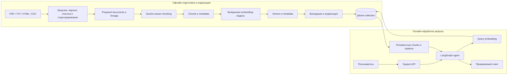

Офлайн-этапы не запускаются из support-сервиса. Во время запроса рассчитывается только query embedding, совместимый с уже созданной коллекцией.

## Быстрый запуск

Зависимости и локальный пакет уже установлены в глобальный Python. Запуск из корня проекта:

```powershell
rag-prep --config config/default.yaml
```

Прямой запуск без Prefect, но с теми же классами этапов:

```powershell
rag-prep --config config/default.yaml --no-prefect
```

Результаты пишутся в `data/prepared/`:

- `documents.json`
- `documents.jsonl`
- `manifest.json`

MLflow tracking использует SQLite БД `mlruns/mlflow.db` относительно корня проекта, определённого по расположению YAML-конфига. Запуск CLI из другого рабочего каталога не создаёт отдельное хранилище экспериментов. Артефакты также остаются в локальном каталоге MLflow; в Docker каталог `mlruns/` подключён как именованный volume.
В `manifest.json` сохраняются параметры запуска, числовые счётчики и диагностический блок `parse_failures` для файлов, которые не удалось разобрать при `parser.fail_on_error: false`.
JSON, JSONL и manifest сначала полностью формируются во временной директории, а затем заменяются как согласованный набор. При ошибке записи или замены предыдущая версия всех артефактов восстанавливается, поэтому новый JSON не смешивается со старым JSONL или manifest.

Посмотреть запуски, параметры, метрики и артефакты в MLflow UI можно из корня проекта:

```powershell
mlflow ui --backend-store-uri sqlite:///mlruns/mlflow.db --host 127.0.0.1 --port 5000
```

Интерфейс будет доступен на `http://127.0.0.1:5000`. Команда запускает долгоживущий локальный сервер MLflow и работает до `Ctrl+C`; открывать интерфейс нужно в браузере, а следующие команды выполнять во втором терминале.

## Установка

Проект рассчитан на установку в текущий глобальный Python, без создания отдельного окружения. Команды нужно выполнять из корня проекта.

Обновить зависимости:

```powershell
python -m pip install --upgrade -r requirements.txt
```

Установить локальный пакет в editable-режиме, чтобы команда `rag-prep` была доступна после изменения исходников:

```powershell
python -m pip install -e . --no-deps
```

Флаг `--no-deps` уместен, если зависимости уже установлены через `requirements.txt`. Если проект переносится на новую машину, сначала ставится `requirements.txt`, затем локальный пакет.

Метаданные локального пакета разделяют зависимости по назначению: базовая установка содержит сервис агента, LLM, RAG и протоколы, extra `data-preparation` содержит парсинг и подготовку данных, `fine-tuning` - зависимости обучения, а `full` объединяет оба набора. Поэтому вместо `requirements.txt` допустима установка `python -m pip install -e ".[full]"`; основной сценарий этого репозитория с глобальным окружением по-прежнему использует две команды выше и точные версии из `requirements.txt`.

При первой установке создать рабочий `.env` из примера:

```powershell
Copy-Item .env.example .env
```

Команда нужна только пока `.env` ещё не существует. После копирования замените placeholders ключами выбранных providers и задайте `SUPPORT_AGENT_CONFIG` и `VECTOR_STORE_CONFIG` для Docker-сценария. Рабочий `.env` содержит секреты, уже исключён из Git и не должен публиковаться; `.env.example` хранит только безопасный шаблон.

Проверить целостность глобального окружения:

```powershell
python -m pip check
```

На Windows для Unstructured дополнительно установлен `python-magic-bin`, чтобы `unstructured.partition.auto` корректно определял типы файлов. Для OCR-режимов PDF могут понадобиться системные Tesseract и Poppler, но для текстовых PDF достаточно `parser.strategy: fast`.
Команда `rag-prep` перед запуском Prefect добавляет `localhost`, `127.0.0.1` и `::1` в `NO_PROXY`, чтобы локальный временный сервер Prefect не ломался из-за системных proxy-настроек. Для локальных CLI-запусков также отключается Prefect EventsWorker: это не мешает оркестрации, но не даёт процессу зависать на websocket-событиях временного сервера. Внешние API, включая OpenAI, при этом не отключаются от системного proxy. Импорт `rag_prep.flow` сам по себе переменные окружения не меняет.

## Официальная документация используемого стека

Этот справочник связывает внешние библиотеки, сервисы, модели и стандарты с их назначением в проекте. Зафиксированные совместимые версии нужно смотреть в `pyproject.toml` и `requirements.txt`: ссылки ниже ведут на актуальную официальную документацию и не заменяют ограничения версий репозитория. Стандартные модули Python перечислены только там, где они образуют отдельный архитектурный компонент, например SQLite.

### Подготовка данных и чанкинг

| Инструмент или аспект                     | Назначение в проекте                                                | Документация                                                                                                                                                                                                                                              |
| ----------------------------------------- | ------------------------------------------------------------------- | --------------------------------------------------------------------------------------------------------------------------------------------------------------------------------------------------------------------------------------------------------- |
| Python                                    | Среда выполнения всех CLI, пайплайнов, сервисов и тестов            | [Python 3](https://docs.python.org/3/)                                                                                                                                                                                                                    |
| `llama-index`, `llama-index-readers-file` | Загрузка файлов, представление документов и sentence-aware chunking | [LlamaIndex](https://docs.llamaindex.ai/en/stable/), [SimpleDirectoryReader](https://docs.llamaindex.ai/en/stable/module_guides/loading/simpledirectoryreader/), [node parsers](https://docs.llamaindex.ai/en/stable/module_guides/loading/node_parsers/) |
| `unstructured`, `unstructured-inference`  | Парсинг PDF, TXT, HTML и CSV в структурные элементы                 | [partitioning](https://docs.unstructured.io/open-source/core-functionality/partitioning), [поддерживаемые форматы](https://docs.unstructured.io/open-source/introduction/supported-file-types)                                                            |
| `beautifulsoup4`, `lxml`                  | Разбор HTML и удаление повторяющегося web boilerplate               | [Beautiful Soup](https://www.crummy.com/software/BeautifulSoup/bs4/doc/), [lxml](https://lxml.de/)                                                                                                                                                        |
| `pandas`                                  | Чтение и нормализация табличных CSV-данных                          | [pandas](https://pandas.pydata.org/docs/)                                                                                                                                                                                                                 |
| `python-magic-bin`                        | Определение MIME-типа файлов в Windows                              | [python-magic](https://github.com/ahupp/python-magic)                                                                                                                                                                                                     |
| `spaCy`                                   | Пакетная нормализация и подсчёт предложений                         | [processing pipelines](https://spacy.io/usage/processing-pipelines/)                                                                                                                                                                                      |
| `datasketch`                              | Exact- и near-duplicate дедупликация через MinHash LSH              | [MinHash LSH](https://ekzhu.com/datasketch/lsh.html), [API](https://ekzhu.com/datasketch/documentation.html)                                                                                                                                              |
| `pydantic`                                | Контракты конфигураций, метаданных и артефактов между этапами       | [models](https://docs.pydantic.dev/latest/concepts/models/), [settings and validation](https://docs.pydantic.dev/latest/)                                                                                                                                 |
| `PyYAML`, `python-dotenv`                 | Воспроизводимые YAML-конфигурации и загрузка секретов из `.env`     | [PyYAML](https://pyyaml.org/wiki/PyYAMLDocumentation), [python-dotenv](https://saurabh-kumar.com/python-dotenv/)                                                                                                                                          |
| `prefect`                                 | Оркестрация воспроизводимых offline-пайплайнов                      | [flows](https://docs.prefect.io/v3/concepts/flows), [tasks](https://docs.prefect.io/v3/concepts/tasks)                                                                                                                                                    |
| `mlflow`                                  | Параметры, метрики, артефакты и сравнение запусков                  | [MLflow Tracking](https://mlflow.org/docs/latest/ml/tracking/), [Tracking API](https://mlflow.org/docs/latest/ml/tracking/tracking-api/)                                                                                                                  |
| `tiktoken`                                | Точный подсчёт токенов для OpenAI-совместимого чанкинга             | [tiktoken](https://github.com/openai/tiktoken)                                                                                                                                                                                                            |

### Embeddings и векторное хранилище

| Инструмент или аспект            | Назначение в проекте                                          | Документация                                                                                                                                                                                                                                                                              |
| -------------------------------- | ------------------------------------------------------------- | ----------------------------------------------------------------------------------------------------------------------------------------------------------------------------------------------------------------------------------------------------------------------------------------- |
| `openai`, `langchain-openai`     | OpenAI chat и embeddings, включая `text-embedding-3-small`    | [OpenAI Python SDK](https://github.com/openai/openai-python), [embedding models](https://developers.openai.com/api/docs/models/embedding), [LangChain OpenAI](https://docs.langchain.com/oss/python/integrations/providers/openai)                                                        |
| `gigachat`, `langchain-gigachat` | GigaChat chat, OAuth, tool calling и опциональные embeddings  | [GigaChat Python SDK](https://developers.sber.ru/docs/ru/gigachain/tools/python/gigachat), [REST API](https://developers.sber.ru/docs/ru/gigachat/api/reference/rest/gigachat-api), [langchain-gigachat](https://github.com/ai-forever/langchain-gigachat)                                |
| GigaChat embeddings              | Выбор embedding-модели и учёт её фактической размерности      | [руководство по embeddings](https://developers.sber.ru/docs/ru/gigachat/guides/embeddings), [`POST /embeddings`](https://developers.sber.ru/docs/ru/gigachat/api/reference/rest/post-embeddings), [EmbeddingsGigaR](https://developers.sber.ru/docs/ru/gigachat/models/embeddings-giga-r) |
| `huggingface-hub`                | Загрузка локальных моделей и работа с `HF_TOKEN`              | [download files](https://huggingface.co/docs/huggingface_hub/guides/download), [authentication](https://huggingface.co/docs/huggingface_hub/package_reference/authentication)                                                                                                             |
| `transformers`                   | Локальная генерация и расчёт embeddings                       | [Transformers](https://huggingface.co/docs/transformers/), [text generation](https://huggingface.co/docs/transformers/main/en/llm_tutorial)                                                                                                                                               |
| `intfloat/multilingual-e5-small` | Многоязычная локальная embedding-модель                       | [model card](https://huggingface.co/intfloat/multilingual-e5-small)                                                                                                                                                                                                                       |
| `numpy`                          | Проверка размерности, нормы и конечности embedding-векторов   | [NumPy](https://numpy.org/doc/stable/)                                                                                                                                                                                                                                                    |
| `tenacity`                       | Ограниченные retry-политики внешних embedding- и LLM-запросов | [Tenacity](https://tenacity.readthedocs.io/en/latest/)                                                                                                                                                                                                                                    |
| `qdrant-client`, Qdrant          | Embedded/server vector store, индексация и similarity search  | [Qdrant](https://qdrant.tech/documentation/), [Python client](https://python-client.qdrant.tech/), [local mode](https://github.com/qdrant/qdrant-client#local-mode)                                                                                                                       |
| `portalocker`                    | Межпроцессная блокировка embedded Qdrant                      | [Portalocker](https://portalocker.readthedocs.io/en/latest/)                                                                                                                                                                                                                              |

### Агенты, память, tools и протоколы

| Инструмент или аспект                      | Назначение в проекте                                          | Документация                                                                                                                                                                                                                                                  |
| ------------------------------------------ | ------------------------------------------------------------- | ------------------------------------------------------------------------------------------------------------------------------------------------------------------------------------------------------------------------------------------------------------- |
| `langchain-core`                           | Сообщения, tools и унифицированные интерфейсы LLM             | [LangChain overview](https://docs.langchain.com/oss/python/langchain/overview), [tools](https://docs.langchain.com/oss/python/langchain/tools)                                                                                                                |
| `langgraph`, `langgraph-checkpoint-sqlite` | Граф состояний, переходы, loop guard и checkpoint persistence | [LangGraph overview](https://docs.langchain.com/oss/python/langgraph/overview), [persistence](https://docs.langchain.com/oss/python/langgraph/persistence), [SQLite checkpointer](https://github.com/langchain-ai/langgraph/tree/main/libs/checkpoint-sqlite) |
| SQLite                                     | Диалоговая, summary- и долговременная память агента           | [`sqlite3`](https://docs.python.org/3/library/sqlite3.html), [SQLite](https://www.sqlite.org/docs.html)                                                                                                                                                       |
| `httpx2`                                   | Синхронные и асинхронные обращения к внешним HTTP API         | [HTTPX2](https://httpx2.pydantic.dev/), [репозиторий](https://github.com/pydantic/httpx2)                                                                                                                                                                     |
| OpenWeatherMap                             | Реальный weather tool                                         | [Current Weather API](https://openweathermap.org/current), [API keys](https://openweathermap.org/appid)                                                                                                                                                       |
| Банк России                                | Официальная конвертация стоимости иностранных API в RUB       | [ежедневные курсы](https://www.cbr.ru/currency_base/daily/), [веб-сервис курсов](https://www.cbr.ru/development/DWS/), [`XML_daily.asp`](https://www.cbr.ru/scripts/XML_daily.asp)                                                                            |
| MCP и `mcp` SDK                            | Локальные и внешние MCP-серверы, discovery и вызов tools      | [MCP specification](https://modelcontextprotocol.io/specification/), [Python SDK](https://github.com/modelcontextprotocol/python-sdk)                                                                                                                         |
| A2A и `a2a-sdk`                            | Межагентный протокол, Agent Card и обмен задачами             | [A2A specification](https://a2a-protocol.org/latest/specification/), [Python SDK](https://github.com/a2aproject/a2a-python)                                                                                                                                   |
| ACP                                        | Исторический протокол, развитие которого продолжается в A2A   | [ACP repository](https://github.com/i-am-bee/acp), [объединение ACP и A2A](https://developers.googleblog.com/en/google-cloud-donates-a2a-to-linux-foundation/)                                                                                                |
| Файловые tools                             | Контролируемые операции внутри разрешённого workspace         | [`pathlib`](https://docs.python.org/3/library/pathlib.html), [`shutil`](https://docs.python.org/3/library/shutil.html)                                                                                                                                        |
| Code runner                                | Изолированный сервис выполнения ограниченного Python-кода     | [`ast`](https://docs.python.org/3/library/ast.html), [Python security considerations](https://docs.python.org/3/library/security_warnings.html)                                                                                                               |

### HTTP API, интерфейсы и контейнеризация

| Инструмент или аспект             | Назначение в проекте                                         | Документация                                                                                                                                                                    |
| --------------------------------- | ------------------------------------------------------------ | ------------------------------------------------------------------------------------------------------------------------------------------------------------------------------- |
| `fastapi`, `starlette`, `uvicorn` | Support API, middleware, lifecycle и ASGI-сервер             | [FastAPI](https://fastapi.tiangolo.com/), [Starlette](https://www.starlette.io/), [Uvicorn](https://www.uvicorn.org/)                                                           |
| `sse-starlette`                   | Потоковые ответы `/v1/chat/stream` по Server-Sent Events     | [sse-starlette](https://github.com/sysid/sse-starlette), [SSE standard](https://html.spec.whatwg.org/multipage/server-sent-events.html)                                         |
| OpenAPI, Swagger UI, ReDoc        | Контракт API и интерактивная документация `/docs` и `/redoc` | [OpenAPI](https://spec.openapis.org/oas/latest.html), [Swagger UI](https://swagger.io/tools/swagger-ui/), [ReDoc](https://redocly.com/docs/redoc/)                              |
| Postman                           | Импорт OpenAPI, environment variables и ручная проверка API  | [Postman](https://learning.postman.com/docs/getting-started/overview/), [environments](https://learning.postman.com/docs/sending-requests/variables/managing-environments/)     |
| `PyJWT` и RBAC                    | JWT-аутентификация, роли и разграничение доступа             | [PyJWT](https://pyjwt.readthedocs.io/en/stable/), [JWT RFC 7519](https://www.rfc-editor.org/rfc/rfc7519), [NIST RBAC](https://csrc.nist.gov/projects/role-based-access-control) |
| Docker, Docker Compose            | Воспроизводимый образ, сервисы и локальный deploy            | [Dockerfile](https://docs.docker.com/reference/dockerfile/), [Docker Compose](https://docs.docker.com/compose/)                                                                 |

### Fine-tuning и локальные модели

| Инструмент или аспект        | Назначение в проекте                                    | Документация                                                                                                                                         |
| ---------------------------- | ------------------------------------------------------- | ---------------------------------------------------------------------------------------------------------------------------------------------------- |
| `torch` и Intel XPU          | Локальное обучение и inference на Intel Arc             | [PyTorch](https://docs.pytorch.org/docs/stable/), [getting started on Intel GPU](https://docs.pytorch.org/docs/stable/notes/get_start_xpu.html)      |
| `transformers`               | Загрузка causal LM, tokenizer, generation и Trainer API | [Transformers](https://huggingface.co/docs/transformers/), [Trainer](https://huggingface.co/docs/transformers/main_classes/trainer)                  |
| `accelerate`                 | Выбор устройства и переносимость training loop          | [Accelerate](https://huggingface.co/docs/accelerate/)                                                                                                |
| `datasets`                   | Загрузка и подготовка train/eval-наборов                | [Datasets](https://huggingface.co/docs/datasets/)                                                                                                    |
| `peft`                       | Parameter-efficient adapters и LoRA                     | [PEFT](https://huggingface.co/docs/peft/), [LoRA guide](https://huggingface.co/docs/peft/main/conceptual_guides/lora)                                |
| `trl`                        | Supervised fine-tuning через `SFTTrainer`               | [SFTTrainer](https://huggingface.co/docs/trl/sft_trainer)                                                                                            |
| `Qwen/Qwen2.5-1.5B-Instruct` | Локальная instruction-модель и база для PEFT            | [model card](https://huggingface.co/Qwen/Qwen2.5-1.5B-Instruct), [Qwen tool use](https://qwen.readthedocs.io/en/latest/framework/function_call.html) |
| LoRA и QLoRA                 | Методы и компромиссы parameter-efficient fine-tuning    | [LoRA paper](https://arxiv.org/abs/2106.09685), [QLoRA paper](https://arxiv.org/abs/2305.14314)                                                      |

### Оркестрация и инфраструктура

| Инструмент или аспект       | Назначение в проекте                                            | Документация                                                                                                                                                              |
| --------------------------- | --------------------------------------------------------------- | ------------------------------------------------------------------------------------------------------------------------------------------------------------------------- |
| `celery`                    | Приоритетные очереди, retry, rate limits и worker orchestration | [Celery](https://docs.celeryq.dev/en/stable/), [configuration](https://docs.celeryq.dev/en/stable/userguide/configuration.html)                                           |
| RabbitMQ                    | AMQP broker и приоритетные task queues                          | [RabbitMQ](https://www.rabbitmq.com/docs), [consumer acknowledgements](https://www.rabbitmq.com/docs/confirms), [priority queues](https://www.rabbitmq.com/docs/priority) |
| `redis`                     | Result backend, события и распределённое состояние              | [Redis](https://redis.io/docs/latest/), [redis-py](https://redis.readthedocs.io/en/stable/)                                                                               |
| `flower`                    | Мониторинг Celery workers, очередей и нагрузки                  | [Flower](https://flower.readthedocs.io/en/latest/)                                                                                                                        |
| `camunda-orchestration-sdk` | Job worker и связь BPMN-процесса с агентным шагом               | [Camunda Python SDK](https://docs.camunda.io/docs/apis-tools/python-sdk/), [job workers](https://docs.camunda.io/docs/components/concepts/job-workers/)                   |
| BPMN                        | Детерминированная часть гибридной оркестрации                   | [BPMN 2.0.2](https://www.omg.org/spec/BPMN/2.0.2/)                                                                                                                        |

### Качество, безопасность и наблюдаемость

| Инструмент или аспект                                                                                                  | Назначение в проекте                                               | Документация                                                                                                                                                                                                                |
| ---------------------------------------------------------------------------------------------------------------------- | ------------------------------------------------------------------ | --------------------------------------------------------------------------------------------------------------------------------------------------------------------------------------------------------------------------- |
| `opentelemetry-api`, `opentelemetry-sdk`                                                                               | API трассировки, sampling, span processing и ресурсы сервиса       | [OpenTelemetry Python](https://opentelemetry.io/docs/languages/python/), [Python API](https://opentelemetry-python.readthedocs.io/en/latest/api/trace.html)                                                                 |
| `opentelemetry-exporter-otlp-proto-http`                                                                               | Экспорт span по OTLP/HTTP                                          | [OTLP exporter](https://opentelemetry-python.readthedocs.io/en/latest/exporter/otlp/otlp.html), [OTLP specification](https://opentelemetry.io/docs/specs/otlp/)                                                             |
| `opentelemetry-instrumentation-fastapi`, `opentelemetry-instrumentation-httpx`, `opentelemetry-instrumentation-celery` | Автоматические spans для API, внешних HTTP-вызовов и фоновых задач | [OpenTelemetry Python instrumentation](https://opentelemetry-python-contrib.readthedocs.io/en/latest/)                                                                                                                      |
| OpenTelemetry Collector                                                                                                | Приём и маршрутизация телеметрии                                   | [Collector](https://opentelemetry.io/docs/collector/), [configuration](https://opentelemetry.io/docs/collector/configuration/)                                                                                              |
| `prometheus-client`, Prometheus                                                                                        | Метрики приложения и правила алертов                               | [Python client](https://prometheus.github.io/client_python/), [Prometheus](https://prometheus.io/docs/introduction/overview/), [alerting rules](https://prometheus.io/docs/prometheus/latest/configuration/alerting_rules/) |
| Alertmanager                                                                                                           | Группировка и доставка алертов                                     | [Alertmanager](https://prometheus.io/docs/alerting/latest/alertmanager/)                                                                                                                                                    |
| Jaeger                                                                                                                 | Просмотр распределённых трейсов                                    | [Jaeger](https://www.jaegertracing.io/docs/latest/)                                                                                                                                                                         |
| Grafana                                                                                                                | Дашборды метрик и эксплуатационная визуализация                    | [Grafana](https://grafana.com/docs/grafana/latest/)                                                                                                                                                                         |
| Prompt injection guardrails                                                                                            | Фильтрация входа, защита system-инструкций и tool boundary         | [OWASP LLM Prompt Injection Prevention](https://cheatsheetseries.owasp.org/cheatsheets/LLM_Prompt_Injection_Prevention_Cheat_Sheet.html)                                                                                    |
| `pytest`, `hypothesis`                                                                                                 | Unit-, regression-, property-based и simulation tests              | [pytest](https://docs.pytest.org/en/stable/), [Hypothesis](https://hypothesis.readthedocs.io/en/latest/)                                                                                                                    |
| Ruff                                                                                                                   | Linting и единое форматирование Python-кода                        | [Ruff](https://docs.astral.sh/ruff/)                                                                                                                                                                                        |
| GitHub Actions                                                                                                         | Обычные проверки, Docker smoke test и opt-in API smoke             | [GitHub Actions](https://docs.github.com/en/actions), [encrypted secrets](https://docs.github.com/en/actions/security-for-github-actions/security-guides/using-secrets-in-github-actions)                                   |
| Dependabot                                                                                                             | Контроль обновлений Python- и GitHub Actions-зависимостей          | [Dependabot](https://docs.github.com/en/code-security/dependabot)                                                                                                                                                           |
| GHCR и SBOM                                                                                                            | Публикация контейнера и attestations состава образа                | [GitHub Container Registry](https://docs.github.com/en/packages/working-with-a-github-packages-registry/working-with-the-container-registry), [Docker attestations](https://docs.docker.com/build/metadata/attestations/)   |

## Команды rag-prep, rag-index и rag-support

Три консольные команды решают разные задачи:

- `rag-prep` запускает конечный batch-пайплайн, сохраняет артефакты и завершает процесс;
- `rag-index` загружает уже готовые embeddings в Qdrant без запуска остальных offline-пайплайнов;
- `rag-support` запускает долгоживущий HTTP API поверх уже подготовленной Qdrant collection;
- Docker Compose запускает тот же `rag-support` внутри контейнера, поэтому после deploy сервисом можно пользоваться через порт `8000`.

### rag-prep

Форма команды:

```powershell
rag-prep <этап> --config <yaml> [--no-prefect]
```

Доступные этапы:

| Команда        | Что делает                                                    | Что не делает                |
| -------------- | ------------------------------------------------------------- | ---------------------------- |
| `prepare`      | Загружает, парсит, очищает и структурирует исходные документы | Не создаёт чанки и vectors   |
| `chunk`        | Делит prepared documents на чанки                             | Не вызывает embedding API    |
| `embed`        | Рассчитывает embeddings для готовых чанков                    | Не создаёт Qdrant collection |
| `vector-store` | Загружает готовые embeddings в Qdrant и проверяет поиск       | Не пересчитывает embeddings  |

Полная последовательность для OpenAI embeddings:

```powershell
rag-prep prepare --config config/default.yaml --no-prefect
rag-prep chunk --config config/chunking_openai.yaml --no-prefect
rag-prep embed --config config/embeddings_openai.yaml --no-prefect
rag-prep vector-store --config config/vector_store_openai.yaml --no-prefect
```

Для локального E5 меняются только три provider-specific конфига:

```powershell
rag-prep prepare --config config/default.yaml --no-prefect
rag-prep chunk --config config/chunking_local.yaml --no-prefect
rag-prep embed --config config/embeddings_local.yaml --no-prefect
rag-prep vector-store --config config/vector_store_local.yaml --no-prefect
```

Для GigaChat embeddings используются `chunking_gigachat.yaml`, `embeddings_gigachat.yaml` и `vector_store_gigachat.yaml`. Расчёт OpenAI или GigaChat embeddings вызывает соответствующий внешний API; повторно запускать `embed` при наличии актуального JSONL не нужно.

Без `--no-prefect` тот же этап оркестрируется Prefect. С `--no-prefect` выполняются те же stage-классы напрямую, что удобнее для локальной отладки. Команды `chunk`, `embed` и `vector-store` требуют явный `--config`; `prepare` использует `config/default.yaml`, если путь не передан.

Справка:

```powershell
rag-prep --help
rag-prep embed --help
```

### rag-index

Форма команды:

```powershell
rag-index --config <vector-store.yaml>
```

`rag-index` читает готовый `embeddings.jsonl`, создаёт или обновляет выбранную Qdrant collection, валидирует количество и размерность vectors, выполняет smoke similarity search и сохраняет те же отчёты vector-store stage. Он не запускает подготовку, чанкинг, расчёт embeddings, Prefect или MLflow.

Для embedded Qdrant на Windows host:

```powershell
rag-index --config config/vector_store_openai.yaml
rag-index --config config/vector_store_local.yaml
```

Это лёгкая альтернатива `rag-prep vector-store --config ... --no-prefect` для уже подготовленных embeddings. Docker-конфиги содержат hostname `qdrant`, доступный только внутри Compose-сети, поэтому `config/vector_store_docker_*.yaml` запускаются через сервис `indexer`, а не командой `rag-index` непосредственно на Windows host:

```powershell
docker compose --profile indexing run --rm indexer
```

Справка:

```powershell
rag-index --help
```

### rag-support

Форма команды:

```powershell
rag-support --config <support-agent.yaml> [--host HOST] [--port PORT]
```

Команда запускает Uvicorn/FastAPI в текущем терминале и работает до `Ctrl+C`. После сообщения `Uvicorn running on ...` терминал занят сервером ожидаемо: это HTTP-сервис, а не интерактивный консольный чат. Swagger или Postman открываются отдельно, а `Invoke-RestMethod` и другие команды выполняются во втором окне PowerShell. Сервис подключает LLM, tools, memory и online RAG, но не запускает `prepare`, `chunk`, `embed` или индексацию. Поэтому перед стартом должна существовать Qdrant collection, соответствующая `rag_profile` выбранного support-конфига.

Пример host-запуска с OpenAI:

```powershell
rag-support --config config/support_agent_openai.yaml
```

Вместо аргумента путь можно записать в `.env` в корне проекта или экспортировать в окружение:

```dotenv
SUPPORT_AGENT_CONFIG=config/support_agent_gigachat_local_embeddings.yaml
```

При запуске из корня проекта достаточно:

```powershell
rag-support
```

Эквивалентный вариант через переменную текущего PowerShell:

```powershell
$env:SUPPORT_AGENT_CONFIG = "config/support_agent_gigachat_local_embeddings.yaml"
rag-support
```

Явный `--config` имеет приоритет над значением из `.env` или окружения.

`--host` и `--port` переопределяют только адрес прослушивания из YAML:

```powershell
rag-support --config config/support_agent_openai.yaml --host 0.0.0.0 --port 8080
```

Host-сервис и Docker-контейнер нельзя одновременно привязать к одному host-порту. Если Docker уже публикует `8000`, используйте только контейнер, остановите его через `docker compose down` либо запустите локальный сервер на другом порту:

```powershell
rag-support --config config/support_agent_openai.yaml --port 8001
```

В последнем случае base URL, Swagger и API меняются на `http://127.0.0.1:8001`, `http://127.0.0.1:8001/docs` и `http://127.0.0.1:8001/v1/chat` соответственно.

После запуска доступны `/health`, `/ready`, `/docs`, `/redoc`, `/openapi.json`, `/metrics` и API `/v1/*`. Host-presets с отключённой аутентификацией не требуют `X-API-Key`. В Docker-presets `/metrics` и API `/v1/*` защищены через `SUPPORT_SERVICE_API_KEY`, тогда как health/readiness и документация остаются публичными.

Справка:

```powershell
rag-support --help
```

## Примеры входных данных

В `data/raw/` лежат русскоязычные примеры, похожие на реальные документы организации:

- `sample.txt` - регламент обработки заявок в ИТ-службе;
- `sample.html` - инструкция по передаче документов в электронный архив;
- `sample.csv` - табличный реестр этапов service desk, где каждая строка становится отдельным элементом, а в конце есть exact и near-дубли для проверки дедупликации;
- `sample.pdf` - памятка по подготовке комплекта документов к архивированию.

Эти файлы нужны для smoke-проверки пайплайна. Для своих данных можно заменить содержимое `data/raw/` или указать другой `paths.input_dir` в `config/default.yaml`.

## Формат результата

Каждая запись:

```json
{
  "text": "...",
  "metadata": {
    "id": "stable-document-id",
    "source": "absolute/path/to/file",
    "source_key": "relative/path/to/file",
    "section": "full_document",
    "file_name": "sample.txt",
    "file_type": "txt",
    "source_hash": "...",
    "text_hash": "...",
    "parent_ids": ["source-id"],
    "origin_element_ids": ["element-id-1", "element-id-2"],
    "lineage": {
      "source_id": "source-id",
      "source_key": "relative/path/to/file",
      "source_hash": "...",
      "origin_element_ids": ["element-id-1", "element-id-2"],
      "element_range": [0, 3],
      "pipeline_stage": "prepared_document"
    },
    "hierarchy": {
      "section_path": ["Раздел", "Подраздел"],
      "section_depth": 2,
      "document_order": 0
    },
    "element_start": 0,
    "element_end": 3,
    "element_types": ["NarrativeText", "Title"],
    "page_number": null,
    "char_count": 100,
    "word_count": 16,
    "sentence_count": 2,
    "pipeline_run_id": "...",
    "parsed_at": "...",
    "extra": {}
  }
}
```

`source` хранит фактический абсолютный путь для диагностики текущего запуска, а `source_key` - путь относительно входной директории. Stable IDs источника, элементов и документа строятся по SHA-256 содержимого и позиции элемента, поэтому перенос проекта, переименование или размещение того же файла в другом каталоге не меняет идентификаторы.

## Готовность к следующим этапам

Поля, которые нужны следующим этапам без реализации самих этапов:

- `metadata.id` - стабильный идентификатор подготовленного документа;
- `metadata.parent_ids` - родительские сущности, сейчас это идентификатор source;
- `metadata.origin_element_ids` - элементы парсинга, из которых собран документ;
- `metadata.lineage` - цепочка `source -> parsed elements -> prepared document`;
- `metadata.hierarchy.section_path` - путь секции для будущего document tree;
- `metadata.hierarchy.document_order` - порядок документа внутри исходника;
- `metadata.extra.quality` - диагностические scores для boilerplate/OCR garbage/menu leftovers.

Quality scoring не удаляет документы сам по себе. Он даёт сигнал будущим этапам чанкинга/retrieval, чтобы можно было фильтровать мусор, расследовать retrieval misses и объяснять происхождение ответа.

## Конфигурация

Основные параметры находятся в `config/default.yaml`:

- `paths.input_dir` и `paths.output_dir`;
- `loader.allowed_extensions`;
- `parser.strategy`: `fast`, `auto`, `hi_res`, `ocr_only`;
- `parser.fail_on_error`: `false` пропускает проблемный файл и пишет failure в manifest, `true` останавливает пайплайн;
- `cleaning.drop_patterns` для удаления boilerplate;
- `normalization.spacy_language`;
- `deduplication.threshold`, `num_perm`, `shingle_size`;
- `structuring.group_by_section`;
- `logging.mlflow_enabled`.

Относительные пути в `paths.*` считаются относительно корня проекта, если конфиг лежит в папке `config/`. Если конфиг расположен в другой папке, относительные пути считаются относительно папки этого YAML-файла.

Для OCR PDF на Windows могут дополнительно понадобиться системные Tesseract/Poppler. Для текстовых PDF используется `strategy: fast`.

## Композиция конфигураций

### Механизм загрузки

Композиция реализована не в YAML и не в CLI, а в `src/rag_prep/config_composition.py`:

| Файл                                 | Роль в композиции                                                                                                                                                                                                                                                                               |
| ------------------------------------ | ----------------------------------------------------------------------------------------------------------------------------------------------------------------------------------------------------------------------------------------------------------------------------------------------- |
| `src/rag_prep/config_composition.py` | `load_composed_yaml()` рекурсивно раскрывает `extends`; `deep_merge()` объединяет словари; `apply_rag_profile()` проецирует единый RAG-профиль в схему `agent`, `chunking`, `embedding` или `vector_store`; валидатор проверяет совпадение `embedding.dimensions` и `vector_store.vector_size`. |
| `src/rag_prep/config.py`             | Загружает композицию для prepare/chunking/embeddings/vector-store, валидирует её профильными Pydantic-моделями и разрешает пути данных.                                                                                                                                                         |
| `src/agent_app/config.py`            | Использует тот же `load_composed_yaml()` и `apply_rag_profile(..., target="agent")` для single-agent, support-, multi-agent и orchestration presets.                                                                                                                                            |
| `tests/test_config_composition.py`   | Проверяет порядок наследования, замену списков/скаляров, рекурсивное слияние, циклы, отсутствующие файлы и несовместимую размерность.                                                                                                                                                           |

Таким образом, YAML-файлы только декларируют слои. Фактический алгоритм наследования и проверки контрактов сосредоточен в одном файле `config_composition.py`, а два config-loader-а преобразуют итоговый словарь в строго типизированные настройки своих подсистем.

### Канонические RAG-профили

Provider-specific параметры не копируются между пайплайнами. Канонические RAG-профили находятся в:

- `config/profiles/rag/openai.yaml`;
- `config/profiles/rag/local.yaml`;
- `config/profiles/rag/gigachat.yaml`.

LLM identity и provider-specific connection settings аналогично находятся в `config/profiles/agent/openai.yaml`, `config/profiles/agent/gigachat.yaml` и `config/profiles/agent/local.yaml`. Их используют и обычные `agent_*.yaml`, и support-presets.

Каждый профиль в одном месте связывает tokenizer, embedding provider/model/dimensions и Qdrant contract: `collection_name`, `vector_size`, `distance`, `local_storage_path`. Конфиги chunking, embeddings, vector-store и support-agent указывают только `rag_profile`, а loader проецирует профиль в нужную Pydantic-схему.

| Профиль                               | Что фиксирует                                                                                 |
| ------------------------------------- | --------------------------------------------------------------------------------------------- |
| `config/profiles/rag/openai.yaml`     | OpenAI tokenizer/embedding contract, размерность 1536 и Qdrant collection для OpenAI vectors. |
| `config/profiles/rag/local.yaml`      | Локальный multilingual E5 contract, размерность 384 и отдельную collection.                   |
| `config/profiles/rag/gigachat.yaml`   | GigaChat embedding contract и соответствующую ему размерность/collection.                     |
| `config/profiles/agent/openai.yaml`   | Chat provider и имя OpenAI-модели.                                                            |
| `config/profiles/agent/gigachat.yaml` | Chat provider, GigaChat-модель, OAuth scope и параметры SSL/profanity check.                  |
| `config/profiles/agent/local.yaml`    | Локальную Qwen, устройство, dtype, путь к adapter и offline-поведение.                        |

### Слои support-конфигурации

Support-presets собираются через `extends` из независимых слоёв `config/profiles/support/`: общая конфигурация, LLM, runtime RAG, state и deployment. Например:

```yaml
extends:
  - profiles/support/base.yaml
  - profiles/support/agent_gigachat.yaml
  - profiles/support/rag_runtime_local.yaml
  - profiles/support/state_gigachat_local.yaml
  - profiles/support/deployment_docker_local_embeddings.yaml

rag_profile: profiles/rag/local.yaml
```

Слои имеют разделённую ответственность:

| Файл или группа                                                   | Назначение                                                                                                                       |
| ----------------------------------------------------------------- | -------------------------------------------------------------------------------------------------------------------------------- |
| `config/profiles/support/base.yaml`                               | Общие tools, memory, security, service, evaluation, конвертация валют через ЦБ РФ и лимиты, не зависящие от provider/deployment. |
| `config/profiles/support/agent_openai.yaml`                       | Подключает OpenAI chat profile к support-конфигурации.                                                                           |
| `config/profiles/support/agent_gigachat.yaml`                     | Подключает GigaChat chat profile и его provider settings.                                                                        |
| `config/profiles/support/agent_local.yaml`                        | Подключает local Qwen profile, XPU/CPU settings и adapter path.                                                                  |
| `config/profiles/support/rag_runtime_openai.yaml`                 | Включает online RAG и лимиты контекста для OpenAI embedding contract.                                                            |
| `config/profiles/support/rag_runtime_local.yaml`                  | Включает online RAG и лимиты контекста для local E5 contract.                                                                    |
| `config/profiles/support/state_openai.yaml`                       | Изолирует OpenAI memory/checkpoint/output paths.                                                                                 |
| `config/profiles/support/state_gigachat_openai.yaml`              | Изолирует state комбинации GigaChat chat + OpenAI vectors.                                                                       |
| `config/profiles/support/state_gigachat_local.yaml`               | Изолирует state комбинации GigaChat chat + local vectors.                                                                        |
| `config/profiles/support/state_local.yaml`                        | Изолирует state local Qwen + local vectors.                                                                                      |
| `config/profiles/support/deployment_host.yaml`                    | Host URL, один API worker и embedded Qdrant.                                                                                     |
| `config/profiles/support/deployment_docker.yaml`                  | Docker hostnames, Qdrant HTTP mode и обязательная API-аутентификация.                                                            |
| `config/profiles/support/deployment_docker_local_embeddings.yaml` | Дополняет Docker deployment путями локальной embedding-модели.                                                                   |
| `config/profiles/support/multi_agent.yaml`                        | Роли, allowlists и LangGraph limits.                                                                                             |
| `config/profiles/support/multi_agent_llm_mixed.yaml`              | Per-role routing между OpenAI, GigaChat и local Qwen.                                                                            |
| `config/profiles/support/multi_agent_docker_tools.yaml`           | Включает Compose-only инженерные tools, включая изолированный code runner.                                                       |
| `config/profiles/support/orchestration.yaml`                      | Общие patterns, retry, backpressure и provider concurrency limits.                                                               |
| `config/profiles/support/orchestration_docker.yaml`               | Переключает orchestration на Celery/RabbitMQ/Redis/Camunda endpoints.                                                            |
| `config/profiles/support/security_jwt.yaml`                       | Включает HMAC JWT, проверку issuer/audience, RBAC и изоляцию данных по `sub`.                                                    |
| `config/profiles/support/observability_docker.yaml`               | Наследует JWT-политику и задаёт OTLP endpoint, structured logging и Docker observability preset.                                 |

### Порядок слияния и разрешение путей

Родители применяются в указанном порядке, затем применяется текущий файл. Словари объединяются рекурсивно, списки и скаляры заменяются целиком. Ссылки `extends` разрешаются относительно YAML, в котором они объявлены; циклические ссылки и отсутствующие файлы останавливают загрузку. Пути данных после композиции по-прежнему разрешаются относительно корня проекта для конфигов из `config/`.

### Где менять параметры

Чтобы изменить модель или размерность во всех этапах, редактируйте соответствующий `profiles/rag/*.yaml`. Параметры конкретного запуска, например batch size, MLflow или `recreate_collection`, остаются в конфиге своего пайплайна.

Практическое правило:

- provider/model/vector contract меняется в `profiles/rag/*.yaml`;
- chat LLM меняется в `profiles/agent/*.yaml`;
- общая политика сервиса меняется в `profiles/support/base.yaml`;
- инфраструктурные адреса и режимы меняются в `deployment_*`, `orchestration_*` и `observability_*`;
- конкретный верхнеуровневый preset только выбирает нужные слои и задаёт исключения для своего запуска.

### Подключение другой LLM

LLM и embeddings выбираются независимо. Замена chat-модели не требует пересчёта
существующих vectors: LLM получает из RAG уже найденный текст. Новый индекс нужен только
при смене embedding-модели.

Для другой API-модели уже поддерживаемого provider-а создайте отдельный профиль рядом с
существующими `config/profiles/agent/*.yaml`, не меняя учебные профили. Например,
`config/profiles/agent/openai_custom.yaml`:

```yaml
agent:
  provider: openai
  model: <идентификатор-chat-модели-в-OpenAI-API>
```

Для GigaChat структура отличается только provider-specific полями:

```yaml
agent:
  provider: gigachat
  model: <идентификатор-доступной-GigaChat-модели>
  gigachat_auth_key_env: GIGACHAT_AUTH_KEY
  gigachat_scope: GIGACHAT_API_PERS
  gigachat_verify_ssl_certs: false
```

Затем создайте отдельный верхнеуровневый support-preset на основе нужной комбинации и
замените в `extends` слой `profiles/support/agent_*.yaml` своим профилем. Остальные слои
оставляют tools, memory, RAG и deployment неизменными:

```yaml
extends:
  - profiles/support/base.yaml
  - profiles/agent/openai_custom.yaml
  - profiles/support/rag_runtime_local.yaml
  - profiles/support/state_openai.yaml
  - profiles/support/deployment_host.yaml

rag_profile: profiles/rag/local.yaml
```

Для запуска укажите новый preset явно: `rag-support --config config/support_agent_custom.yaml`.
Ключ выбранного API хранится только в `.env`: `OPENAI_API_KEY` для OpenAI либо
`GIGACHAT_AUTH_KEY` для GigaChat. Имя модели должно быть доступно именно учётной записи,
которой принадлежит ключ. Те же `AgentConfig` можно назначать отдельным ролям через
`multi_agent.llm_profiles`, как показано в разделе «Отдельная LLM для каждой роли».

Локальный runtime принимает Hugging Face causal language model, совместимую с
`AutoTokenizer` и `AutoModelForCausalLM`. Для agent tools модель также должна иметь chat
template, корректно принимающий `tools`; без этого обычный диалог может работать, а tool
calling будет ненадёжным или недоступным. Скачивание любой модели выполняется одинаково:

```powershell
python scripts/download_hf_model.py `
  --model-id <organization/model> `
  --local-dir data/models/hf/<model-folder>
```

После скачивания создайте `config/profiles/agent/local_custom.yaml`:

```yaml
agent:
  provider: local
  model: data/models/hf/<model-folder>
  adapter_path: null
  local_device: auto
  local_dtype: auto
  local_files_only: true
  trust_remote_code: false
  low_cpu_mem_usage: true
```

`local_device: auto` выбирает XPU, затем CUDA и затем CPU. `trust_remote_code: true`
включайте только после проверки кода репозитория модели. Если используется LoRA/PEFT
adapter, `adapter_path` должен относиться к той же базовой модели. Для большой модели
сначала проверьте один запрос без параллельных workers: каждый процесс загружает отдельную
копию весов.

Встроенная фабрика `src/agent_app/llm.py` реализует только providers `openai`, `gigachat`
и `local`. Подключение API другого производителя, даже с похожим HTTP-интерфейсом, не
является одной заменой `model`: нужно добавить тип provider-а в `AgentConfig`, отдельную
ветку клиента в `build_llm()`, получение секрета из окружения и тесты message/tool calling.

### Подключение другой embedding-модели

Embedding provider выбирается отдельным RAG-профилем. Для другой модели OpenAI или
GigaChat скопируйте ближайший `config/profiles/rag/*.yaml` в новый файл и измените весь
контракт одновременно:

```yaml
tokenizer_model: <tokenizer-или-tiktoken-encoding>

embedding:
  provider: openai
  model: <идентификатор-embedding-модели>
  dimensions: <фактическая-размерность-вектора>
  api_key_env: OPENAI_API_KEY
  max_input_tokens: <лимит-модели>
  normalize: false

vector_store:
  provider: qdrant
  collection_name: rag_chunks_<уникальное-имя>
  vector_size: <та-же-размерность>
  distance: Cosine
  local_storage_path: data/qdrant_storage_<уникальное-имя>
```

Для GigaChat укажите `provider: gigachat`, `api_key_env: GIGACHAT_AUTH_KEY` и сохраните
поля `gigachat_*` из исходного профиля. Известные модели GigaChat дополнительно проверяются
по встроенной таблице размерностей; для новой модели размерность всё равно должна быть
явно подтверждена документацией или пробным ответом provider-а.

Для другой локальной embedding-модели сначала скачайте её тем же скриптом, затем создайте
профиль с `provider: local`:

```yaml
tokenizer_model: cl100k_base

embedding:
  provider: local
  model: data/models/hf/<embedding-model-folder>
  dimensions: <размерность-output-модели>
  api_key_env: HF_TOKEN
  max_input_tokens: <лимит-модели>
  normalize: true
  local_device: auto
  local_dtype: auto
  local_files_only: true
  trust_remote_code: false
  pooling: mean
  passage_prefix: "<префикс-документа-или-пустая-строка>"
  query_prefix: "<префикс-запроса-или-пустая-строка>"

vector_store:
  provider: qdrant
  collection_name: rag_chunks_<уникальное-имя>
  vector_size: <та-же-размерность>
  distance: Cosine
  local_storage_path: data/qdrant_storage_<уникальное-имя>
```

Локальная модель должна загружаться через `AutoModel`, возвращать `last_hidden_state` и
быть совместимой с выбранным `mean` или `cls` pooling. Префиксы зависят от model card:
E5 использует разные `query:`/`passage:`, а для симметричных encoder-моделей они часто не
нужны. `HF_TOKEN` используется только для скачивания закрытых или rate-limited моделей;
при `local_files_only: true` расчёт vectors не обращается к Hub.

Для нового embedding-профиля скопируйте три тонких run-конфига
`chunking_<provider>.yaml`, `embeddings_<provider>.yaml` и
`vector_store_<provider>.yaml`, задайте в них новый `rag_profile` и отдельные каталоги
`data/chunks_*`, `data/embeddings_*`, `data/vector_store_*`. Затем выполните полный
downstream-порядок:

```powershell
rag-prep chunk --config config/chunking_<name>.yaml --no-prefect
rag-prep embed --config config/embeddings_<name>.yaml --no-prefect
rag-index --config config/vector_store_<name>.yaml
```

Нельзя загружать новые vectors в старую коллекцию даже при совпадении размерности:
разные embedding-модели создают разные векторные пространства. Перед запуском support
agent новый RAG-профиль должен использоваться и offline-конфигами, и support-preset;
loader проверит `embedding.model`, размерность и upstream hashes. API embeddings другого
производителя требуют нового stage в `src/rag_prep/embedding_stages/embedding.py`, нового
значения provider в `EmbeddingConfig` и реализации одинаковых методов batch/query;
произвольный HTTP endpoint автоматически не подменяется под OpenAI или GigaChat.

# Пайплайн чанкинга для RAG

Второй пайплайн делает только чанкинг подготовленных документов. Он не считает embeddings, не пишет vector DB и не запускает retrieval.

Вход берётся из результата первого пайплайна:

- `data/prepared/documents.jsonl` - структурированные документы `text + metadata`;
- lineage, hierarchy, source metadata и quality signals переносятся в каждый чанк.

Выход разделён по целевой embedding-модели: `data/chunks_openai/`, `data/chunks_local/` или `data/chunks_gigachat/`:

- `chunks.json`
- `chunks.jsonl`
- `manifest.json`

## Файлы раздела

| Файл                                         | Назначение                                                                                                                |
| -------------------------------------------- | ------------------------------------------------------------------------------------------------------------------------- |
| `config/chunking_openai.yaml`                | Читает prepared documents и создаёт чанки под tokenizer/embedding contract OpenAI.                                        |
| `config/chunking_local.yaml`                 | Настраивает чанкинг под локальный multilingual E5 и отдельный output directory.                                           |
| `config/chunking_gigachat.yaml`              | Настраивает чанкинг под выбранный GigaChat embedding contract.                                                            |
| `src/rag_prep/chunking_stages/__init__.py`   | Экспортирует стадии чанкинга.                                                                                             |
| `src/rag_prep/chunking_stages/loading.py`    | Загружает и валидирует `PreparedDocument` из JSONL предыдущего этапа.                                                     |
| `src/rag_prep/chunking_stages/splitting.py`  | Выполняет section-aware block packing, bounded overlap, oversized-block splitting, span tracking и chunk quality scoring. |
| `src/rag_prep/chunking_stages/validation.py` | Проверяет размер, позиции, offsets, section boundaries, lineage и готовность чанков к embeddings.                         |
| `src/rag_prep/chunking_stages/exporting.py`  | Сохраняет `chunks.json`, `chunks.jsonl` и manifest транзакционным набором.                                                |
| `src/rag_prep/models.py`                     | Содержит `Chunk`, `ChunkMetadata`, quality/lineage модели и результаты чанкинга.                                          |
| `src/rag_prep/config.py`                     | Содержит `ChunkingConfig`, paths, splitter strategy, `chunk_size`, `chunk_overlap` и validation policy.                   |
| `src/rag_prep/pipeline.py`                   | Реализует `RagChunkingPipeline` для прямого ООП-запуска.                                                                  |
| `src/rag_prep/flow.py`                       | Реализует Prefect flow и tasks чанкинга.                                                                                  |
| `src/rag_prep/cli.py`                        | Маршрутизирует `rag-prep chunk --config ...`.                                                                             |
| `tests/test_chunk_overlap.py`                | Проверяет фактический предел overlap, повторяющиеся spans и пограничные semantic blocks.                                  |

## Стек чанкинга

- LlamaIndex `SentenceSplitter` - основной семантически ориентированный splitter, который старается не резать текст внутри предложений;
- LlamaIndex `TokenTextSplitter` - альтернативная стратегия для строгого token-based режима;
- `tiktoken` - подсчёт токенов по явно выбранной модели или encoding;
- Pydantic - схема чанка и metadata;
- Prefect - воспроизводимая оркестрация;
- MLflow - параметры запуска, метрики размера чанков и артефакты экспорта.

## Логика чанкинга

Пайплайн не режет весь документ одной плоской строкой. Он работает в таком порядке:

1. читает `PreparedDocument` из первого пайплайна;
2. восстанавливает semantic blocks внутри секции по границам абзацев/элементов, которые были сохранены как `\n\n`;
3. упаковывает блоки в chunk до `chunk_size`;
4. применяет `chunk_overlap` только внутри текущей секции и не превышает заданный предел;
5. режет LlamaIndex splitter'ом только oversized-блок, который сам больше token budget;
6. считает chunk-level quality signals и сохраняет span metadata.

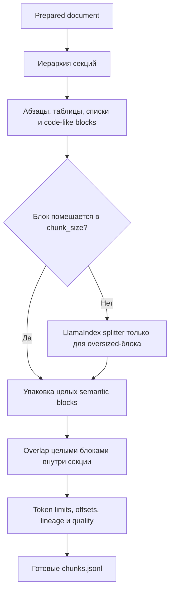

Так чанки не пересекают границы prepared document/section, а table/list/code-like блоки и повторяющиеся абзацы получают стабильные `semantic_block_ids`. Overlap переносит только целые semantic blocks: если ближайший блок больше лимита, фактическое перекрытие будет меньше заданного значения или нулевым, но никогда не превысит `chunk_overlap`. Для обычных block-aware чанков offsets берутся из заранее посчитанных block spans, без глобального `text.find()` по всему документу. Если fallback splitter не сможет точно найти подстроку для oversized-блока, чанк получит `offset_strategy` с `estimated_*`, warning в логах и отдельный `estimated_offsets_count` в validation.

## Запуск чанкинга

Перед запуском чанкинга должен существовать файл `data/prepared/documents.jsonl`.

OpenAI-вариант через Prefect:

```powershell
rag-prep chunk --config config/chunking_openai.yaml
```

Прямой запуск без Prefect:

```powershell
rag-prep chunk --config config/chunking_openai.yaml --no-prefect
rag-prep chunk --config config/chunking_local.yaml --no-prefect
rag-prep chunk --config config/chunking_gigachat.yaml --no-prefect
```

Старые команды подготовки данных остаются рабочими:

```powershell
rag-prep prepare --config config/default.yaml
rag-prep prepare --config config/default.yaml --no-prefect
```

Legacy-форма тоже сохранена:

```powershell
rag-prep --config config/default.yaml
```

## Конфигурация чанкинга

Параметры запуска находятся в `config/chunking_openai.yaml`, `config/chunking_local.yaml` или `config/chunking_gigachat.yaml`. Поля tokenizer и будущей embedding-модели подставляются из указанного там `rag_profile`:

- `paths.input_jsonl` - JSONL из первого пайплайна;
- `paths.output_dir` - директория экспорта чанков;
- `chunking.strategy` - `sentence` или `token`;
- `chunking.chunk_size` - целевой размер чанка в токенах;
- `chunking.chunk_overlap` - максимальный overlap в токенах, должен быть меньше `chunk_size`; при сохранении целых semantic blocks фактическое перекрытие может быть меньше;
- `chunking.tokenizer_model` - модель или encoding `tiktoken` из RAG-профиля;
- `chunking.embedding_model` - модель будущих embeddings из того же профиля, записывается в metadata, сами embeddings не считаются;
- `chunking.preserve_section_boundaries` - не смешивать разные prepared documents/sections;
- `chunking.preserve_block_boundaries` - сначала упаковывать semantic blocks и резать только oversized-блоки;
- `chunking.max_chunk_tokens` - validation guardrail перед embeddings;
- `chunking.min_quality_score` - порог для диагностического счётчика low-quality chunks;
- `chunking.fail_on_validation_error` - останавливать пайплайн при пустых, слишком маленьких, слишком больших, low-quality чанках, estimated offsets или проблемах lineage.

## Формат Чанка

Каждая запись в `chunks.jsonl` готова к следующему embeddings-пайплайну:

```json
{
  "text": "...",
  "metadata": {
    "id": "stable-chunk-id",
    "document_id": "prepared-document-id",
    "source": "absolute/path/to/file",
    "section": "Раздел",
    "position": 0,
    "chunk_start_char": 0,
    "chunk_end_char": 430,
    "chunk_token_count": 128,
    "chunk_size": 220,
    "chunk_overlap": 40,
    "chunking_strategy": "sentence",
    "tokenizer_model": "text-embedding-3-small",
    "embedding_model": "text-embedding-3-small",
    "semantic_block_ids": ["semantic-block-id-1"],
    "semantic_block_start": 0,
    "semantic_block_end": 0,
    "offset_strategy": "semantic_block_span",
    "parent_ids": ["prepared-document-id"],
    "origin_element_ids": ["element-id-1"],
    "lineage": {
      "document_id": "prepared-document-id",
      "chunk_id": "stable-chunk-id",
      "chunk_position": 0,
      "semantic_block_ids": ["semantic-block-id-1"],
      "semantic_block_range": [0, 0],
      "pipeline_stage": "chunk"
    },
    "hierarchy": {
      "section_path": ["Раздел"],
      "document_order": 0,
      "chunk_position": 0,
      "semantic_block_count": 1,
      "semantic_block_range": [0, 0]
    },
    "source_hash": "...",
    "document_text_hash": "...",
    "text_hash": "...",
    "file_name": "sample.txt",
    "file_type": "txt",
    "quality": {
      "token_density": 0.37,
      "language_confidence": 0.99,
      "ocr_noise_score": 0.0,
      "structure_score": 0.82,
      "unique_token_ratio": 0.74,
      "semantic_block_count": 1,
      "is_low_quality_chunk": false
    },
    "chunked_at": "..."
  }
}
```

`position`, `chunk_start_char`, `chunk_end_char`, `semantic_block_ids`, `parent_ids`, `origin_element_ids`, `chunking_run_id` и `lineage` нужны для отладки retrieval misses, hallucinations и обратной трассировки ответа к исходному документу. `embedding_model` фиксируется заранее, чтобы следующий этап мог проверить совместимость чанков с выбранной моделью embeddings. Каждый downstream loader требует соседний `manifest.json`, сверяет SHA-256 входного JSONL и сохраняет upstream `run_id`/hash в новом manifest: перенос корректного набора разрешён, а подмена или смешение результатов разных запусков завершается до вычислений и индексации.

# Пайплайн embeddings для RAG

Третий пайплайн считает embeddings для готовых чанков. Он не создаёт vector DB, не индексирует данные и не запускает retrieval.

Вход:

- `data/chunks_openai/chunks.jsonl`, `data/chunks_local/chunks.jsonl` или `data/chunks_gigachat/chunks.jsonl` - чанки для выбранной embedding-модели.

Выход:

- `data/embeddings_openai/embeddings.json`
- `data/embeddings_openai/embeddings.jsonl`
- `data/embeddings_openai/manifest.json`

Для локального конфига `config/embeddings_local.yaml` результат пишется отдельно в `data/embeddings_local/`, чтобы не смешивать 1536-мерные OpenAI vectors и 384-мерные локальные vectors. GigaChat как chat-модель может работать поверх любого уже построенного vector store; пересчитывать embeddings только из-за смены LLM не нужно.

## Файлы раздела

| Файл                                          | Назначение                                                                                           |
| --------------------------------------------- | ---------------------------------------------------------------------------------------------------- |
| `config/embeddings_openai.yaml`               | Batch/token/retry/export параметры расчёта `text-embedding-3-small`.                                 |
| `config/embeddings_local.yaml`                | Локальный E5, device/dtype/pooling/prefixes и offline model path.                                    |
| `config/embeddings_gigachat.yaml`             | GigaChat embedding model, OAuth/SSL, batch и размерность.                                            |
| `src/rag_prep/embedding_stages/__init__.py`   | Экспортирует embedding stage, validation и metrics API.                                              |
| `src/rag_prep/embedding_stages/loading.py`    | Загружает provider-specific `chunks.jsonl` и сохраняет исходный порядок.                             |
| `src/rag_prep/embedding_stages/embedding.py`  | Реализует OpenAI, локальный Transformers и GigaChat providers, batching, normalization и retry.      |
| `src/rag_prep/embedding_stages/validation.py` | Сверяет embeddings с исходными chunk IDs/text/identity metadata и проверяет vector contract.         |
| `src/rag_prep/embedding_stages/metrics.py`    | Единообразно считает counts, норму, token statistics и provider metrics для direct/Prefect режимов.  |
| `src/rag_prep/embedding_stages/exporting.py`  | Сохраняет embedding records и manifest для дальнейшей индексации.                                    |
| `src/rag_prep/models.py`                      | Содержит `EmbeddedChunk`, `EmbeddedChunkMetadata` и validation/export result models.                 |
| `src/rag_prep/config.py`                      | Содержит `EmbeddingConfig`, известные размерности GigaChat и provider-specific validators.           |
| `src/rag_prep/pipeline.py`                    | Реализует `RagEmbeddingPipeline` без Prefect.                                                        |
| `src/rag_prep/flow.py`                        | Реализует Prefect flow расчёта embeddings.                                                           |
| `src/rag_prep/cli.py`                         | Маршрутизирует `rag-prep embed --config ...`.                                                        |
| `scripts/download_hf_model.py`                | Унифицированно скачивает локальную embedding- или chat-модель по явным `--model-id` и `--local-dir`. |
| `tests/test_embedding_stage.py`               | Проверяет batching, provider dispatch, normalization и metadata без платных API.                     |
| `tests/test_embedding_validation.py`          | Проверяет соответствие результата исходным чанкам, IDs, тексту и размерности.                        |
| `tests/test_download_hf_model.py`             | Проверяет параметры безопасного воспроизводимого скачивания Hugging Face моделей.                    |

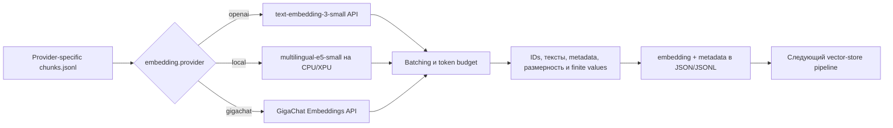

## Стек embeddings

- OpenAI Python SDK - вызов `client.embeddings.create` для `text-embedding-3-small`;
- `langchain-gigachat` - опциональный provider для GigaChat embeddings;
- `transformers` + `torch` - локальный расчёт embeddings для локального сценария;
- локальная embedding-модель `intfloat/multilingual-e5-small`, скачанная в `data/models/hf/multilingual-e5-small`;
- mean pooling по encoder hidden states для локальной модели;
- L2-нормализация vectors для локального cosine search;
- `tiktoken` - контроль token limits и token budget для OpenAI batch;
- `tenacity` - retry/backoff при временных ошибках OpenAI API;
- `numpy` - расчёт нормы и опциональная L2-нормализация vectors;
- Pydantic - строгие схемы `embedding + metadata`;
- Prefect - оркестрация;
- MLflow - параметры, метрики и артефакты запуска.

## Запуск embeddings

Способ расчёта embeddings выбирается конфигом и должен соответствовать модели, которую вы используете в сценарии:

- `config/embeddings_openai.yaml` - OpenAI-вариант: `text-embedding-3-small`, размерность `1536`, нужен `OPENAI_API_KEY`;
- `config/embeddings_local.yaml` - локальный вариант: `multilingual-e5-small`, размерность `384`, OpenAI API не вызывается;
- `config/embeddings_gigachat.yaml` - опциональный GigaChat-вариант: явно задана `Embeddings-2`, размерность `1024`, нужен `GIGACHAT_AUTH_KEY`.

В проекте нет provider-а embeddings по умолчанию: команды `rag-prep chunk`, `rag-prep embed`, `rag-prep vector-store` и `rag-agent` без `--config` завершатся ошибкой. Для `rag-support` путь задаётся через `--config` или `SUPPORT_AGENT_CONFIG`.

OpenAI-вариант:

```powershell
rag-prep embed --config config/embeddings_openai.yaml --no-prefect
```

Локальный вариант перед первым запуском требует скачать embedding-модель:

```powershell
python scripts/download_hf_model.py --model-id intfloat/multilingual-e5-small --local-dir data/models/hf/multilingual-e5-small --dry-run
```

После проверки скачать E5:

```powershell
python scripts/download_hf_model.py --model-id intfloat/multilingual-e5-small --local-dir data/models/hf/multilingual-e5-small
```

Если модель скачана вручную, положите файлы Hugging Face repo в эту же папку:

```text
data/models/hf/multilingual-e5-small
```

Внутри должны быть `config.json`, веса модели (`model.safetensors` или `pytorch_model.bin`) и tokenizer-файлы. После этого повторно скачивать модель не нужно: `config/embeddings_local.yaml` читает её локально через `local_files_only: true`.

Затем локальный расчёт:

```powershell
rag-prep embed --config config/embeddings_local.yaml --no-prefect
```

Перед запуском должен существовать соответствующий JSONL: `data/chunks_openai/chunks.jsonl`, `data/chunks_local/chunks.jsonl` или `data/chunks_gigachat/chunks.jsonl`.

Каждый embeddings-конфиг читает provider-specific набор чанков. Это фиксирует token budget и целевую embedding-модель ещё на этапе чанкинга; при расчёте фактическая модель и provider записываются в metadata embedding-записи.

Через Prefect используются те же конфиги без `--no-prefect`:

```powershell
rag-prep embed --config config/embeddings_openai.yaml
rag-prep embed --config config/embeddings_local.yaml
```

## Конфигурация embeddings

Параметры batch-запуска находятся в `config/embeddings_openai.yaml`, `config/embeddings_local.yaml` или `config/embeddings_gigachat.yaml`. Provider contract берётся из их `rag_profile`:

- `paths.input_jsonl` - входной JSONL с чанками;
- `paths.output_dir` - директория экспорта embeddings;
- `embedding.provider`, `embedding.model`, `embedding.dimensions` - единый контракт из `config/profiles/rag/*.yaml`;
- `embedding.batch_size` - количество чанков в одном batch;
- `embedding.max_batch_tokens` - общий token budget batch;
- `embedding.max_input_tokens` - лимит одного текста;
- `embedding.local_device` - `auto`, `xpu`, `cuda` или `cpu`;
- `embedding.local_dtype` - `auto`, `bf16`, `fp16` или `fp32`;
- `embedding.local_files_only` - не скачивать модель во время расчёта embeddings;
- `embedding.pooling` - стратегия получения одного vector из encoder output;
- `embedding.passage_prefix` и `query_prefix` - префиксы E5-семейства для документов и запросов;
- `embedding.max_retries` и `timeout_seconds` - сетевые guardrails для OpenAI-режима;
- `embedding.normalize` - L2-нормализация vectors;
- `embedding.clear_no_proxy_for_openai` - создаёт OpenAI HTTP-клиент при очищенном `NO_PROXY/no_proxy`, но не меняет эти переменные во время самого API-запроса; это оставляет Prefect доступ к localhost и не ломает маршрут до OpenAI API;
- `embedding.gigachat_scope` - OAuth scope GigaChat, по умолчанию `GIGACHAT_API_PERS`;
- `embedding.gigachat_verify_ssl_certs` - проверка SSL-сертификатов для GigaChat SDK;
- `embedding.gigachat_chars_per_token` - оценка token budget для GigaChat batch без отдельного tokenizer API;
- `embedding.fail_on_validation_error` - останавливать пайплайн при ошибках validation.

## Формат записи embedding

Каждая строка в `embeddings.jsonl` готова к загрузке в vector store:

```json
{
  "text": "...",
  "embedding": [0.0123, -0.0456],
  "metadata": {
    "id": "chunk-id",
    "document_id": "prepared-document-id",
    "source": "absolute/path/to/file",
    "section": "Раздел",
    "position": 0,
    "chunk_token_count": 128,
    "embedding_provider": "openai",
    "embedding_model": "text-embedding-3-small",
    "embedding_dimensions": 1536,
    "embedding_vector_hash": "...",
    "embedding_norm": 1.02,
    "embedding_run_id": "...",
    "lineage": {},
    "hierarchy": {}
  }
}
```

Validation проверяет соответствие количества chunks и embeddings, множества chunk ids,
текста и identity metadata, фактическую и объявленную размерность vectors,
`embedding_provider`, `embedding_model`, `NaN/Infinity`, дубликаты chunk ids, наличие
базовой metadata и превышение token limit. `manifest.json` сохраняет config, counts,
diagnostics, SHA-256/размер каждого артефакта и ссылку на проверенный upstream manifest.
Загрузчик следующего этапа повторно вычисляет hash входного JSONL и останавливается при
подмене или смешении файлов разных запусков.

# Пайплайн vector store для RAG

Четвёртый пайплайн создаёт локальное векторное хранилище, загружает уже готовые embeddings и выполняет smoke-проверку similarity search. Embeddings здесь повторно не считаются.

Выбран **Qdrant**, потому что он даёт полноценную коллекцию с vectors + payload metadata, умеет filtering/search и при этом может работать локально без Docker через embedded storage.

Вход:

- `data/embeddings_openai/embeddings.jsonl` - результат OpenAI embeddings pipeline.

Выход:

- `data/vector_store_openai/manifest.json`
- `data/vector_store_openai/validation.json`
- `data/vector_store_openai/search_results.json`
- `data/qdrant_storage_openai/` - локальное embedded-хранилище Qdrant для OpenAI vectors.

Для локальных embeddings используется отдельный набор путей: `data/vector_store_local/` и `data/qdrant_storage_local/`. Для опциональных GigaChat embeddings используется `data/vector_store_gigachat/` и `data/qdrant_storage_gigachat/`.

Embedded local mode удобен для локальной разработки, но это режим одного процесса. Пайплайн берёт OS-lock на `.rag_prep.lock` внутри выбранного `vector_store.local_storage_path` и остановит второй локальный запуск с понятной ошибкой. Сам файл lock может остаться после аварийного завершения, но блокировка держится операционной системой и освобождается при завершении процесса. Для конкурентных запусков лучше поднять Qdrant server и переключить `vector_store.mode: http`.

## Файлы раздела

| Файл                                             | Назначение                                                                             |
| ------------------------------------------------ | -------------------------------------------------------------------------------------- |
| `config/vector_store_openai.yaml`                | Embedded Qdrant collection и отчёты для OpenAI vectors размерности 1536.               |
| `config/vector_store_local.yaml`                 | Отдельная embedded collection для локальных E5 vectors размерности 384.                |
| `config/vector_store_gigachat.yaml`              | Отдельная collection для GigaChat embedding contract.                                  |
| `config/vector_store_docker_openai.yaml`         | HTTP-подключение indexer-а к Qdrant server и OpenAI embedding input внутри Compose.    |
| `config/vector_store_docker_local.yaml`          | HTTP-подключение indexer-а к Qdrant server для локальных E5 vectors.                   |
| `src/rag_prep/vector_store_cli.py`               | CLI `rag-index`, который индексирует готовые embeddings без остальных offline-этапов.  |
| `src/rag_prep/vector_store_stages/__init__.py`   | Экспортирует стадии Qdrant pipeline.                                                   |
| `src/rag_prep/vector_store_stages/client.py`     | Создаёт embedded/HTTP Qdrant client и защищает local storage межпроцессным lock.       |
| `src/rag_prep/vector_store_stages/loading.py`    | Загружает `EmbeddedChunk` из JSONL.                                                    |
| `src/rag_prep/vector_store_stages/indexing.py`   | Проверяет vectors, создаёт/сверяет collection и выполняет детерминированный upsert.    |
| `src/rag_prep/vector_store_stages/validation.py` | Сверяет count delta, наличие vectors, payload и размерность collection/points.         |
| `src/rag_prep/vector_store_stages/search.py`     | Выполняет smoke similarity search и формирует hits с payload metadata.                 |
| `src/rag_prep/vector_store_stages/metrics.py`    | Агрегирует indexing/validation/search metrics, включая self-match diagnostics.         |
| `src/rag_prep/vector_store_stages/exporting.py`  | Сохраняет manifest, validation и search results.                                       |
| `src/rag_prep/config.py`                         | Содержит `VectorStoreConfig`, mode, distance, collection contract и validation policy. |
| `src/rag_prep/models.py`                         | Содержит модели indexing result, search query/hit/result и validation result.          |
| `src/rag_prep/pipeline.py`                       | Реализует прямой vector-store pipeline с одним клиентом на полный run.                 |
| `src/rag_prep/flow.py`                           | Реализует Prefect orchestration Qdrant stages.                                         |
| `tests/test_qdrant_pipeline.py`                  | Проверяет index/read/search, locks, count direction, sampling и vector validation.     |

## Стек vector store

- `qdrant-client` - создание коллекции, upsert vectors, similarity search;
- Qdrant local mode - локальное хранилище без отдельного сервера;
- Pydantic - схемы результатов indexing/validation/search;
- Prefect - оркестрация;
- MLflow - параметры, метрики и артефакты проверки.

## Запуск vector store

Перед запуском должен существовать JSONL выбранного provider-а, например `data/embeddings_openai/embeddings.jsonl`.

Для OpenAI embeddings используется отдельный provider-конфиг:

```powershell
rag-prep vector-store --config config/vector_store_openai.yaml --no-prefect
```

Для локальных embeddings используется отдельный конфиг:

```powershell
rag-prep vector-store --config config/vector_store_local.yaml --no-prefect
```

Для опциональных GigaChat embeddings используется отдельный конфиг:

```powershell
rag-prep vector-store --config config/vector_store_gigachat.yaml --no-prefect
```

Через Prefect используются те же конфиги без `--no-prefect`:

```powershell
rag-prep vector-store --config config/vector_store_openai.yaml
rag-prep vector-store --config config/vector_store_local.yaml
rag-prep vector-store --config config/vector_store_gigachat.yaml
```

## Конфигурация vector store

Параметры индексации находятся в `config/vector_store_openai.yaml`, `config/vector_store_local.yaml` и `config/vector_store_gigachat.yaml`. Контракт коллекции подставляется из `rag_profile`:

- `paths.input_jsonl` - готовые embeddings;
- `paths.output_dir` - директория отчётов;
- `vector_store.provider` - сейчас `qdrant`, задаётся RAG-профилем;
- `vector_store.mode` - `local` для embedded Qdrant или `http` для внешнего Qdrant server;
- `vector_store.collection_name`, `vector_store.vector_size`, `vector_store.distance`, `vector_store.local_storage_path` - единый vector contract из `config/profiles/rag/*.yaml`;
- `vector_store.recreate_collection` - пересоздавать коллекцию для воспроизводимого запуска; в кодовом дефолте это `false`, а в provider-конфигах учебного локального запуска явно стоит `true`;
- `vector_store.batch_size` - размер upsert batch;
- `vector_store.search_limit` - количество результатов на тестовый запрос;
- `vector_store.test_queries_count` - сколько готовых embeddings использовать как тестовые запросы;
- `vector_store.validation_sample_size` - сколько точек проверить через scroll;
- `vector_store.fail_on_validation_error` - останавливать пайплайн при некорректном индексе.

## Что загружается в Qdrant

Vector сохраняется как Qdrant vector, а payload содержит:

```json
{
  "text": "...",
  "chunk_id": "stable-chunk-id",
  "document_id": "prepared-document-id",
  "source": "absolute/path/to/file",
  "section": "Раздел",
  "position": 0,
  "file_name": "sample.txt",
  "file_type": "txt",
  "embedding_model": "text-embedding-3-small",
  "embedding_provider": "openai",
  "embedding_dimensions": 1536,
  "metadata": {}
}
```

Qdrant point id строится детерминированно как UUID5 от `collection_name + chunk_id`, потому что исходный `metadata.id` не обязан быть UUID. Оригинальный chunk id сохраняется в `payload.chunk_id` и `payload.metadata.id`. Перед upsert pipeline проверяет дубликаты chunk ids и сгенерированных point ids, чтобы случайный повтор не перезаписал точку молча.

## Проверки

Пайплайн проверяет:

- количество points в коллекции совпадает с количеством embeddings;
- направление расхождения counts сохраняется в `count_delta`, `extra_points_count` и `missing_points_count`;
- размерность коллекции и vectors соответствует `vector_size`;
- точки без возвращённого vector считаются отдельно в `missing_vector_count`, а не смешиваются с неправильной размерностью;
- несовпадение размерности коллекции и отдельных point vectors логируется раздельно через `collection_vector_size_mismatch_count` и `point_vector_size_mismatch_count`;
- distance metric соответствует конфигу;
- payload содержит `text`;
- payload содержит полную `metadata`;
- обязательные поля metadata присутствуют;
- ожидаемые point IDs извлекаются с vectors и сверяются с исходным embedding по каждой
  координате; совпадение только ID, payload и размерности не считается достаточным;
- similarity search возвращает результаты;
- для smoke-запросов ближайший результат обычно совпадает с исходным chunk.

`search_results.json` сохраняет тестовые запросы и найденные hits. Это не production retrieval, а базовая проверка корректности записи/чтения индекса перед следующим этапом RAG.

# Интеграция GigaChat

Проект поддерживает GigaChat как отдельный provider для chat-модели агента. Это не меняет уже построенный RAG-индекс: LLM, которая отвечает пользователю, и embedding-модель, которая строит vector store, являются разными компонентами.

Практический сценарий:

1. посчитать embeddings через `config/embeddings_openai.yaml` или `config/embeddings_local.yaml`;
2. загрузить их в Qdrant через `config/vector_store_openai.yaml` или `config/vector_store_local.yaml`;
3. использовать `config/agent_gigachat.yaml` как генеративную модель агента с tools и памятью.

Для работы нужен Authorization key в `.env`:

```powershell
GIGACHAT_AUTH_KEY=...
```

Ключ передаётся в GigaChat SDK как `credentials`, а SDK сам получает и обновляет access token через OAuth. В коде не нужно вручную вызывать `/api/v2/oauth`.

## GigaChat для агента

Конфиг:

```text
config/agent_gigachat.yaml
```

Запуск одноразового запроса:

```powershell
rag-agent --config config/agent_gigachat.yaml --message "Сколько будет 128 * 47? Используй калькулятор."
```

Запуск сценариев MVP-агента:

```powershell
rag-agent --config config/agent_gigachat.yaml --run-scenarios --scenario-report data/agent/scenario_report_gigachat.json
```

В `config/agent_gigachat.yaml` основные параметры:

- `agent.provider: gigachat`;
- `agent.model` - по умолчанию `GigaChat-2`; для более сложных задач можно указать `GigaChat-2-Pro` или `GigaChat-2-Max`;
- `agent.gigachat_auth_key_env` - имя переменной с Authorization key;
- `agent.gigachat_scope` - scope для OAuth, по умолчанию `GIGACHAT_API_PERS`;
- `agent.gigachat_verify_ssl_certs` - проверка SSL-сертификатов SDK;
- `agent.max_new_tokens` - передаётся в GigaChat как `max_tokens`.

LangGraph остаётся тем же: `agent -> tools -> agent`. `langchain-gigachat` поддерживает `bind_tools`, поэтому backend выполняет tools так же, как в OpenAI-варианте: модель выбирает tool call, `ToolNode` исполняет Python-функцию, затем результат возвращается модели.

## GigaChat и готовый vector store

GigaChat chat-модель не требует, чтобы vectors были посчитаны GigaChat embeddings-моделью. Для неё подходят уже подготовленные индексы:

- OpenAI embeddings: `1536` координат, `config/vector_store_openai.yaml`;
- локальные embeddings: `384` координаты, `config/vector_store_local.yaml`.

Размерность vector store важна только для этапа индексации и поиска. Chat-модель получает уже найденный текстовый контекст, поэтому она не зависит от того, были vectors размерности `1536`, `384` или другой.

## Опциональные GigaChat embeddings

Конфиг:

```text
config/embeddings_gigachat.yaml
```

Запуск:

```powershell
rag-prep embed --config config/embeddings_gigachat.yaml --no-prefect
```

Результат пишется отдельно:

```text
data/embeddings_gigachat/
```

Поддерживаемые размерности GigaChat embeddings нужно согласовывать с `embedding.dimensions` и `vector_store.vector_size`:

- `Embeddings` - `1024`;
- `Embeddings-2` - `1024`;
- `EmbeddingsGigaR` - `2560`;
- `Embeddings-3B-2025-09` - `2048`.

Если в `config/embeddings_gigachat.yaml` указана известная модель и неверная размерность, конфиг не загрузится. Это защищает от ситуации, когда embeddings уже посчитаны в одной размерности, а Qdrant-коллекция создана под другую.

После расчёта GigaChat embeddings используется отдельный Qdrant-конфиг:

```powershell
rag-prep vector-store --config config/vector_store_gigachat.yaml --no-prefect
```

Для `Embeddings-2` профиль `config/profiles/rag/gigachat.yaml` связывает `embedding.dimensions: 1024` и `vector_store.vector_size: 1024`. При смене GigaChat embedding-модели обе части контракта меняются в этом одном файле.

## Файлы раздела

| Файл                                                          | Назначение                                                                                        |
| ------------------------------------------------------------- | ------------------------------------------------------------------------------------------------- |
| `config/profiles/agent/gigachat.yaml`                         | Каноническое имя chat-модели и GigaChat provider identity.                                        |
| `config/profiles/rag/gigachat.yaml`                           | Канонический GigaChat embedding/vector contract и проверяемая размерность.                        |
| `config/agent_gigachat.yaml`                                  | Single-agent preset GigaChat с tools, memory и weather settings.                                  |
| `config/embeddings_gigachat.yaml`                             | Batch-запуск GigaChat embeddings.                                                                 |
| `config/vector_store_gigachat.yaml`                           | Embedded Qdrant-индекс под GigaChat vectors.                                                      |
| `config/support_agent_gigachat_openai_embeddings.yaml`        | Host support-agent: GigaChat LLM поверх OpenAI vector store.                                      |
| `config/support_agent_gigachat_local_embeddings.yaml`         | Host support-agent: GigaChat LLM поверх локального E5 vector store.                               |
| `config/support_agent_docker_gigachat_openai_embeddings.yaml` | Та же комбинация в Docker/Qdrant server.                                                          |
| `config/support_agent_docker_gigachat_local_embeddings.yaml`  | Docker-комбинация GigaChat + локальные E5 vectors.                                                |
| `src/agent_app/llm.py`                                        | Создаёт `langchain_gigachat.GigaChat`, передаёт scope/model/retry и очищает значение credentials. |
| `src/rag_prep/embedding_stages/embedding.py`                  | Реализует `GigaChatEmbeddingStage` и batch-вызовы embedding API.                                  |
| `src/rag_prep/config.py`                                      | Проверяет допустимые GigaChat embedding dimensions.                                               |
| `.env.example`                                                | Показывает имя `GIGACHAT_AUTH_KEY`, не содержит рабочего секрета.                                 |

# Модуль агента с tools и памятью

Это модуль LangGraph-агента с tools и полноценной памятью.

## Файлы раздела

| Файл                                                                                | Назначение                                                                                  |
| ----------------------------------------------------------------------------------- | ------------------------------------------------------------------------------------------- |
| `config/agent_openai.yaml`, `config/agent_gigachat.yaml`, `config/agent_local.yaml` | Явные single-agent presets для трёх LLM providers.                                          |
| `src/agent_app/__init__.py`                                                         | Публичная граница пакета агентного приложения.                                              |
| `src/agent_app/config.py`                                                           | Pydantic-конфигурация LLM, memory, tools, RAG, service, security и orchestration.           |
| `src/agent_app/models.py`                                                           | Общие модели memory, agent state/response, trace и tool result.                             |
| `src/agent_app/llm.py`                                                              | Фабрика OpenAI/GigaChat/local Qwen и parser локальных tool calls.                           |
| `src/agent_app/prompts.py`                                                          | System prompt и правила использования памяти/tools/RAG.                                     |
| `src/agent_app/graph.py`                                                            | LangGraph `agent -> tools -> agent`, trace, retry и loop guard.                             |
| `src/agent_app/cli.py`                                                              | CLI `rag-agent`, интерактивный режим, память, scenarios, protocols и orchestration actions. |
| `src/agent_app/cli_formatting.py`                                                   | Форматирует CLI-ответы и диагностические JSON-структуры.                                    |
| `src/agent_app/memory/__init__.py`                                                  | Экспортирует memory API.                                                                    |
| `src/agent_app/memory/short_term.py`                                                | Хранит bounded buffer полных диалоговых ходов текущего процесса.                            |
| `src/agent_app/memory/summary.py`                                                   | Сжимает старую историю и безопасно переживает ошибку summary LLM.                           |
| `src/agent_app/memory/store.py`                                                     | User/session-scoped long-term SQLite CRUD, search, TTL и access statistics.                 |
| `src/agent_app/memory/policy.py`                                                    | Определяет допустимые типы/важность/TTL и запрещает хранение секретов.                      |
| `src/agent_app/tools/__init__.py`                                                   | Экспортирует registry и базовые tools.                                                      |
| `src/agent_app/tools/registry.py`                                                   | Собирает только разрешённые конфигом tools и проверяет allowlist/disabled list.             |
| `src/agent_app/tools/calculator.py`                                                 | Безопасно вычисляет арифметические выражения без `eval`.                                    |
| `src/agent_app/tools/datetime_tool.py`                                              | Возвращает текущую дату/время.                                                              |
| `src/agent_app/tools/weather.py`                                                    | Вызывает OpenWeatherMap через `httpx2` и редактирует ключ в ошибках.                        |
| `src/agent_app/tools/travel.py`                                                     | Считает бюджет поездки и формирует список вещей.                                            |
| `src/agent_app/tools/project.py`                                                    | Реализует проект, задачи, статусы и сводку проектного состояния.                            |
| `src/agent_app/tools/memory_tools.py`                                               | Экспортирует user-scoped CRUD/search operations долговременной памяти.                      |
| `src/agent_app/tools/filesystem.py`                                                 | Ограничивает файловые операции разрешённым workspace и расширениями.                        |
| `src/agent_app/tools/code_runner.py`                                                | Клиент изолированного HTTP code-runner с timeout/output limits.                             |
| `src/agent_app/tools/support.py`                                                    | Инженерные RAG, log analysis, incident и checklist tools.                                   |
| `src/agent_app/tools/mcp_external.py`                                               | Подключает внешние MCP servers с allowlist, timeout и transport lifecycle.                  |
| `tests/test_tools.py`                                                               | Проверяет базовые tools и их registry.                                                      |
| `tests/test_memory_isolation.py`                                                    | Проверяет запрет межпользовательского доступа и session/global scopes.                      |
| `tests/test_summary_memory.py`                                                      | Проверяет целые диалоговые ходы и fallback при ошибке суммаризации.                         |
| `tests/test_agent_loop_guard.py`, `tests/test_agent_tool_retry.py`                  | Проверяют защиту от циклов и разрешённый retry временно упавшего tool.                      |
| `tests/test_filesystem_tools.py`, `tests/test_external_mcp.py`                      | Проверяют sandbox файлов и lifecycle внешних MCP tools.                                     |

## Что реализовано

- LangGraph workflow `agent -> tools -> agent` для OpenAI, GigaChat и локального Qwen backend;
- OpenAI chat-модель `gpt-5.4-nano` через явно выбранный `config/agent_openai.yaml`;
- GigaChat chat-модель через `config/agent_gigachat.yaml`;
- локальный backend `transformers` через `config/agent_local.yaml` для Qwen без OpenAI API;
- Qwen-style tool calling через chat template, XML-теги `<tool_call>` и parser в `AIMessage.tool_calls`;
- tools:
  - `calculator` для точных вычислений;
  - `current_datetime` для текущей даты и времени;
  - `get_weather` для OpenWeatherMap через `httpx2`;
  - `calculate_travel_budget` для расчёта бюджета поездки;
  - `advise_packing` для подбора вещей в поездку;
  - `create_project`, `create_task`, `update_task_status`, `list_project_tasks`, `summarize_project_state` для проектных сценариев;
  - `save_memory`;
  - `search_memory`;
  - `get_memory`;
  - `update_memory`;
  - `delete_memory`;
  - `list_memories`;
  - `clear_session_memory`;
- short-term buffer memory для текущей сессии;
- summary memory для сжатия длинного диалога;
- long-term memory в SQLite;
- сценарии MVP-агента в `config/agent_scenarios.yaml`;
- JSON-отчёт прохождения сценариев;
- CLI-команда `rag-agent`.

## Конфигурация агента

Параметры OpenAI-агента находятся в `config/agent_openai.yaml`; GigaChat и локальная модель используют отдельные provider-конфиги:

- `agent.provider` - `openai`, `gigachat` или `local`;
- `agent.model` - модель агента или путь к локальной модели;
- `agent.adapter_path` - необязательный путь к LoRA adapter для локального backend;
- `agent.temperature` - температура генерации;
- `agent.max_new_tokens` - лимит ответа локальной модели;
- `agent.gigachat_auth_key_env`, `gigachat_scope`, `gigachat_verify_ssl_certs` - параметры GigaChat provider;
- `agent.max_history_messages` - максимальный размер short-term buffer; при переполнении история делится только на границе полного хода `user -> assistant`;
- `agent.max_summary_chars` - ограничение summary memory;
- `agent.tool_error_retries` - количество повторов identical tool call после ошибочного результата, по умолчанию `1`;
- `memory.sqlite_path` - SQLite-файл долговременной памяти;
- `memory.default_user_id` и `default_session_id`; global-записи с `session_id=null` и записи конкретных сессий хранятся в независимых scope;
- `weather.api_key_env` - имя переменной окружения с OpenWeatherMap API-ключом;
- `weather.default_city`;
- `weather.default_units`.

В `.env` должны быть:

```powershell
OPENAI_API_KEY=...
OPENWEATHER_API_KEY=...
GIGACHAT_AUTH_KEY=...
HF_TOKEN=hf_...
```

Пример без секретов лежит в `.env.example`.

Tool `save_memory` создаёт global-запись пользователя с `session_id=null`, поэтому сохранённый факт, предпочтение или задача доступны через `search_memory` в следующих сессиях того же пользователя. Session-scoped записи используются для summary и внутреннего контекста конкретного диалога. Операция `clear_session_memory` удаляет только второй тип и намеренно сохраняет долговременные global-записи.

## Запуск агента

Одноразовый запрос:

```powershell
rag-agent --config config/agent_openai.yaml --message "Сколько будет 128 * 47?"
```

Локальный вызов Qwen без OpenAI API:

```powershell
rag-agent --config config/agent_local.yaml --message "Кратко объясни, зачем нужен LoRA adapter."
```

Локальный вызов Qwen с tool:

```powershell
rag-agent --config config/agent_local.yaml --message "Сколько будет 128 * 47? Используй калькулятор."
```

Вызов GigaChat с tool:

```powershell
rag-agent --config config/agent_gigachat.yaml --message "Сколько будет 128 * 47? Используй калькулятор."
```

В `config/agent_local.yaml` можно указать уже обученный adapter:

```yaml
agent:
  adapter_path: data/models/lora/<run_id>
```

Локальный backend использует `transformers.apply_chat_template(..., tools=...)`, парсит `<tool_call>{...}</tool_call>`, передаёт вызов в LangGraph `ToolNode`, а затем возвращает результат модели через `<tool_response>`. Для Qwen2.5-1.5B-Instruct это рабочий учебный режим, но он менее надёжен, чем OpenAI function calling или более крупные Qwen-модели: маленькая модель может ошибаться в выборе tool, аргументах или финальной формулировке.

Интерактивный режим:

```powershell
rag-agent --config config/agent_openai.yaml
```

Выбрать область пользователя и сессии:

```powershell
rag-agent --user-id default --session-id lesson-1 --message "Запомни, что мой проект называется RAG Engineer Assistant"
```

Посмотреть память:

```powershell
rag-agent --list-memory
```

Очистить память текущей сессии:

```powershell
rag-agent --clear-session-memory
```

# MVP-агент: сценарии и проверка поведения

MVP-слой показывает не просто одиночный ответ LLM, а воспроизводимое поведение агента:

1. сценарий задаёт цель, пользовательский запрос и ожидаемый результат;
2. `test_case_id` связывает сценарий и каждый шаг с конкретным тест-кейсом;
3. шаги сценария фиксируют цепочку действий;
4. поля `llm_role`, `tools_role` и `memory_role` объясняют роли компонентов;
5. `action_chain`, `decision_points` и `transition_rules` описывают сценарную логику;
6. agent trace показывает стартовое состояние, tool calls, tool results, изменения памяти и финальное состояние;
7. evaluator проверяет критерии прохождения;
8. результат сохраняется в JSON-отчёт.

## Файлы раздела

| Файл                                   | Назначение                                                                                   |
| -------------------------------------- | -------------------------------------------------------------------------------------------- |
| `config/agent_scenarios.yaml`          | Цели, типы, шаги, test-case IDs, ожидаемые tools/memory и критерии MVP-сценариев.            |
| `src/agent_app/scenarios/__init__.py`  | Экспортирует scenario loading/runner API.                                                    |
| `src/agent_app/scenarios/models.py`    | Pydantic-контракты suite, scenario, step, criteria, checks и итогового отчёта.               |
| `src/agent_app/scenarios/loading.py`   | Загружает и валидирует YAML suite.                                                           |
| `src/agent_app/scenarios/evaluator.py` | Детерминированно проверяет текст, tools, trace, memory и loop-guard критерии.                |
| `src/agent_app/scenarios/runner.py`    | Повторно использует LLM/RAG между сценариями, изолирует user/session и формирует результаты. |
| `src/agent_app/graph.py`               | Производит исполняемый trace состояний, tool calls/results и изменения памяти.               |
| `src/agent_app/cli.py`                 | Реализует `--run-scenario`, `--run-scenarios`, JSON-отчёт и корректный exit code.            |
| `tests/test_agent_cli.py`              | Проверяет CLI-маршрутизацию и коды завершения.                                               |
| `tests/test_empty_scenarios.py`        | Не позволяет пустому suite считаться успешно пройденным.                                     |
| `tests/test_scenario_model_reuse.py`   | Проверяет повторное использование одной локальной модели без XPU OOM.                        |
| `tests/test_agent_loop_guard.py`       | Проверяет отдельный ошибочный сценарий зацикливания.                                         |

Типы сценариев:

- `main` - основной рабочий сценарий;
- `alternative` - сценарий с неполными данными и допущениями;
- `error` - ошибочный сценарий, например попытка сохранить секрет;
- `recovery` - восстановление контекста из долговременной памяти;
- `tool_failure` - корректная обработка ошибки внешнего tool;
- `loop_guard` - проверка защиты от повторяющихся tool-вызовов.

Запустить все сценарии:

```powershell
rag-agent --config config/agent_openai.yaml --run-scenarios
```

Запустить один сценарий:

```powershell
rag-agent --config config/agent_openai.yaml --run-scenario project_manager
```

Сохранить отчёт в явный путь:

```powershell
rag-agent --config config/agent_openai.yaml --run-scenarios --scenario-report data/agent/scenario_report.json
```

Получить полный JSON в консоли:

```powershell
rag-agent --config config/agent_openai.yaml --run-scenario travel_planning --json
```

Проверить сценарий защиты от циклов:

```powershell
rag-agent --config config/agent_openai.yaml --run-scenario tool_loop_guard --scenario-report data/agent/scenario_report_loop_guard.json
```

В отчёте для каждого шага сохраняются:

- `test_case_id`;
- финальный ответ агента;
- вызванные tools;
- результаты tools;
- стартовое, промежуточные и финальное состояния;
- флаг `loop_guard_triggered`, если агент остановил повторяющийся tool loop;
- правила переходов и точки принятия решений;
- созданные, обновлённые и удалённые записи памяти;
- список checks с `passed=true/false`.

Сценарий считается пройденным, если прошли все step-level checks и scenario-level checks: ожидаемые tools были вызваны, запрещённые tools не использовались, нужные записи памяти появились, секреты не сохранились, а агент завершил ответ без зацикливания.

Команда возвращает exit code `0`, только если весь выбранный набор сценариев прошёл. При `failed` возвращается `1`, поэтому результат можно напрямую использовать в CI.

Связь сценариев с тест-кейсами:

- `TC-MVP-001` - основной сценарий планирования поездки;
- `TC-MVP-002` - альтернативный сценарий с неполными данными;
- `TC-MVP-003` - ошибочный сценарий с попыткой сохранить секрет;
- `TC-MVP-004` - основной сценарий project manager;
- `TC-MVP-005` - восстановление контекста из long-term memory;
- `TC-MVP-006` - fallback при ошибке внешнего weather tool;
- `TC-MVP-007` - защита от повторяющегося tool loop.

Отладка сценариев:

- если сценарий `failed`, сначала открыть `data/agent/scenario_report.json`;
- проверить failed checks внутри `step_results[].checks`;
- сверить `response.tool_calls` с `expected_tools` и `forbidden_tools`;
- посмотреть `response.trace.tool_results`, чтобы увидеть ошибку tool;
- посмотреть `response.trace.memory_created_ids`, `memory_updated_ids` и `memory_deleted_ids`;
- скорректировать либо критерии в `config/agent_scenarios.yaml`, либо поведение tools/graph в `src/agent_app/`.

Типовые сбои, которые уже покрыты кодом:

- попытка сохранить API-ключ останавливается secret guardrail до LLM/tools;
- ошибка weather API попадает в tool result и допускается только в сценарии `tool_failure`;
- `agent.recursion_limit` ограничивает переходы `agent -> tools -> agent`;
- после ошибочного tool result допускается не более `agent.tool_error_retries` повторов с теми же аргументами;
- после успешного результата или исчерпания retry loop guard останавливает identical tool call и закрывает отменённый вызов результатом `status=cancelled`;
- ошибка LLM-вызова summary memory не отменяет уже готовый ответ; short-term history обрезается до последних полных ходов;
- один LLM backend переиспользуется во всём наборе сценариев, поэтому локальная модель не загружается в XPU повторно для каждого кейса;
- `ScenarioRunner` ловит исключение шага и записывает failed check вместо аварийного обрыва всего запуска.

Deterministic проверка loop guard без реальных API-вызовов:

```powershell
python -m unittest discover -s tests -v
```

## Проверочные запросы

```text
Сколько будет 128 * 47?
```

```text
Какая сегодня дата?
```

```text
Какая погода в Екатеринбурге?
```

```text
Запомни, что мой проект называется RAG Engineer Assistant.
```

```text
Как называется мой проект?
```

```text
Что ты обо мне помнишь?
```

```text
Обнови название моего проекта на Engineer Support Agent.
```

```text
Забудь название моего проекта.
```

# LoRA/QLoRA/PEFT fine-tuning локальной LLM

Этот модуль готовит воспроизводимый fine-tuning локальной LLM через PEFT.

Основная модель для основного запуска:

- Hugging Face ID: `Qwen/Qwen2.5-1.5B-Instruct`;
- локальный путь после скачивания: `data/models/hf/Qwen2.5-1.5B-Instruct`;
- fallback для быстрых проверок: `Qwen/Qwen2.5-0.5B-Instruct`.

Для Intel(R) Arc(TM) 140T GPU 16GB базовый режим - `LoRA` через `torch.xpu`. QLoRA оставлен как опциональный режим, но не включён по умолчанию: 4-bit режимы через `bitsandbytes` исторически сильнее завязаны на CUDA, поэтому для Intel Arc надёжнее начинать с обычного LoRA, маленького batch size и gradient accumulation.

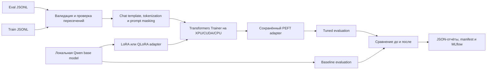

## Выбор метода

Критерии выбора:

- размер модели: чем больше base model, тем сильнее давление на память GPU/CPU;
- доступная память: на Intel Arc 140T 16GB безопаснее начинать с 0.5B-1.5B модели;
- требования к качеству: большая модель обычно даёт лучший baseline, но медленнее обучается;
- скорость итераций: для учебных запусков важнее быстрый цикл `данные -> обучение -> отчёт`, чем максимальный размер модели.

LoRA:

- базовая модель загружается в обычной точности `bf16`/`fp16`/`fp32`;
- обучаются только adapter-веса;
- режим проще и надёжнее для Intel Arc/XPU;
- выбран по умолчанию.

QLoRA:

- базовая модель загружается в 4-bit quantized режиме;
- экономит память, но добавляет зависимость от 4-bit backend;
- полезен для более крупных моделей при ограниченной памяти;
- в этом проекте включается только явно через `peft.method: qlora` и заранее проверяет поддержку.

## Что реализовано

- отдельный пакет `src/llm_tuning/`;
- конфиг `config/fine_tuning.yaml`;
- русскоязычные train/eval JSONL-датасеты в `data/fine_tuning/`;
- проверка датасета и пересечения train/eval id;
- auto-device выбор `xpu` / `cuda` / `cpu`;
- загрузка tokenizer и causal LM через `transformers`;
- PEFT LoRA adapter через `peft`;
- QLoRA-ветка с явной проверкой доступности;
- supervised chat tokenization с masking prompt-токенов через `-100`;
- запуск fine-tuning через `Trainer`;
- baseline evaluation до обучения;
- evaluation после обучения;
- сравнение baseline/tuned отчётов;
- сохранение adapter-а, manifest и JSON-отчётов;
- MLflow-логирование параметров, метрик и артефактов;
- CLI-команда `llm-tune`.

## Файлы раздела

| Файл                                         | Назначение                                                                                              |
| -------------------------------------------- | ------------------------------------------------------------------------------------------------------- |
| `config/fine_tuning.yaml`                    | Основной Qwen/LoRA preset: модель, PEFT, training arguments, datasets, checkpoints, reports и MLflow.   |
| `config/fine_tuning_smoke.yaml`              | Малый воспроизводимый preset для быстрой проверки pipeline.                                             |
| `data/fine_tuning/train.jsonl`               | Русскоязычные supervised chat-примеры обучения.                                                         |
| `data/fine_tuning/eval.jsonl`                | Непересекающиеся примеры baseline/tuned оценки.                                                         |
| `src/llm_tuning/__init__.py`                 | Публичная граница fine-tuning пакета.                                                                   |
| `src/llm_tuning/models.py`                   | Pydantic-модели датасета, environment report, generation, metrics, comparison и run artifacts.          |
| `src/llm_tuning/config.py`                   | Загружает YAML/.env, валидирует LoRA/QLoRA и разрешает local/fallback model paths относительно проекта. |
| `src/llm_tuning/dataset.py`                  | Читает JSONL, проверяет schema/IDs и отсутствие пересечения train/eval.                                 |
| `src/llm_tuning/device.py`                   | Выбирает XPU/CUDA/CPU, dtype и собирает диагностический environment report.                             |
| `src/llm_tuning/modeling.py`                 | Загружает tokenizer/base model, fallback model и подключает PEFT adapter/quantization.                  |
| `src/llm_tuning/tokenization.py`             | Применяет chat template, truncation и masking prompt tokens через `-100`.                               |
| `src/llm_tuning/training.py`                 | Создаёт Transformers `Trainer`, callbacks, checkpoints и запускает fine-tuning.                         |
| `src/llm_tuning/generation.py`               | Единообразно генерирует ответы base и adapter-моделей.                                                  |
| `src/llm_tuning/evaluation.py`               | Считает eval loss/perplexity и проверяемый pass rate на фиксированных примерах.                         |
| `src/llm_tuning/metrics.py`                  | Извлекает train/eval metrics и log history из Trainer output.                                           |
| `src/llm_tuning/comparison.py`               | Сравнивает baseline/tuned только по общим example IDs и отмечает improvements/regressions.              |
| `src/llm_tuning/exporting.py`                | Пишет run-scoped baseline/tuned/comparison/manifest без перезаписи прошлых запусков.                    |
| `src/llm_tuning/pipeline.py`                 | ООП-фасад validate/baseline/train/evaluate/compare и MLflow lifecycle.                                  |
| `src/llm_tuning/cli.py`                      | CLI `llm-tune` для inspect, validate, baseline, train, evaluate и compare.                              |
| `scripts/download_hf_model.py`               | Скачивает любую Qwen/E5 модель с `HF_TOKEN` по явным аргументам без hardcode.                           |
| `tests/test_fine_tuning_model_resolution.py` | Проверяет project-relative model/fallback paths из другого CWD.                                         |
| `tests/test_fine_tuning_reports.py`          | Проверяет run-scoped экспорт и сравнение совместимых наборов примеров.                                  |
| `tests/test_download_hf_model.py`            | Проверяет единый CLI скачивания и dry-run.                                                              |

## Установка зависимостей

Проект рассчитан на глобальное окружение Python без отдельного venv:

```powershell
python -m pip install --upgrade -r requirements.txt
python -m pip install -e . --no-deps
```

Проверить окружение:

```powershell
python -m pip check
```

Если `torch.xpu.is_available()` возвращает `False`, нужно проверить установленную сборку PyTorch для Intel GPU и драйвер Intel Arc. На CPU модуль тоже запускается, но обучение будет заметно медленнее.

Для Intel Arc нужна XPU-сборка PyTorch. По официальной документации PyTorch для Intel GPU, после установки драйвера Intel GPU stable wheel ставится так:

```powershell
python -m pip install --upgrade torch torchvision torchaudio --index-url https://download.pytorch.org/whl/xpu
```

Проверка XPU:

```powershell
python -c "import torch; print(torch.__version__); print(torch.xpu.is_available())"
```

Если вывод `False`, обучение пойдёт на CPU. Это не ошибка кода fine-tuning, а признак того, что в текущем глобальном Python установлена CPU-сборка PyTorch или не готов драйвер Intel GPU.

Если Hugging Face зависает на Xet/CAS-загрузке больших файлов, в конфиге можно оставить:

```yaml
model:
  hub_disable_xet: true
  hub_disable_symlink_warning: true
```

Это переводит загрузку в более предсказуемый режим для локального учебного запуска.

## Команды без запуска обучения

Проверить датасет и выбранное устройство:

```powershell
llm-tune --config config/fine_tuning.yaml validate-data
```

Проверить только окружение:

```powershell
llm-tune --config config/fine_tuning.yaml inspect-env
```

Эти команды не загружают модель для обучения и не запускают fine-tuning.

Для быстрой проверки всего кода без скачивания большой instruct-модели есть smoke-конфиг:

```powershell
llm-tune --config config/fine_tuning_smoke.yaml train
```

Он использует `sshleifer/tiny-gpt2`, делает 2 training steps, сохраняет LoRA adapter, baseline/tuned reports, comparison и MLflow run. Этот режим проверяет работоспособность pipeline, но не предназначен для оценки качества русскоязычной модели.

## Скачивание локальной модели

Перед обучением основной модели можно заранее скачать `Qwen/Qwen2.5-1.5B-Instruct`. Команды выполняются из корня проекта:

```powershell
cd C:\Users\user\Desktop\rag
```

Проверить доступ к Hugging Face без скачивания весов:

```powershell
python scripts/download_hf_model.py --model-id Qwen/Qwen2.5-1.5B-Instruct --local-dir data/models/hf/Qwen2.5-1.5B-Instruct --dry-run
```

Скачать модель:

```powershell
python scripts/download_hf_model.py --model-id Qwen/Qwen2.5-1.5B-Instruct --local-dir data/models/hf/Qwen2.5-1.5B-Instruct
```

Скрипт не содержит модели или папки по умолчанию: `--model-id` и `--local-dir` обязательны для Qwen, E5 и любой другой Hugging Face модели. Он читает `HF_TOKEN` из `.env`, отключает Xet-загрузчик Hugging Face и сохраняет модель в указанную папку:

```text
data/models/hf/Qwen2.5-1.5B-Instruct
```

Если `Qwen/Qwen2.5-1.5B-Instruct` уже скачана вручную, структура такая же: файлы repo должны лежать в `data/models/hf/Qwen2.5-1.5B-Instruct`. Скрипт скачивания в этом случае запускать не нужно.

Основной `config/fine_tuning.yaml` уже настроен на локальную папку:

```yaml
model:
  model_id: data/models/hf/Qwen2.5-1.5B-Instruct
```

Локальные `model_id`, `tokenizer_id`, `fallback_model_id` и
`training.resume_from_checkpoint` разрешаются относительно корня проекта,
определённого по расположению YAML-конфига. Поэтому `llm-tune` можно запускать из
другого рабочего каталога, передав абсолютный путь к `config/fine_tuning.yaml`. Если
загрузка основной модели переключилась на fallback, tokenizer загружается из того же
фактического model ID: веса и словарь не могут незаметно относиться к разным моделям.

Если нужно брать модель напрямую с Hugging Face Hub, можно временно заменить это значение на:

```yaml
model:
  model_id: Qwen/Qwen2.5-1.5B-Instruct
```

## Локальный вызов модели

Проверить базовую локальную модель без OpenAI API:

```powershell
llm-tune --config config/fine_tuning.yaml generate --prompt "Кратко объясни, зачем нужен LoRA adapter." --max-new-tokens 80
```

Проверить ту же модель с обученным LoRA adapter:

```powershell
llm-tune --config config/fine_tuning.yaml generate --prompt "Кратко объясни, зачем нужен LoRA adapter." --adapter-path data/models/lora/<run_id> --max-new-tokens 80
```

Эта команда не запускает обучение. Она загружает локальную модель из `data/models/hf/Qwen2.5-1.5B-Instruct`, при необходимости подключает adapter и возвращает один JSON-ответ.

## Baseline, обучение и оценка

Снять baseline на базовой модели без обучения:

```powershell
llm-tune --config config/fine_tuning.yaml baseline
```

Запустить LoRA fine-tuning:

```powershell
llm-tune --config config/fine_tuning.yaml train
```

Команда `train` при текущем конфиге:

1. валидирует train/eval датасеты;
2. снимает baseline до обучения;
3. запускает LoRA fine-tuning;
4. сохраняет adapter в `data/models/lora/<run_id>/`;
5. оценивает adapter на том же eval-наборе;
6. сравнивает baseline и tuned-ответы;
7. пишет отчёты в `data/fine_tuning/reports/<run_id>/`, не перезаписывая результаты других запусков;
8. логирует параметры и метрики в MLflow.

Оценить уже обученный adapter отдельно:

```powershell
llm-tune --config config/fine_tuning.yaml evaluate --adapter-path data/models/lora/<run_id>
```

Сравнить два готовых отчёта:

```powershell
llm-tune --config config/fine_tuning.yaml compare --baseline-report data/fine_tuning/reports/<run_id>/baseline_report.json --tuned-report data/fine_tuning/reports/<run_id>/tuned_report.json
```

Оба пути для `compare` задаются явно. Метрики сравнения вычисляются только по общим `example_id`; отчёты без общих примеров отклоняются как несопоставимые.

## Ключевые параметры

- `model.model_id` - базовая локальная модель;
- `model.fallback_model_id` - резервная локальная или Hub-модель, которая используется, если основную модель невозможно загрузить; в отчётах сохраняется фактически загруженный `model_id`;
- `model.device` - `auto`, `xpu`, `cuda` или `cpu`;
- `model.dtype` - `auto`, `bf16`, `fp16` или `fp32`;
- `model.max_seq_length` - максимальная длина обучающего примера;
- `model.hub_disable_xet` - отключение Xet-загрузчика Hugging Face для более стабильного локального скачивания;
- `peft.method` - `lora` или `qlora`;
- `peft.r`, `lora_alpha`, `lora_dropout` - параметры LoRA;
- `peft.target_modules` - слои, куда вставляется adapter;
- `training.learning_rate` - learning rate;
- `training.per_device_train_batch_size` - batch size на устройство;
- `training.gradient_accumulation_steps` - накопление градиента;
- `training.num_train_epochs` - число эпох;
- `training.eval_strategy`, `save_strategy` - частота оценки и чекпоинтов.

Практический подход к настройке:

- если модель переобучается, уменьшить `learning_rate`, число эпох или увеличить dropout;
- если модель недообучается, увеличить число эпох, `r` или аккуратно поднять `learning_rate`;
- если не хватает памяти, уменьшить `per_device_train_batch_size`, `max_seq_length` или перейти на fallback-модель;
- если обучение нестабильно, снизить `learning_rate` и оставить `gradient_accumulation_steps` больше 1;
- каждую итерацию фиксировать в YAML-конфиге и MLflow, чтобы можно было сравнить runs.

## Метрики и выводы

В отчётах фиксируются:

- `train_loss`;
- `eval_loss`;
- `perplexity`;
- `pass_rate` по проверочным критериям;
- `log_history` с динамикой train/eval метрик;
- ответы baseline и tuned-модели;
- примеры, где качество улучшилось;
- примеры с регрессией;
- итоговый текстовый вывод.

Это позволяет сравнивать поведение модели до/после на одинаковых запросах, а не оценивать fine-tuning только по субъективному впечатлению.

# ИИ-агент поддержки инженера

Итоговый модуль объединяет существующие LLM, online RAG, Qdrant, tools и память в воспроизводимый FastAPI-сервис. Offline-пайплайны подготовки, chunking и document embeddings остаются отдельными: сервис читает уже построенную коллекцию и рассчитывает только один query embedding для каждого поискового запроса.

## Файлы раздела

| Файл                                                                        | Назначение                                                                                                                                                      |
| --------------------------------------------------------------------------- | --------------------------------------------------------------------------------------------------------------------------------------------------------------- |
| `src/agent_app/service/__init__.py`                                         | Экспортирует фабрику FastAPI-приложения.                                                                                                                        |
| `src/agent_app/service/app.py`                                              | Создаёт routes, lifespan, Swagger/OpenAPI, health/readiness, metrics, auth, guardrails и API multi-agent/orchestration.                                         |
| `src/agent_app/service/runtime.py`                                          | Управляет session cache, shared RAG/LLM resources и жизненным циклом `AgentRunner`.                                                                             |
| `src/agent_app/service/schemas.py`                                          | Request/response модели chat, SSE, memory, incidents, reviews и orchestration API.                                                                              |
| `src/agent_app/service/auth.py`                                             | API key/JWT authentication, role mapping, RBAC и user-scope enforcement.                                                                                        |
| `src/agent_app/service/rate_limit.py`                                       | Реализует user-scoped token bucket для прямых LLM/A2A/MCP-вызовов.                                                                                              |
| `src/agent_app/service/cli.py`                                              | CLI `rag-support`, выбор конфига и запуск Uvicorn.                                                                                                              |
| `src/agent_app/rag/__init__.py`                                             | Экспортирует online RAG API.                                                                                                                                    |
| `src/agent_app/rag/models.py`                                               | Модели citations, retrieval result и context item.                                                                                                              |
| `src/agent_app/rag/retriever.py`                                            | Считает query embedding и выполняет Qdrant search с provider-compatible vector size.                                                                            |
| `src/agent_app/rag/context.py`                                              | Упаковывает найденные фрагменты в ограниченный token budget и формирует citations.                                                                              |
| `src/agent_app/rag/runtime.py`                                              | Владеет embedding provider/Qdrant client и объединяет retrieval с context packing.                                                                              |
| `src/agent_app/support/__init__.py`                                         | Экспортирует support storage/security helpers.                                                                                                                  |
| `src/agent_app/support/incidents.py`                                        | User-scoped SQLite CRUD инженерных инцидентов.                                                                                                                  |
| `src/agent_app/support/security.py`                                         | Редактирует секреты и опасные значения в support data.                                                                                                          |
| `src/agent_app/tools/support.py`                                            | Knowledge-base search, runbook, log analysis, incident operations и diagnostic checklist tools.                                                                 |
| `src/code_runner/__init__.py`                                               | Публичная граница изолированного code-runner.                                                                                                                   |
| `src/code_runner/app.py`                                                    | Ограниченный FastAPI endpoint с предварительной AST-политикой, отдельным subprocess, timeout и OS resource limits.                                              |
| `src/code_runner/sandbox.py`                                                | Исполняет RestrictedPython bytecode с явным allowlist builtins и безопасными proxy модулей без транзитивных атрибутов.                                          |
| `src/code_runner/cli.py`                                                    | CLI `rag-code-runner` для запуска отдельного сервиса.                                                                                                           |
| `Dockerfile`                                                                | Собирает support-agent/indexer/orchestration worker image.                                                                                                      |
| `Dockerfile.code-runner`                                                    | Собирает минимальный непривилегированный read-only code-runner image.                                                                                           |
| `docker-compose.yaml`                                                       | Связывает support API, Qdrant, indexer, code runner и дополнительные orchestration/observability/BPMN profiles.                                                 |
| `scripts/rebuild_docker.ps1`                                                | Пересобирает единый Docker release, принудительно пересоздаёт сервисы, синхронизирует credentials RabbitMQ/Grafana с `.env` и сверяет image digest API/workers. |
| `requirements-service.txt`                                                  | Фиксирует совместимый минимальный набор зависимостей контейнерного сервиса.                                                                                     |
| `config/support_agent_openai.yaml`                                          | Host: OpenAI chat + OpenAI query embeddings + embedded Qdrant.                                                                                                  |
| `config/support_agent_gigachat_openai_embeddings.yaml`                      | Host: GigaChat chat + OpenAI query embeddings.                                                                                                                  |
| `config/support_agent_gigachat_local_embeddings.yaml`                       | Host: GigaChat chat + локальные E5 query embeddings.                                                                                                            |
| `config/support_agent_local.yaml`                                           | Host: локальная Qwen/LoRA + локальные E5 query embeddings.                                                                                                      |
| `config/support_agent_docker_openai.yaml`                                   | Docker: OpenAI chat/embeddings + Qdrant server.                                                                                                                 |
| `config/support_agent_docker_gigachat_openai_embeddings.yaml`               | Docker: GigaChat chat + OpenAI query embeddings.                                                                                                                |
| `config/support_agent_docker_gigachat_local_embeddings.yaml`                | Docker: GigaChat chat + local E5 query embeddings.                                                                                                              |
| `config/support_agent_docker_local.yaml`                                    | Docker: local Qwen + local E5, рассчитанный прежде всего на CPU.                                                                                                |
| `config/support_agent_docker_openai_observability.yaml`                     | OpenAI Docker preset с OTLP/structured logs.                                                                                                                    |
| `config/support_agent_docker_gigachat_openai_embeddings_observability.yaml` | GigaChat/OpenAI-embedding preset с observability.                                                                                                               |
| `config/support_agent_docker_gigachat_local_embeddings_observability.yaml`  | GigaChat/local-embedding preset с observability.                                                                                                                |
| `config/support_agent_docker_local_observability.yaml`                      | Local/local preset с observability.                                                                                                                             |
| `config/support_agent_docker_openai_smoke.yaml`                             | CI preset без RAG/LLM API-вызовов для контейнерного smoke test.                                                                                                 |
| `config/support_scenarios.yaml`                                             | Основные, альтернативные, recovery и error кейсы итогового support-агента.                                                                                      |
| `tests/test_online_rag.py`                                                  | Проверяет query retrieval, context limits, citations и provider compatibility.                                                                                  |
| `tests/test_support_agent.py`                                               | Проверяет инженерные tools, memory и RAG-поведение агента.                                                                                                      |
| `tests/test_support_configs.py`                                             | Загружает все host/Docker/composed presets и проверяет их контракты.                                                                                            |
| `tests/test_support_service.py`                                             | Проверяет HTTP routes, SSE, lifecycle, sessions и readiness.                                                                                                    |
| `tests/test_code_runner.py`                                                 | Проверяет auth, AST restrictions, timeout и output limits изолированного runner.                                                                                |

## Архитектура support-сервиса

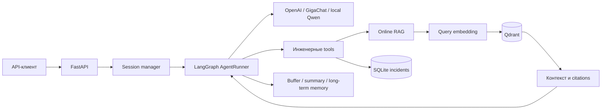

## Требования и критерии готовности

Функциональные требования:

- агент отвечает на инженерные запросы, использует LLM для выбора действий и формирования ответа;
- технические сведения извлекаются online из Qdrant и сопровождаются `source`, `section`, `chunk_id` и score;
- tools выполняют поиск документации, анализ логов, формирование чек-листа и операции с инцидентами;
- buffer, summary и long-term memory сохраняют контекст диалога и изолируют данные по `user_id`;
- API поддерживает обычный запрос, SSE, просмотр и очистку сессии, health/readiness и Prometheus metrics;
- Docker Compose воспроизводимо запускает Qdrant, индексатор готовых embeddings и support-сервис.

Системные требования и допущения:

- локальный запуск требует Python 3.13, установленных зависимостей и заранее построенной коллекции Qdrant;
- Docker-сценарий требует Docker Compose, `SUPPORT_SERVICE_API_KEY` и provider-ключи выбранного preset-а в `.env`;
- document embeddings повторно не рассчитываются при запуске агента, но query embedding должен быть создан той же embedding-моделью и иметь ту же размерность;
- SQLite и in-process session cache рассчитаны на один worker; горизонтальное масштабирование требует общего хранилища;
- `user_id` считается проверенным внешним gateway, а доступ к произвольному shell отсутствует.

Критерии готовности:

- `/health` и `/ready` возвращают HTTP 200 после deploy;
- основной RAG-сценарий возвращает содержательный ответ без служебной разметки tool call и с citations;
- запрос по отсутствующей сущности получает retrieval status `empty`, не содержит нерелевантных citations и не приводит к выдуманному ответу;
- основной, альтернативный, recovery и ошибочный сценарии проходят зафиксированные критерии;
- память и Qdrant сохраняются после перезапуска контейнеров;
- unit/integration-тесты, Ruff, проверка форматирования и Docker Compose завершаются успешно.

## Совместимость моделей

Chat LLM и embedding-модель выбираются независимо. Смена LLM не требует повторного расчёта document embeddings.

| Chat LLM                  | Query embeddings         | Коллекция Qdrant                    |
| ------------------------- | ------------------------ | ----------------------------------- |
| OpenAI                    | `text-embedding-3-small` | OpenAI vectors, 1536 координат      |
| GigaChat                  | `text-embedding-3-small` | та же OpenAI-коллекция              |
| GigaChat                  | `multilingual-e5-small`  | локальная коллекция, 384 координаты |
| Local Qwen / LoRA adapter | `multilingual-e5-small`  | локальная коллекция, 384 координаты |
| Local Qwen / LoRA adapter | `text-embedding-3-small` | OpenAI-коллекция                    |

Готовые support-presets:

| Конфиг                                                 | Chat LLM              | Query embeddings  | Qdrant                       | Нужные внешние ключи                                             |
| ------------------------------------------------------ | --------------------- | ----------------- | ---------------------------- | ---------------------------------------------------------------- |
| `support_agent_openai.yaml`                            | OpenAI                | OpenAI, 1536      | embedded `rag_chunks_openai` | `OPENAI_API_KEY`                                                 |
| `support_agent_gigachat_openai_embeddings.yaml`        | GigaChat              | OpenAI, 1536      | embedded `rag_chunks_openai` | `GIGACHAT_AUTH_KEY`, `OPENAI_API_KEY`                            |
| `support_agent_gigachat_local_embeddings.yaml`         | GigaChat              | локальный E5, 384 | embedded `rag_chunks_local`  | `GIGACHAT_AUTH_KEY`                                              |
| `support_agent_local.yaml`                             | локальный Qwen        | локальный E5, 384 | embedded `rag_chunks_local`  | не нужны во время inference                                      |
| `support_agent_docker_openai.yaml`                     | OpenAI                | OpenAI, 1536      | Qdrant server                | `OPENAI_API_KEY`, `SUPPORT_SERVICE_API_KEY`                      |
| `support_agent_docker_gigachat_openai_embeddings.yaml` | GigaChat              | OpenAI, 1536      | Qdrant server                | `GIGACHAT_AUTH_KEY`, `OPENAI_API_KEY`, `SUPPORT_SERVICE_API_KEY` |
| `support_agent_docker_gigachat_local_embeddings.yaml`  | GigaChat              | локальный E5, 384 | Qdrant server                | `GIGACHAT_AUTH_KEY`, `SUPPORT_SERVICE_API_KEY`                   |
| `support_agent_docker_local.yaml`                      | локальный Qwen на CPU | локальный E5, 384 | Qdrant server                | `SUPPORT_SERVICE_API_KEY`                                        |

`OPENWEATHER_API_KEY` опционален для каждого preset-а: `get_weather` включён в allowlist, но вызывается только для погодных запросов. `HF_TOKEN` нужен при скачивании Qwen/E5 с Hugging Face; при `local_files_only: true` уже скачанные модели работают без него.

Параметры `rag.embedding.model`, `rag.embedding.dimensions` и `rag.vector_store.vector_size` поступают из общего RAG-профиля. Readiness-проверка дополнительно останавливает retrieval до запроса, если фактическая коллекция ему не соответствует.

`rag.vector_store.score_threshold` отсекает слабые совпадения. Для OpenAI установлен порог `0.28`, для локального E5 - `0.70`. Порог нужно повторно оценивать на репрезентативном наборе запросов после изменения корпуса или embedding-модели.

## Online RAG

Для технического запроса агент:

1. определяет необходимость knowledge base;
2. вызывает `search_knowledge_base` или `find_runbook`;
3. считает query embedding выбранным provider;
4. выполняет similarity search в Qdrant;
5. удаляет повторяющиеся `chunk_id`;
6. ограничивает контекст параметром `rag.max_context_tokens`;
7. возвращает `citations`, retrieval diagnostics и ссылки `[Источник N]`;
8. не формирует неподтверждённый технический ответ, если retrieval недоступен или не вернул источники.

Фильтры `source` и `section` поддерживаются на уровне Qdrant payload. В API не возвращается полный служебный контекст, но возвращаются excerpt, score, source, section, document/chunk IDs.

## Инженерные tools

Support-конфиг включает:

- `search_knowledge_base` - технический поиск по Qdrant;
- `find_runbook` - поиск инструкции диагностики;
- `analyze_log_fragment` - детерминированный анализ timeout, OOM, network, auth и disk errors;
- `create_incident`, `get_incident`, `update_incident_status`, `list_incidents`;
- `build_diagnostic_checklist`;
- calculator, datetime и memory tools из предыдущих модулей.

Tools подключаются allowlist-списком `tools.enabled`. Произвольное выполнение shell-команд отсутствует. Log fragment ограничен `tools.max_log_chars`, а Bearer/Basic credentials, token, password, secret и API key маскируются до записи или ответа.

Incident storage изолирован по `user_id`. Чтение или изменение чужого incident ID возвращает `not_found`.

## Память и сессии

Для каждой пары `user_id + session_id` сервис кэширует один `AgentRunner`:

- buffer memory хранит последние полные ходы;
- summary memory сжимает длинную историю;
- long-term SQLite memory хранит факты, предпочтения и задачи;
- session scope отделяет текущее расследование;
- один shared LLM и один shared RAG runtime используются всеми сессиями процесса.

Размер кэша задаётся `service.session_cache_size`. После вытеснения short-term buffer освобождается, а summary и долговременная память остаются в SQLite.

## Локальный запуск API

Установить обновлённый локальный пакет:

```powershell
python -m pip install --upgrade -r requirements.txt
python -m pip install -e . --no-deps
```

Перед запуском `config/support_agent_openai.yaml` должна существовать коллекция `rag_chunks_openai` в `data/qdrant_storage_openai`. Её создаёт уже реализованный vector-store pipeline:

```powershell
rag-prep vector-store --config config/vector_store_openai.yaml --no-prefect
```

Запустить сервис:

```powershell
rag-support --config config/support_agent_openai.yaml
```

Оставьте это окно PowerShell работающим. После строки `Uvicorn running on http://127.0.0.1:8000` откройте второе окно PowerShell для проверочных HTTP-запросов либо браузер со Swagger `http://127.0.0.1:8000/docs`. Вводить пользовательские сообщения в терминал Uvicorn не нужно.

Запуск с GigaChat и существующими OpenAI embeddings:

```powershell
rag-support --config config/support_agent_gigachat_openai_embeddings.yaml
```

Для режима без OpenAI сначала должны быть построены локальные embeddings и коллекция:

```powershell
rag-prep embed --config config/embeddings_local.yaml --no-prefect
rag-prep vector-store --config config/vector_store_local.yaml --no-prefect
```

GigaChat с локальным retrieval:

```powershell
rag-support --config config/support_agent_gigachat_local_embeddings.yaml
```

Полностью локальные Qwen, E5 и Qdrant:

```powershell
rag-support --config config/support_agent_local.yaml
```

Локальные presets рассчитаны на запуск на Windows host: `local_device: auto` выбирает Intel XPU при наличии и CPU как fallback. Одновременно нельзя запускать два процесса с одним `data/qdrant_storage_local`.

Проверить состояние:

```powershell
Invoke-RestMethod http://127.0.0.1:8000/health
Invoke-RestMethod http://127.0.0.1:8000/ready
```

`/health` проверяет процесс, `/ready` дополнительно проверяет LLM, security configuration, Qdrant collection и размерность vectors. Readiness не отправляет платный запрос в LLM.

Типовые ситуации при запуске:

| Симптом                                                          | Причина и действие                                                                                                            |
| ---------------------------------------------------------------- | ----------------------------------------------------------------------------------------------------------------------------- |
| Сервер запустился, но в текущем терминале нельзя вводить команды | Это штатная работа Uvicorn. Оставьте сервер запущенным и используйте второй терминал, Swagger или Postman                     |
| `WinError 10048` при bind на `127.0.0.1:8000`                    | Порт уже занят, часто Docker-контейнером. Остановите один из сервисов или передайте `--port 8001`                             |
| HTTP 401                                                         | Docker preset требует правильный `X-API-Key`, равный `SUPPORT_SERVICE_API_KEY` из `.env`                                      |
| HTTP 503 от `/ready`                                             | Проверьте блок `details`: обычно отсутствует provider key или Qdrant collection либо не совпадает embedding model/vector size |
| Ошибка lock embedded Qdrant                                      | Другой процесс уже открыл тот же `data/qdrant_storage_*`; завершите его и повторите запуск                                    |
| Local Qwen/E5 перешёл на CPU или получил XPU OOM                 | Проверьте `torch.xpu.is_available()`, закройте другие процессы с моделью; CPU остаётся функциональным fallback                |

## API

Основной запрос:

```powershell
$body = @{
  message = "Какие обязательные поля нужно указать в заявке и что делать, если данных недостаточно?"
  user_id = "engineer-1"
  session_id = "incident-42"
} | ConvertTo-Json

Invoke-RestMethod `
  -Method Post `
  -Uri http://127.0.0.1:8000/v1/chat `
  -ContentType "application/json" `
  -Body $body
```

Контракт ответа содержит:

```json
{
  "answer": "...",
  "user_id": "engineer-1",
  "session_id": "incident-42",
  "tool_calls": ["search_knowledge_base"],
  "citations": [
    {
      "reference": "[Источник 1]",
      "chunk_id": "...",
      "source": "...",
      "section": "...",
      "score": 0.91,
      "excerpt": "..."
    }
  ],
  "retrieval": {
    "status": "ok",
    "retrieved_count": 5,
    "used_count": 5,
    "context_tokens": 920
  },
  "request_id": "...",
  "duration_ms": 820.4
}
```

Endpoints:

- `POST /v1/chat` - обычный ответ;
- `POST /v1/chat/stream` - SSE events `started` и `result`;
- `GET /v1/sessions/{session_id}?user_id=...` - память и incidents сессии;
- `DELETE /v1/sessions/{session_id}?user_id=...` - очистка session memory и runner cache;
- `GET /health`;
- `GET /ready`;
- `GET /metrics` - Prometheus format.

Для API-key режима передаётся `X-API-Key`. Значение читается из `SUPPORT_SERVICE_API_KEY`; ключ не должен находиться в YAML или Docker image.

## Swagger, OpenAPI и ReDoc

После запуска сервиса доступны:

- Swagger UI: `http://127.0.0.1:8000/docs`;
- ReDoc: `http://127.0.0.1:8000/redoc`;
- OpenAPI 3 schema: `http://127.0.0.1:8000/openapi.json`.

Swagger содержит группы операций, схемы запросов и ответов, примеры, SSE-контракт и документированные ошибки. Для Docker-конфига нажмите **Authorize**, вставьте значение `SUPPORT_SERVICE_API_KEY` в схему `SupportApiKey`, затем выполняйте защищённые запросы через **Try it out**. `/health`, `/ready` и документация доступны без сервисного ключа; `/metrics` требует роль с разрешением `metrics:read`.

### Ключ доступа SUPPORT_SERVICE_API_KEY

`SUPPORT_SERVICE_API_KEY` - не ключ OpenAI, GigaChat или другого внешнего сервиса. Это собственный секрет проекта для ограничения доступа к HTTP API support-агента. Его не нужно получать на стороннем сайте: владелец сервиса генерирует значение самостоятельно и передаёт его доверенным API-клиентам.

Сгенерировать криптографически стойкое значение можно командой:

```powershell
python -c "import secrets; print(secrets.token_urlsafe(32))"
```

Полученную строку нужно записать в локальный `.env`:

```dotenv
SUPPORT_SERVICE_API_KEY=сгенерированная-строка
```

Во всех `config/support_agent_docker_*.yaml` установлено `security.require_api_key: true`. При запуске контейнера сервис читает ожидаемое значение из `SUPPORT_SERVICE_API_KEY` и сравнивает его со значением HTTP-заголовка `X-API-Key`. Запрос к защищённому endpoint без ключа или с другим значением получает HTTP 401.

Этот ключ нельзя заменять значением `OPENAI_API_KEY`, публиковать в README, сохранять в Postman collection или добавлять `.env` в Git. Для ротации сгенерируйте новое значение, обновите `.env` и пересоздайте контейнер `docker compose up -d --force-recreate support-agent`. Все API-клиенты после этого должны использовать новый ключ.

### Настройка Postman

OpenAPI-схему можно импортировать через **Import → Link → `http://127.0.0.1:8000/openapi.json`**. Postman создаст коллекцию запросов из актуального API-контракта.

После импорта проверьте переменную `baseUrl`. Значение `/` некорректно: с ним Postman формирует адреса вида `http:////metrics`. Установите collection variable или environment variable:

```text
baseUrl = http://127.0.0.1:8000
```

Итоговые адреса должны выглядеть так:

```text
{{baseUrl}}/v1/chat
{{baseUrl}}/v1/chat/stream
{{baseUrl}}/metrics
```

Названия ключа на стороне сервиса и Postman выполняют разные роли:

- `SUPPORT_SERVICE_API_KEY` - переменная в `.env`, из которой сервер получает ожидаемое значение ключа;
- `apiKey` - переменная Postman, в которую вручную помещается то же значение из `SUPPORT_SERVICE_API_KEY`;
- `X-API-Key` - HTTP-заголовок, через который Postman передаёт значение серверу.

Создайте переменную Postman без добавления ключа в экспортируемую коллекцию:

```text
apiKey = значение SUPPORT_SERVICE_API_KEY из .env
```

Для защищённых запросов задайте на уровне коллекции header:

```text
X-API-Key: {{apiKey}}
Content-Type: application/json
```

Таким образом, цепочка выглядит как `SUPPORT_SERVICE_API_KEY` в `.env` → `apiKey` в Postman → `X-API-Key` в HTTP-запросе. Endpoints `/health`, `/ready`, `/docs`, `/redoc` и `/openapi.json` доступны без ключа. Для `/metrics` Postman также должен передавать `X-API-Key`; роль ключа должна включать разрешение `metrics:read`.

## Docker Compose и deploy

Docker Compose читает рабочий `.env`. В нём обязательно должны быть два внутренних service key и два selector-а:

```dotenv
SUPPORT_SERVICE_API_KEY=replace-with-random-secret
CODE_RUNNER_API_KEY=replace-with-another-random-secret
SUPPORT_AGENT_CONFIG=<один из config/support_agent_docker_*.yaml>
VECTOR_STORE_CONFIG=<config/vector_store_docker_openai.yaml или config/vector_store_docker_local.yaml>
RABBITMQ_DEFAULT_PASS=<отдельный случайный пароль без демонстрационного fallback>
SUPPORT_PUBLIC_BASE_URL=http://127.0.0.1:8000
```

Compose не содержит fallback на OpenAI: без `SUPPORT_AGENT_CONFIG` или `VECTOR_STORE_CONFIG` конфигурация считается неполной и запуск останавливается до создания контейнеров.

Остальные ключи нужны в зависимости от выбранного сценария:

| Переменная            | Когда нужна                                                          |
| --------------------- | -------------------------------------------------------------------- |
| `OPENAI_API_KEY`      | OpenAI chat LLM или query embeddings `text-embedding-3-small`        |
| `GIGACHAT_AUTH_KEY`   | GigaChat как chat LLM                                                |
| `OPENWEATHER_API_KEY` | Опциональный weather tool во всех presets                            |
| `HF_TOKEN`            | Скачивание Qwen/E5 на host; уже скачанные модели работают без токена |

Сначала собрать image и запустить общий Qdrant server:

```powershell
docker compose build
docker compose up -d qdrant
```

Все опубликованные инфраструктурные порты Compose привязаны к `127.0.0.1`:
Qdrant, Redis, RabbitMQ, Flower, Jaeger, OTLP, Prometheus, Alertmanager, Grafana и
Camunda доступны только с локального компьютера. Это соответствует учебному локальному
deployment; для удалённого окружения требуются TLS, отдельные credentials, firewall и
явная публикация только необходимых ingress endpoints. `RABBITMQ_DEFAULT_PASS`
генерируется владельцем проекта, например через
`python -c "import secrets; print(secrets.token_urlsafe(32))"`. Если RabbitMQ volume уже
был инициализирован со старым паролем, одного изменения `.env` недостаточно: смените
пароль пользователя внутри RabbitMQ либо запустите `pwsh -File
scripts/rebuild_docker.ps1`. Штатный rebuild-скрипт применяет пароль из `.env` к
сохранённой учётной записи после пересоздания контейнера, не удаляя очереди и volume.

Host- и Docker-хранилища Qdrant независимы. Каталоги `data/qdrant_storage_openai`, `data/qdrant_storage_local` и `data/qdrant_storage_gigachat` относятся к embedded host-режиму и автоматически не попадают в Docker volume `qdrant_data`. Даже если host-индекс уже существует, при первом Docker-запуске соответствующие готовые `data/embeddings_*/embeddings.jsonl` нужно один раз загрузить через Compose-сервис `indexer`.

Image содержит CPU-сборку PyTorch и Transformers, а `data/models` монтируется read-only. Поэтому один image поддерживает все четыре Docker-сценария. Локальный Qwen в базовом Docker Compose работает на CPU; для Intel XPU используйте host-конфиг `support_agent_local.yaml`.

### Docker: OpenAI LLM и OpenAI embeddings

Значения в `.env`:

```dotenv
OPENAI_API_KEY=sk-...
SUPPORT_SERVICE_API_KEY=replace-with-random-secret
CODE_RUNNER_API_KEY=replace-with-another-random-secret
SUPPORT_AGENT_CONFIG=config/support_agent_docker_openai.yaml
VECTOR_STORE_CONFIG=config/vector_store_docker_openai.yaml
```

Загрузить готовые `data/embeddings_openai/embeddings.jsonl` в коллекцию `rag_chunks_openai` и запустить API:

```powershell
docker compose --profile indexing run --rm indexer
docker compose up -d --force-recreate support-agent
```

### Docker: GigaChat LLM и OpenAI embeddings

Этот режим переиспользует ту же 1536-мерную коллекцию `rag_chunks_openai`. Значения в `.env`:

```dotenv
GIGACHAT_AUTH_KEY=...
OPENAI_API_KEY=sk-...
SUPPORT_SERVICE_API_KEY=replace-with-random-secret
CODE_RUNNER_API_KEY=replace-with-another-random-secret
SUPPORT_AGENT_CONFIG=config/support_agent_docker_gigachat_openai_embeddings.yaml
VECTOR_STORE_CONFIG=config/vector_store_docker_openai.yaml
```

Если `rag_chunks_openai` уже загружена предыдущим сценарием, повторная индексация не нужна:

```powershell
docker compose up -d --force-recreate support-agent
```

### Docker: GigaChat LLM и локальные E5 embeddings

Этот режим не вызывает OpenAI. До запуска должны существовать `data/models/hf/multilingual-e5-small` и `data/embeddings_local/embeddings.jsonl`. Значения в `.env`:

```dotenv
GIGACHAT_AUTH_KEY=...
SUPPORT_SERVICE_API_KEY=replace-with-random-secret
CODE_RUNNER_API_KEY=replace-with-another-random-secret
SUPPORT_AGENT_CONFIG=config/support_agent_docker_gigachat_local_embeddings.yaml
VECTOR_STORE_CONFIG=config/vector_store_docker_local.yaml
```

Загрузить 384-мерные vectors в отдельную коллекцию `rag_chunks_local` и запустить API:

```powershell
docker compose --profile indexing run --rm indexer
docker compose up -d --force-recreate support-agent
```

### Docker: локальные Qwen и E5

Внешние LLM/embedding API не вызываются. Нужны локальные каталоги `data/models/hf/Qwen2.5-1.5B-Instruct`, `data/models/hf/multilingual-e5-small` и ранее загруженная `rag_chunks_local`. Значения в `.env`:

```dotenv
SUPPORT_SERVICE_API_KEY=replace-with-random-secret
CODE_RUNNER_API_KEY=replace-with-another-random-secret
SUPPORT_AGENT_CONFIG=config/support_agent_docker_local.yaml
VECTOR_STORE_CONFIG=config/vector_store_docker_local.yaml
```

Если локальная коллекция ещё не загружена, выполнить indexer, затем запустить API:

```powershell
docker compose --profile indexing run --rm indexer
docker compose up -d --force-recreate support-agent
```

### Использование сервиса после Docker Compose

Docker Compose здесь является не только примером сборки: он запускает рабочий FastAPI-сервис `support-agent` на `http://127.0.0.1:8000` и Qdrant на `http://127.0.0.1:6333`. После состояния `healthy` запросы отправляются в API так же, как при host-запуске `rag-support`.

Проверить контейнеры и готовность приложения:

```powershell
docker compose ps
Invoke-RestMethod http://127.0.0.1:8000/health
Invoke-RestMethod http://127.0.0.1:8000/ready
```

Compose читает сервисный ключ из `.env`, но не экспортирует его в текущий PowerShell. Для ручного запроса прочитайте значение в переменную:

```powershell
$apiKey = (
  Get-Content .env |
    Where-Object { $_ -match '^SUPPORT_SERVICE_API_KEY=' } |
    Select-Object -First 1
) -replace '^SUPPORT_SERVICE_API_KEY=', ''

$body = @{
  message = "Как инженер должен обработать заявку на сброс пароля?"
  user_id = "engineer-1"
  session_id = "incident-42"
} | ConvertTo-Json

Invoke-RestMethod `
  -Method Post `
  -Uri http://127.0.0.1:8000/v1/chat `
  -Headers @{ "X-API-Key" = $apiKey } `
  -ContentType "application/json" `
  -Body $body
```

Интерактивный вариант доступен в Swagger: откройте `http://127.0.0.1:8000/docs`, нажмите **Authorize**, укажите то же значение `SUPPORT_SERVICE_API_KEY` и выполните `POST /v1/chat` через **Try it out**. Для Postman импортируется `http://127.0.0.1:8000/openapi.json`; настройка `baseUrl`, `apiKey` и `X-API-Key` описана выше.

Логи работающего API:

```powershell
docker compose logs -f support-agent
```

После изменения `SUPPORT_AGENT_CONFIG` пересоздайте только API-контейнер:

```powershell
docker compose up -d --force-recreate support-agent
```

Эта короткая команда допустима только при смене YAML/переменных окружения без изменения
Python-кода или image. После изменения исходного кода, зависимостей или Dockerfile нужно
обновить весь release-контур одной командой из корня проекта:

```powershell
pwsh -File scripts/rebuild_docker.ps1
```

Для этой команды требуется PowerShell 7 (`pwsh`): директива
`#requires -Version 7.0` исключает различия Windows PowerShell 5.1 при обработке
UTF-8, native exit codes и массивов аргументов Docker Compose.

Скрипт проверяет Compose, собирает свежие `rag-support-agent` и `rag-code-runner`,
выполняет `up -d --force-recreate` для профилей observability/orchestration/BPMN без
удаления именованных volumes и сверяет image digest у `support-agent`,
`orchestration-worker`, `camunda-worker` и `flower`. Поэтому HTTP API и фоновые workers
не могут остаться на разных версиях приложения после обновления общего тега `latest`.

Indexer повторно нужен только при переходе на другую embedding collection или после обновления `data/embeddings_*`. Он не нужен для обычных запросов к уже загруженной коллекции.

Первый `/ready` и первый запрос выполняются дольше из-за загрузки Qwen и E5 в RAM. Для практической работы на Intel Arc быстрее запускать тот же стек на Windows host командой `rag-support --config config/support_agent_local.yaml`.

Qdrant одновременно хранит `rag_chunks_openai` и `rag_chunks_local`. `rag-index` не пересчитывает embeddings и выполняет idempotent upsert с deterministic point IDs. `recreate_collection: false` защищает саму коллекцию от удаления, а `prune_stale_points: true` синхронизирует её с текущим `embeddings.jsonl`: после успешного upsert пакетно удаляются только прежние point IDs, которых больше нет во входном snapshot. Число удалений сохраняется как `stale_points_deleted`; поэтому перенос корпуса или смена стабильных chunk IDs не оставляют смешанный индекс. Для additive/shared collection эту настройку можно явно отключить, но строгая валидация полного snapshot тогда закономерно сообщит о дополнительных точках. После изменения `SUPPORT_AGENT_CONFIG` достаточно пересоздать `support-agent` без перезапуска Qdrant.

Qdrant и SQLite используют persistent volumes `qdrant_data` и `agent_data`. После `docker compose restart` индекс, память и incidents сохраняются.

Перед обновлением или переносом deployment volumes можно сохранить в архивы. Команды выполняются из корня проекта при уже созданных контейнерах:

```powershell
$backupDir = Join-Path $HOME "rag-backups"
New-Item -ItemType Directory -Force $backupDir | Out-Null

docker compose stop support-agent qdrant
$qdrantContainer = docker compose ps -aq qdrant
$agentContainer = docker compose ps -aq support-agent

docker run --rm --volumes-from $qdrantContainer `
  --mount "type=bind,source=$backupDir,target=/backup" `
  alpine:3.21 tar -czf /backup/qdrant_data.tar.gz -C /qdrant/storage .

docker run --rm --volumes-from $agentContainer `
  --mount "type=bind,source=$backupDir,target=/backup" `
  alpine:3.21 tar -czf /backup/agent_data.tar.gz -C /app/data/agent .

docker compose start qdrant support-agent
```

Архивы `$HOME/rag-backups/qdrant_data.tar.gz` и `$HOME/rag-backups/agent_data.tar.gz` содержат соответственно индекс и память/инциденты. Каталог выбран вне репозитория: backup может содержать пользовательские и служебные данные, поэтому его нельзя добавлять в Git. Для восстановления сначала остановите сервисы и убедитесь, что архивы относятся к совместимой версии приложения и Qdrant. Восстановление заменяет текущее содержимое volumes, поэтому перед ним сохраните отдельную резервную копию:

```powershell
docker compose stop support-agent qdrant
$qdrantContainer = docker compose ps -aq qdrant
$agentContainer = docker compose ps -aq support-agent
$backupDir = Join-Path $HOME "rag-backups"

docker run --rm --volumes-from $qdrantContainer `
  --mount "type=bind,source=$backupDir,target=/backup,readonly" `
  alpine:3.21 sh -c 'rm -rf /qdrant/storage/* /qdrant/storage/.[!.]* /qdrant/storage/..?*; tar -xzf /backup/qdrant_data.tar.gz -C /qdrant/storage'

docker run --rm --volumes-from $agentContainer `
  --mount "type=bind,source=$backupDir,target=/backup,readonly" `
  alpine:3.21 sh -c 'rm -rf /app/data/agent/* /app/data/agent/.[!.]* /app/data/agent/..?*; tar -xzf /backup/agent_data.tar.gz -C /app/data/agent'

docker compose start qdrant support-agent
Invoke-RestMethod http://127.0.0.1:8000/ready
```

Остановить сервисы:

```powershell
docker compose down
```

Команда не удаляет volumes. Их удаление через `docker compose down -v` необратимо удалит containerized Qdrant и память агента.

## Сценарии support-агента

Запустить десять сценариев на выбранной LLM:

```powershell
rag-agent `
  --config config/support_agent_openai.yaml `
  --scenarios-config config/support_scenarios.yaml `
  --run-scenarios `
  --json
```

Сценарии проверяют knowledge search, runbook, log analysis, session memory, incidents, diagnostic checklist, secret guard, отсутствие знаний и loop guard. Критерии `require_retrieval`, `require_retrieval_success` и `require_citations` проверяют структурированный результат, а не только слова в ответе.

## Тестирование

Полный локальный набор без внешних API:

```powershell
python -m unittest discover -s tests -v
python -m ruff check src tests scripts
python -m ruff format --check src tests scripts
```

Покрыты:

- query embedding contract, Qdrant retrieval, context budget и citations;
- интеграция retrieval в `AgentResponse`;
- user isolation memory и incidents;
- secret redaction и log analysis;
- FastAPI auth, chat, SSE, sessions, readiness и metrics;
- существующие preparation, chunking, embeddings, Qdrant, agent loop guard и fine-tuning reports.

Docker-проверка:

```powershell
docker compose config --quiet
docker compose build
docker compose up -d qdrant
docker compose --profile indexing run --rm indexer
docker compose up -d support-agent
```

Базовые образы Python и Qdrant закреплены по version tag и digest, а прямые зависимости service image - точными версиями в `requirements-service.txt`.

## Ограничения

- SQLite memory и incident storage рассчитаны на один API worker. `rag-support` отклоняет `service.workers != 1`.
- Для нескольких replicas память и incidents нужно перенести в PostgreSQL или другой общий transactional store.
- Embedded Qdrant используется только при локальном запуске одним процессом. Docker использует отдельный Qdrant server.
- Local Qwen загружается один раз на процесс. Запуск Transformers с Intel Arc XPU надёжнее выполнять на Windows host; passthrough Intel XPU в Linux Docker требует отдельного Intel GPU runtime и не включён в базовый Compose.
- SSE endpoint отдаёт события этапов и готовый результат, но не выполняет token-by-token streaming конкретного LLM provider.
- API key обеспечивает доступ к сервису, но не заменяет полноценную корпоративную идентификацию пользователя. `user_id` должен поступать из доверенного gateway при production deployment.

# Введение в ИИ-агентов и мультиагентные системы

Этот модуль продолжает существующий MVP-агент и добавляет supervisor-архитектуру, в которой координатор декомпозирует запрос, передаёт задания профильным агентам, собирает результаты, выполняет критическую проверку и формирует общий ответ. Отдельный проект не создаётся: реализация находится в `src/agent_app/multi_agent/`, а существующие LLM, RAG, tools, память, FastAPI и MLflow переиспользуются.

Обычный вызов LLM получает сообщения и возвращает продолжение. ИИ-агент дополнительно управляет состоянием, выбирает tools, использует память, проверяет условия переходов и завершения. Мультиагентная система добавляет явные роли, делегирование, протокол сообщений и контроль общего бюджета.

## Файлы раздела

| Файл                                                                      | Назначение                                                                                                |
| ------------------------------------------------------------------------- | --------------------------------------------------------------------------------------------------------- |
| `config/multi_agent_openai.yaml`                                          | Host supervisor и все роли на OpenAI.                                                                     |
| `config/multi_agent_gigachat.yaml`                                        | Host supervisor и роли на GigaChat.                                                                       |
| `config/multi_agent_local.yaml`                                           | Host multi-agent на локальной Qwen с последовательной защитой XPU.                                        |
| `config/multi_agent_mixed.yaml`                                           | Host routing разных ролей между OpenAI, GigaChat и local Qwen.                                            |
| `config/multi_agent_docker_openai.yaml`                                   | Docker/Celery вариант OpenAI multi-agent.                                                                 |
| `config/multi_agent_docker_gigachat_openai_embeddings.yaml`               | Docker GigaChat с OpenAI RAG contract.                                                                    |
| `config/multi_agent_docker_gigachat_local_embeddings.yaml`                | Docker GigaChat с local E5 RAG contract.                                                                  |
| `config/multi_agent_docker_local.yaml`                                    | Docker local Qwen/local E5 вариант.                                                                       |
| `config/multi_agent_docker_mixed.yaml`                                    | Docker смешанный per-role LLM routing.                                                                    |
| `config/multi_agent_docker_openai_observability.yaml`                     | OpenAI multi-agent Docker preset с OpenTelemetry.                                                         |
| `config/multi_agent_docker_gigachat_openai_embeddings_observability.yaml` | GigaChat/OpenAI-vectors multi-agent preset с OpenTelemetry.                                               |
| `config/multi_agent_docker_gigachat_local_embeddings_observability.yaml`  | GigaChat/local-vectors multi-agent preset с OpenTelemetry.                                                |
| `config/multi_agent_docker_local_observability.yaml`                      | Local Qwen/local E5 multi-agent preset с OpenTelemetry.                                                   |
| `config/multi_agent_docker_mixed_observability.yaml`                      | Смешанный per-role provider preset с OpenTelemetry.                                                       |
| `config/multi_agent_scenarios.yaml`                                       | Набор single-vs-multi сравнений качества, latency и стоимости.                                            |
| `src/agent_app/multi_agent/__init__.py`                                   | Экспортирует runtime, models и protocol API.                                                              |
| `src/agent_app/multi_agent/models.py`                                     | Типизированные run state, plan, task, role result, message, lifecycle и response contracts.               |
| `src/agent_app/multi_agent/bus.py`                                        | In-process request-response/pub-sub message bus с correlation IDs.                                        |
| `src/agent_app/multi_agent/decomposition.py`                              | Rule/hybrid/LLM декомпозиция запроса на ограниченный план подзадач.                                       |
| `src/agent_app/multi_agent/roles.py`                                      | Role registry, цели, инструкции, tool allowlists и capability matching.                                   |
| `src/agent_app/multi_agent/llm_routing.py`                                | Создаёт и кэширует выбранную LLM отдельно для каждой роли.                                                |
| `src/agent_app/multi_agent/lifecycle.py`                                  | Фиксирует последовательность состояний и проверяет допустимые переходы.                                   |
| `src/agent_app/multi_agent/persistence.py`                                | SQLite LangGraph checkpoints и восстановление истории user/session.                                       |
| `src/agent_app/multi_agent/graph.py`                                      | Supervisor StateGraph: decompose, dispatch, review, retry и synthesize.                                   |
| `src/agent_app/multi_agent/runtime.py`                                    | Фасад ask/compare, shared resources, persistence, export и tracking.                                      |
| `src/agent_app/multi_agent/evaluation.py`                                 | Считает single-vs-multi критерии, latency, tool/role coverage.                                            |
| `src/agent_app/multi_agent/exporting.py`                                  | Сохраняет run JSON, messages JSONL, plans и comparison reports.                                           |
| `src/agent_app/multi_agent/tracking.py`                                   | Записывает multi-agent параметры, usage и артефакты в MLflow.                                             |
| `src/agent_app/currency.py`                                               | Получает официальный курс ЦБ РФ, учитывает номинал валюты, кэширует снимок и переводит API-расходы в RUB. |
| `src/agent_app/multi_agent/usage.py`                                      | Извлекает token usage, считает provider cost в валюте тарифа и добавляет сопоставимый RUB-эквивалент.     |
| `src/agent_app/multi_agent/protocols/__init__.py`                         | Экспортирует A2A/MCP/ACP simulation adapters.                                                             |
| `src/agent_app/multi_agent/protocols/a2a.py`                              | Строит Agent Card и A2A request handler поверх runtime.                                                   |
| `src/agent_app/multi_agent/protocols/mcp.py`                              | Публикует собственный MCP server с безопасным набором tools.                                              |
| `src/agent_app/multi_agent/protocols/acp.py`                              | Legacy ACP-to-A2A compatibility adapter.                                                                  |
| `src/agent_app/multi_agent/protocols/simulation.py`                       | Воспроизводит упрощённый обмен request-response и pub-sub без внешнего сервера.                           |
| `src/agent_app/service/app.py`                                            | Монтирует Agent Card, A2A и MCP endpoints в общий FastAPI-сервис.                                         |
| `tests/test_multi_agent_core.py`                                          | Проверяет роли, decomposition, lifecycle, bus, protocols и limits.                                        |
| `tests/test_multi_agent_configs.py`                                       | Проверяет все provider/mixed presets и per-role routing.                                                  |
| `tests/test_multi_agent_runtime.py`                                       | Проверяет end-to-end runtime, export, recovery и comparison.                                              |
| `tests/test_multi_agent_service.py`                                       | Проверяет A2A/MCP/multi-agent HTTP contracts.                                                             |
| `tests/test_currency_conversion.py`                                       | Проверяет XML ЦБ РФ, номинал, кэш, fail-open и mixed-currency aggregation.                                |

## Выбор фреймворка мультиагентной оркестрации

В проекте используется [LangGraph](https://docs.langchain.com/oss/python/langgraph/overview): это низкоуровневый runtime для явного графа состояний, ветвлений, циклов, долговременного выполнения и интеграции с LangChain tools. Такой уровень контроля подходит инженерному агенту, потому что переходы `decompose -> dispatch -> review -> synthesize`, лимиты повторов и аварийное завершение должны быть видны в коде и тестироваться отдельно.

| Фреймворк                                                                                   | Архитектурная модель                                           | Оркестрация и состояние                                                       | Интеграция tools                                                                    | Когда уместен                                                                                     |
| ------------------------------------------------------------------------------------------- | -------------------------------------------------------------- | ----------------------------------------------------------------------------- | ----------------------------------------------------------------------------------- | ------------------------------------------------------------------------------------------------- |
| LangGraph                                                                                   | Граф узлов и переходов над типизированным state                | Явные ветвления, циклы, параллельные ветви, checkpointing и human-in-the-loop | LangChain tools или собственные узлы; выбор и права доступа контролирует приложение | Когда критичны предсказуемые переходы, восстановление и точный контроль выполнения                |
| [CrewAI](https://docs.crewai.com/en/introduction)                                           | Ролевые команды `Crews` внутри управляемых `Flows`             | Готовые sequential/hierarchical процессы и event-driven flows                 | Tools назначаются агентам и командам; поддерживается MCP                            | Когда важнее быстро описать роли, задачи и совместную работу на высоком уровне                    |
| [AutoGen](https://microsoft.github.io/autogen/stable/user-guide/core-user-guide/index.html) | Stateful agents и actor-подобный асинхронный обмен сообщениями | Event-driven runtime, request-response и распределённое выполнение            | Tools, workbench, code executor и расширяемые model clients                         | Когда система строится вокруг диалогов агентов, событий и последующего распределённого исполнения |

CrewAI и AutoGen не являются зависимостями проекта: таблица нужна для архитектурного выбора, а не для одновременного использования нескольких orchestration runtime. Текущая реализация опирается на `StateGraph`, собственную типизированную шину сообщений, Pydantic-контракты, role-based tool allowlists и отдельные LLM-маршруты. Возможности persistence и conversational memory в LangGraph требуют явно настроенного checkpointer; сам факт использования `StateGraph` не сохраняет состояние между HTTP-запросами. Подробнее: [LangGraph persistence](https://docs.langchain.com/oss/python/langgraph/persistence).

## Архитектура и жизненный цикл

Реализованные роли:

- `coordinator` - определяет подзадачи, собирает отчёты и отвечает пользователю;
- `knowledge_agent` - выполняет online RAG и сохраняет citations;
- `diagnostics_agent` - анализирует логи и строит диагностический чек-лист;
- `incident_agent` - работает только с памятью и инцидентами текущего `user_id`;
- `tool_agent` - выполняет разрешённые внешние API, файловые и вычислительные tools;
- `critic_agent` - ищет противоречия, неподтверждённые утверждения и ошибки tools.

Жизненный цикл запуска фиксируется как проверяемая цепочка:

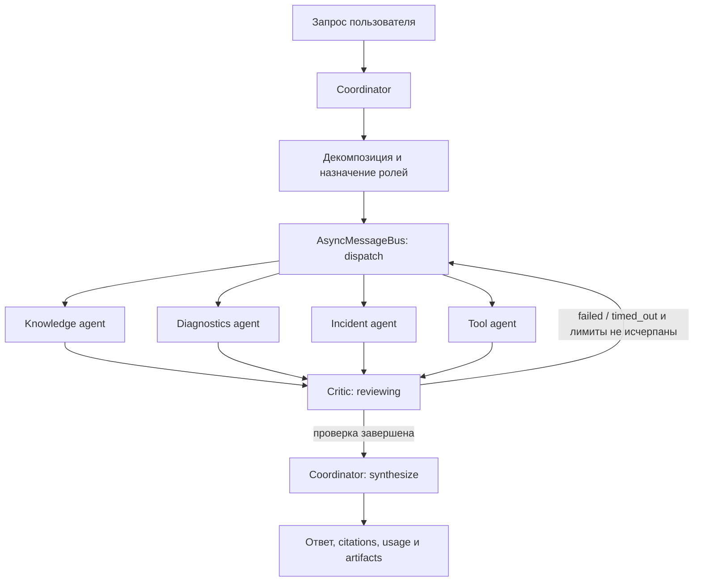

Из `reviewing` повторно делегируются только задачи со статусом `failed` или `timed_out`. Недопустимые переходы отклоняются, а retry ограничен `max_rounds` и общим `max_delegations`, поэтому цикл не может стать бесконечным. Каждый запуск также ограничен `max_tasks`, `task_timeout_seconds`, TTL сообщений и резервируемым перед LLM-вызовом `token_budget`. Для локального Qwen выполнение принудительно остаётся последовательным, даже если в YAML выбран `parallel`: это предотвращает конкурирующие вызовы одной модели на XPU.

Декомпозиция использует четыре capabilities:

- `knowledge_retrieval` для документации, процедур и runbook;
- `technical_diagnostics` для ошибок, логов, timeout и OOM;
- `incident_context` для памяти, сессии и incident state;
- `tool_execution` для явного function calling внешних, файловых и вычислительных tools.

В режиме `rules` маршрутизация детерминирована. `hybrid` сначала применяет правила и обращается к LLM только для незнакомого запроса. `llm` использует structured JSON-планировщик и затем валидирует capabilities по registry. Простому вопросу разрешено не создавать ни одной specialist-задачи: координатор отвечает напрямую и не создаёт искусственную multi-agent стоимость.

## Обмен сообщениями

`AsyncMessageBus` поддерживает:

- request-response между координатором и специалистом;
- publish-subscribe для lifecycle events;
- `message_id`, `correlation_id` и `causation_id`;
- TTL, timeout, дедупликацию и idempotent response cache;
- dead-letter журнал для недоставленных и просроченных сообщений.

Агенты передают структурированные задания, наблюдения, результаты tools и artifacts. Скрытые рассуждения модели между агентами не сохраняются и не экспортируются.

Локальная симуляция не вызывает LLM или внешние API:

```powershell
rag-agent `
  --config config/multi_agent_openai.yaml `
  --simulate-protocols `
  --json
```

Команда показывает request-response, публикацию события, журнал шины и преобразование legacy ACP message в A2A message.

## A2A, MCP и ACP

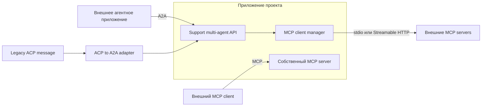

A2A используется для взаимодействия независимых агентных приложений. Реализация основана на официальном `a2a-sdk==1.1.1` и предоставляет:

- Agent Card: `GET /.well-known/agent-card.json`;
- JSON-RPC: `POST /a2a`;
- HTTP+JSON REST binding под `/a2a/v1`;
- асинхронные persistent tasks: `SendMessage` сразу возвращает `submitted`, а состояние и
  результат читаются через `GetTask`/`ListTasks`;
- SQLite-хранилище task state с owner scope, TTL, лимитом записей и общей видимостью для
  нескольких Uvicorn workers;
- owner-scoped отмену, пагинацию с непрозрачным page token, messages и artifacts;
- `A2A-Version: 1.0` и официальный protobuf/JSON contract.

`metadata.userId` не является доверенным: для обычного JWT он обязан совпадать с `sub`.
Только роли `admin` и `service` могут выполнять запрос от имени другого пользователя.
Аналогично `GetTask`, `ListTasks` и `CancelTask` не раскрывают чужие задачи. Физически
остановить уже начатый синхронный provider-вызов Python не может, но отменённая задача
остаётся `cancelled`, а поздний результат не публикуется.

Пример A2A JSON-RPC-запроса:

```powershell
$body = @{
  jsonrpc = "2.0"
  id = "request-1"
  method = "SendMessage"
  params = @{
    message = @{
      messageId = "message-1"
      contextId = "incident-42"
      role = "ROLE_USER"
      parts = @(@{ text = "Найди runbook и диагностируй timeout." })
      metadata = @{
        userId = "engineer-1"
        sessionId = "incident-42"
      }
    }
  }
} | ConvertTo-Json -Depth 10

Invoke-RestMethod `
  -Method Post `
  -Uri http://127.0.0.1:8000/a2a `
  -Headers @{ "A2A-Version" = "1.0" } `
  -ContentType "application/json" `
  -Body $body
```

Из результата сохраните `result.task.id`, затем опрашивайте ту же `/a2a` операцией
`GetTask`, пока `status.state` не станет `TASK_STATE_COMPLETED` или
`TASK_STATE_FAILED`. `ListTasks` принимает `pageSize` и возвращаемый `nextPageToken`.
Для deployment за reverse proxy задайте внешний адрес в `.env`, например
`SUPPORT_PUBLIC_BASE_URL=https://agents.example.org`; именно он публикуется в Agent Card
вместо bind-address `0.0.0.0`/локального адреса контейнера.

Для Docker preset дополнительно передаётся `X-API-Key`. Agent Card остаётся публичной discovery-информацией и не содержит credentials или внутренних prompts.

MCP предназначен не для agent-to-agent делегирования, а для стандартизованного доступа к tools, resources и prompts. Официальный `mcp==1.28.1` используется в двух направлениях:

- собственный MCP-сервер проекта смонтирован на `/mcp/` и предоставляет безопасные tools `analyze_log_fragment`, `build_diagnostic_checklist` и resource `agent://roles`;
- MCP-клиент проекта подключает внешние серверы по `stdio` или Streamable HTTP, обнаруживает их tools и передаёт разрешённые инструменты single-agent и multi-agent runtime.

Произвольный shell, память пользователя и incident mutation через собственный MCP-сервер не экспортируются. Для внешних серверов обязательно задаётся доверенный endpoint/command, а `tool_allowlist` ограничивает доступные агенту операции. Application-код по-прежнему использует `httpx2`; обычный `httpx` устанавливается только как транзитивная зависимость официальных A2A/MCP SDK.

Пример внешнего локального MCP-сервера, запускаемого как дочерний процесс:

```yaml
tools:
  mcp_servers:
    - name: filesystem
      transport: stdio
      command: npx
      args: ["-y", "@modelcontextprotocol/server-filesystem", "C:/work/docs"]
      cwd: .
      required: false
      tool_allowlist: ["read_file", "list_directory"]
      tool_prefix: external_fs
      timeout_seconds: 30
      max_output_chars: 12000
```

`stdio`-сервер наследует только безопасные системные переменные, которые отбирает официальный MCP SDK. Поле `env` задаёт несекретные значения, а `env_from_host` перечисляет имена переменных с credentials, которые нужно безопасно взять из `.env` или окружения, не записывая значения в YAML. Для каждого включённого сервера `tool_allowlist` обязателен; значение `["*"]` явно разрешает все опубликованные сервером tools и подходит только для полностью доверенного endpoint.

Пример удалённого Streamable HTTP endpoint:

```yaml
tools:
  mcp_servers:
    - name: company_docs
      transport: streamable_http
      url: https://mcp.example.org/mcp
      required: true
      verify_ssl: true
      headers:
        Accept-Language: ru
      header_env:
        Authorization: COMPANY_MCP_AUTHORIZATION
      tool_allowlist: ["search_docs", "get_document"]
      tool_prefix: company
      timeout_seconds: 30
```

В этом примере `.env` содержит уже готовое значение заголовка, например `COMPANY_MCP_AUTHORIZATION=Bearer ...`. `required: true` запрещает запуск с недоступной обязательной интеграцией; необязательный сервер записывает ошибку в readiness и не блокирует остальные tools. Имена, доступные LLM, получают префикс: `company_search_docs`, `company_get_document`. Это предотвращает коллизии между локальными и внешними инструментами.

Проверить discovery без вызова LLM:

```powershell
rag-agent --config config/multi_agent_openai.yaml --list-mcp-tools
```

Детерминированно вызвать внешний tool без LLM:

```powershell
rag-agent `
  --config config/multi_agent_openai.yaml `
  --call-mcp-tool company_search_docs `
  --mcp-arguments '{"query":"регламент сброса пароля"}'
```

После discovery внешние tools автоматически входят в общий registry. Если `tools.enabled` непустой, prefixed-имена внешних tools нужно добавить и в этот список. Для multi-agent режима их дополнительно нужно назначить конкретной роли через `multi_agent.role_tool_allowlists`, иначе specialist не получит инструмент. Состояние подключений, список tools и ошибки необязательных серверов доступны в поле `external_mcp` ответа `/ready`.

При запуске агента в Docker команда `stdio`-сервера и её runtime должны существовать внутри image; например, `npx` потребует отдельного Node.js-слоя в Dockerfile. Для MCP-сервера, запущенного на Windows host, из контейнера используйте Streamable HTTP URL с `host.docker.internal` вместо `127.0.0.1`. Для сервера из того же Compose укажите DNS-имя его service.

ACP официально объединён с A2A под Linux Foundation, поэтому новый отдельный ACP server не создаётся. Это зафиксировано в [репозитории ACP](https://github.com/i-am-bee/acp) и в [официальном объявлении команды ACP](https://github.com/orgs/i-am-bee/discussions/5). `ACPProtocolAdapter` оставлен как учебный legacy-adapter: он показывает старый envelope и его преобразование в актуальный A2A message. Актуальные спецификации: [A2A](https://a2a-protocol.org/latest/specification) и [MCP](https://modelcontextprotocol.io/specification/latest).

## Конфигурация и запуск

Явные host-конфиги:

| Конфиг                             | Chat LLM                           | Retrieval         | Выполнение specialists          |
| ---------------------------------- | ---------------------------------- | ----------------- | ------------------------------- |
| `config/multi_agent_openai.yaml`   | OpenAI                             | OpenAI embeddings | parallel                        |
| `config/multi_agent_gigachat.yaml` | GigaChat                           | локальный E5      | parallel                        |
| `config/multi_agent_local.yaml`    | локальный Qwen                     | локальный E5      | sequential                      |
| `config/multi_agent_mixed.yaml`    | OpenAI + GigaChat + локальный Qwen | OpenAI embeddings | sequential из-за локальной роли |

Общие лимиты, протоколы и параметры MLflow находятся в `config/profiles/support/multi_agent.yaml`. Provider-presets переопределяют только время ожидания, режим выполнения, каталог артефактов и имя эксперимента; копии общего блока по YAML-файлам не расходятся.

### Отдельная LLM для каждой роли

По умолчанию все роли используют общий `agent` из выбранного support-конфига. Для произвольного назначения моделей создаются именованные `multi_agent.llm_profiles`, после чего `multi_agent.role_llm_profiles` связывает профиль с ролью. Поддерживаются роли `planner`, `knowledge_agent`, `diagnostics_agent`, `incident_agent`, `critic_agent` и `coordinator`; каждый профиль может использовать `openai`, `gigachat` или `local` и все параметры соответствующего `AgentConfig`.

```yaml
multi_agent:
  llm_profiles:
    openai_coordination:
      provider: openai
      model: gpt-5.4-nano
      max_new_tokens: 350
      input_cost_per_million: 0.20
      output_cost_per_million: 1.25
      currency: USD
    gigachat_review:
      provider: gigachat
      model: GigaChat-2
      input_cost_per_million: 65.0
      output_cost_per_million: 65.0
      currency: RUB
      gigachat_auth_key_env: GIGACHAT_AUTH_KEY
    local_incidents:
      provider: local
      model: data/models/hf/Qwen2.5-1.5B-Instruct
      input_cost_per_million: 0.0
      output_cost_per_million: 0.0
      currency: RUB
      local_device: auto
      local_files_only: true
  role_llm_profiles:
    planner: openai_coordination
    coordinator: openai_coordination
    critic_agent: gigachat_review
    incident_agent: local_incidents
```

Готовая карта находится в `config/profiles/support/multi_agent_llm_mixed.yaml` и переиспользуется host-конфигом `config/multi_agent_mixed.yaml` и Docker-конфигом `config/multi_agent_docker_mixed.yaml`. Роли без записи в `role_llm_profiles` используют базовую модель `agent`; один профиль, назначенный нескольким ролям, создаёт один LLM client и не дублирует локальную модель в памяти.

Запуск смешанной конфигурации:

```powershell
rag-agent `
  --config config/multi_agent_mixed.yaml `
  --multi-agent `
  --message "Проверь текущий инцидент, выполни диагностику и сформируй итог." `
  --user-id engineer-1 `
  --session-id incident-42 `
  --json
```

Для этого примера одновременно требуются `OPENAI_API_KEY`, `GIGACHAT_AUTH_KEY` и скачанный локальный Qwen. Если хотя бы одна назначенная роль использует `provider: local`, effective execution mode становится `sequential`, даже когда в YAML указано `parallel`: это защищает Intel Arc XPU от конкурентных генераций и лишнего расхода памяти. Chat LLM ролей не связана с моделью embeddings: существующая Qdrant collection продолжает использовать тот embedding-профиль, который задан в `rag_profile`, и пересчитывать vectors при смене role LLM не нужно.

Фактический маршрут каждой роли возвращается в `response.llm_routes`, сохраняется в `result.json` и `manifest.json`, отображается в `/ready` и передаётся в MLflow. Token budget остаётся общим для запуска, а стоимость каждого вызова считается по `input_cost_per_million`, `output_cost_per_million` и `currency` его профиля. Для ролей с базовым `agent` используются тарифы из `multi_agent.cost`.

Проверенная stable-комбинация сервисного слоя закреплена в `requirements-service.txt`:
FastAPI `0.139.2`, Starlette `1.3.1`, SSE-Starlette `3.4.5`, A2A SDK `1.1.1`, MCP SDK
`1.28.1` и MLflow `3.14.0`. Переход на Starlette 1.x устраняет известные уязвимости
ветки 0.52.x; совместимость подтверждается полным FastAPI/A2A/MCP/service test suite,
`pip check` и `pip-audit` для всех трёх requirements-файлов. Устаревший
`pytest-freezegun`, использовавший deprecated `distutils`, удалён: тесты времени используют
явные clocks/monkeypatch и не зависят от этого plugin. Docker использует те же точные
версии для воспроизводимости, а диапазоны совместимости заданы в `requirements.txt` и
`pyproject.toml`.

В [README официального MCP Python SDK версии 1.28.1](https://github.com/modelcontextprotocol/python-sdk/tree/v1.28.1#readme) прямо указано, что v1.x является текущей стабильной и рекомендуемой для production веткой, v2 пока находится в alpha, а приложениям рекомендуется заранее установить верхнюю границу `<2`, например `mcp>=1.27,<2`. Поэтому проект использует `mcp>=1.28.1,<2` и не переходит на v2 автоматически; переход выполняется только после стабильного релиза и отдельной проверки миграции.

Перед запуском должны существовать Qdrant collection и provider keys, требуемые базовым support-конфигом. Модуль не пересчитывает document embeddings.

Один multi-agent запрос:

```powershell
rag-agent `
  --config config/multi_agent_openai.yaml `
  --multi-agent `
  --message "В логах service desk есть timeout. Найди runbook и составь диагностику." `
  --user-id engineer-1 `
  --session-id incident-42 `
  --json
```

Вывести сохранённый результат по `run_id` без повторного вызова LLM:

```powershell
rag-agent `
  --config config/multi_agent_openai.yaml `
  --get-multi-agent-run <run_id> `
  --json
```

## Single-agent и multi-agent

Сравнение выполняет одинаковые запросы и отдельно сохраняет ответы обоих режимов. Single-agent всегда использует базовый `agent`; multi-agent использует карту ролей, поэтому в mixed-конфигурации сравнивается единый агент с составной системой моделей:

```powershell
rag-agent `
  --config config/multi_agent_openai.yaml `
  --compare-agents `
  --multi-agent-scenarios config/multi_agent_scenarios.yaml `
  --user-id comparison-user `
  --json
```

Сценарии проверяют простой запрос без лишней декомпозиции, RAG + диагностику, session/incident context и безопасный ответ при отсутствии знаний. Сравниваются:

- детерминированный quality score;
- наличие ожидаемых терминов и citations;
- количество LLM и tool calls;
- input/output tokens и доля оценённых tokens;
- latency;
- число выбранных агентов;
- стоимость и разница single vs multi.

Тарифы не зашиты в Python-код: воспроизводимые исходные значения находятся в YAML и могут быть изменены пользователем при смене модели или способа оплаты. `multi_agent.cost.input_cost_per_million`, `output_cost_per_million` и `currency` задают тариф базового `agent`, а одноимённые поля внутри `llm_profiles` - тариф конкретного provider/model. Для `gpt-5.4-nano` в OpenAI-профилях указаны `$0.20/$1.25` и `currency: USD` за 1 млн входных/выходных токенов. Для `GigaChat-2` указано `65.0/65.0` и `currency: RUB`: официальный тариф GigaChat 2 Lite не разделяет входные и выходные токены. Эти 65 ₽ следуют как из [пакетов для физических лиц](https://developers.sber.ru/docs/ru/gigachat/tariffs/individual-tariffs), так и из [pay-as-you-go тарифа для юридических лиц](https://developers.sber.ru/docs/ru/gigachat/tariffs/legal-tariffs).

OpenAI-профиль мигрирован с deprecated `gpt-4.1-nano` на актуальный экономичный `gpt-5.4-nano`. Политика следующих миграций: сначала обновить alias и тарифы в профилях, затем выполнить unit/regression suite, live API smoke и сравнение сценариев; только после этого обновлять Docker release. Для экспериментов используется alias `gpt-5.4-nano`, а для воспроизводимого production baseline можно зафиксировать snapshot `gpt-5.4-nano-2026-03-17`. Актуальность alias, snapshot и цены проверяется по [официальной карточке GPT-5.4 nano](https://developers.openai.com/api/docs/models/gpt-5.4-nano).

Для любой стоимости не в RUB runtime автоматически получает официальный ежедневный курс с `https://www.cbr.ru/scripts/XML_daily.asp`, делит котировку на её `Nominal` и рассчитывает рублёвый эквивалент. Один снимок кэшируется на 12 часов и переиспользуется всеми вызовами текущего service runtime. Настройки находятся в общем support-профиле:

```yaml
currency_conversion:
  enabled: true
  cbr_daily_rates_url: https://www.cbr.ru/scripts/XML_daily.asp
  timeout_seconds: 10
  cache_ttl_seconds: 43200
  allow_stale_on_error: true
  fail_on_error: false
```

`cbr_daily_rates_url` валидируется и может указывать только на официальный HTTPS-домен `cbr.ru`. Если новый курс временно недоступен, допускается ранее успешно полученный снимок с `exchange_rate_stale: true`. Если снимка нет, исходная стоимость всё равно сохраняется, но `estimated_cost_rub` получает `null`, а причина попадает в `currency_conversion_errors`: система не подставляет выдуманный или захардкоженный курс. Для критичного batch-сценария можно включить `fail_on_error: true`.

В API, JSON-артефактах и MLflow сохраняются обе формы стоимости:

- `estimated_cost` и `estimated_cost_currency` - сумма и валюта конкретного или одновалютного запуска;
- `costs_by_currency` - исходные суммы отдельно по `USD`, `RUB` и другим валютам, поэтому mixed routing не складывает их напрямую;
- `estimated_cost_rub` - сопоставимая сумма в рублях;
- `exchange_rates_to_rub`, `exchange_rate_dates`, `exchange_rate_source` - курс, дата и официальный источник;
- `currency_conversion_errors` и `exchange_rate_stale` - полнота и актуальность конвертации.

Comparison report использует RUB для `cost_delta`, `total_single_cost`, `total_multi_cost` и одновременно сохраняет `total_*_costs_by_currency`. `LLMRouteInfo` содержит `cost_currency`, поэтому применённый тариф можно проверить для каждой роли.

Single-agent usage оценивается по базовой модели; multi-agent usage собирается из фактических provider metadata или воспроизводимой оценки каждого role-вызова. Comparison report хранит `llm_routes`, поэтому смешанные модели и валюты не маскируются одним названием.

## API и артефакты

Запустить API с мультиагентным конфигом:

```powershell
rag-support --config config/multi_agent_openai.yaml
```

Для Docker Compose в `.env` укажите один явный selector:

```dotenv
SUPPORT_AGENT_CONFIG=config/multi_agent_docker_openai.yaml
```

Допустимые Docker-presets:

| Конфиг                                                      | Chat LLM                           | Retrieval         |
| ----------------------------------------------------------- | ---------------------------------- | ----------------- |
| `config/multi_agent_docker_openai.yaml`                     | OpenAI                             | OpenAI embeddings |
| `config/multi_agent_docker_gigachat_openai_embeddings.yaml` | GigaChat                           | OpenAI embeddings |
| `config/multi_agent_docker_gigachat_local_embeddings.yaml`  | GigaChat                           | локальный E5      |
| `config/multi_agent_docker_local.yaml`                      | локальный Qwen                     | локальный E5      |
| `config/multi_agent_docker_mixed.yaml`                      | OpenAI + GigaChat + локальный Qwen | OpenAI embeddings |

Для смешанного Docker-сценария задайте в `.env`:

```dotenv
SUPPORT_AGENT_CONFIG=config/multi_agent_docker_mixed.yaml
```

После выбора preset запустите уже описанный Compose-сервис:

```powershell
docker compose up -d --build qdrant code-runner support-agent
docker compose logs -f support-agent
```

API доступен на `http://127.0.0.1:8000`, A2A - на `/a2a`, MCP - на `/mcp/`. Артефакты multi-agent запусков сохраняются в именованном volume `multi_agent_data`, а MLflow runs - в `mlruns_data`; оба набора не исчезают при пересоздании контейнера.

После запуска Swagger `http://127.0.0.1:8000/docs` содержит:

- `POST /v1/multi-agent/chat`;
- `POST /v1/multi-agent/compare`;
- `GET /v1/multi-agent/runs/{run_id}`;
- A2A JSON-RPC и REST routes;
- существующий `POST /v1/chat` как single-agent baseline.

Каждый запуск сохраняется в provider-specific `data/multi_agent/<provider>/<run_id>/`:

- `result.json` - ответ, задания, роли, LLM routes, quality и usage;
- `manifest.json` - краткий воспроизводимый контракт запуска, включая provider/model каждой роли;
- `messages.jsonl` - журнал доставки сообщений;
- `trace.jsonl` - lifecycle events;
- `dead_letters.jsonl` - ошибки доставки.

Сравнение сохраняется в `comparison-<run_id>/comparison.json`. MLflow получает quality, latency, tokens, tool/LLM calls, стоимость, число и ошибки заданий, количество использованных сообщений истории и факт применения summary. Каталог `data/multi_agent/` исключён из Git.

## Проверка модуля

Offline-тесты не вызывают OpenAI, GigaChat или OpenWeatherMap:

```powershell
python -m unittest tests.test_multi_agent_core -v
python -m unittest tests.test_multi_agent_runtime -v
python -m unittest tests.test_multi_agent_service -v
python -m pytest tests/test_multi_agent_memory_and_tools.py -q
python -m pytest tests/test_filesystem_tools.py tests/test_code_runner.py -q
```

Они проверяют lifecycle, декомпозицию, role-based маршрутизацию OpenAI/GigaChat/local LLM без внешних вызовов, request-response/pub-sub, дедупликацию, timeout/dead letters, собственные MCP tools, подключение и вызов внешнего MCP stdio tool, ACP→A2A, supervisor runtime, comparison report, Swagger, Agent Card и реальный A2A `SendMessage`.

Ограничения текущего учебного модуля:

- message bus работает внутри одного процесса и имеет интерфейс для будущей замены на Redis/NATS;
- A2A streaming и push notifications явно возвращают unsupported operation;
- собственный MCP endpoint экспортирует только stateless безопасные tools, а внешние MCP tools доступны только после явной настройки сервера и allowlist;
- оценка качества основана на фиксированных критериях, а не на скрытом LLM judge;
- multi-agent полезен для декомпозируемых задач, но для простых запросов обычно дороже и медленнее single-agent режима.

# Инструментарий и фреймворки для мультиагентных систем

Модуль реализован поверх существующего support-агента и не создаёт отдельное приложение. LangGraph управляет общим состоянием и переходами, SQLite хранит диалог и долговременную память, Qdrant выполняет семантический поиск по базе знаний, role-based allowlists ограничивают tools, а вычислительный Python-код исполняется отдельным сервисом.

## Файлы раздела

| Файл                                                    | Назначение                                                                                             |
| ------------------------------------------------------- | ------------------------------------------------------------------------------------------------------ |
| `config/multi_agent_tool_memory_scenarios.yaml`         | Практические сценарии диалога с историей, semantic RAG и реальными/ошибочными tools.                   |
| `src/agent_app/multi_agent/graph.py`                    | LangGraph state orchestration, ветвления, retries и bounded execution.                                 |
| `src/agent_app/multi_agent/persistence.py`              | Сохраняет conversational state между запросами и перезапусками runtime.                                |
| `src/agent_app/memory/short_term.py`                    | Передаёт последние полные ходы в контекст роли.                                                        |
| `src/agent_app/memory/summary.py`                       | Сжимает старую историю без разрыва диалога.                                                            |
| `src/agent_app/memory/store.py`                         | Долговременная память с user/session scope, TTL и поиском.                                             |
| `src/agent_app/memory/policy.py`                        | Политики сохранения, TTL и запрет секретов.                                                            |
| `src/agent_app/rag/retriever.py`                        | Семантический Qdrant search для knowledge agent.                                                       |
| `src/agent_app/rag/context.py`                          | Ограничивает контекст и сохраняет attribution/citations.                                               |
| `src/agent_app/rag/runtime.py`                          | Переиспользует embedding client и Qdrant connection.                                                   |
| `src/agent_app/tools/registry.py`                       | Выдаёт каждой роли только разрешённые functions.                                                       |
| `src/agent_app/tools/weather.py`                        | Реальный внешний OpenWeatherMap API с обработкой timeout/error.                                        |
| `src/agent_app/tools/filesystem.py`                     | Sandboxed read/list/write в разрешённой директории.                                                    |
| `src/agent_app/tools/code_runner.py`                    | Авторизованный клиент изолированного code interpreter.                                                 |
| `src/agent_app/tools/mcp_external.py`                   | Подключает сторонние stdio/Streamable HTTP MCP servers.                                                |
| `src/code_runner/app.py`                                | Исполняет проверенный Python в отдельном ограниченном процессе.                                        |
| `src/code_runner/sandbox.py`                            | Ограничивает builtins/imports и не отдаёт пользовательскому коду реальные module objects.              |
| `src/code_runner/cli.py`                                | Запускает code-runner вне Compose.                                                                     |
| `Dockerfile.code-runner`                                | Контейнеризирует code interpreter с read-only filesystem и dropped capabilities.                       |
| `docker-compose.yaml`                                   | Создаёт внутреннюю сеть между support-agent и code-runner/Qdrant.                                      |
| `config/profiles/support/multi_agent_docker_tools.yaml` | Включает Docker-only tools и адрес code-runner во внутренней сети.                                     |
| `tests/test_multi_agent_memory_and_tools.py`            | Проверяет историю, TTL, semantic context и role tool permissions.                                      |
| `tests/test_online_rag.py`                              | Проверяет vector retrieval, context и citations.                                                       |
| `tests/test_filesystem_tools.py`                        | Проверяет traversal, расширения, размеры и read/write policy.                                          |
| `tests/test_external_mcp.py`                            | Проверяет внешние transports, allowlist, prefix и cleanup.                                             |
| `tests/test_code_runner.py`                             | Проверяет auth, RestrictedPython allowlist, известные module-export bypass, timeout и resource limits. |

| Тема                         | Реализация в проекте                                                  | Основные файлы                                                                            |
| ---------------------------- | --------------------------------------------------------------------- | ----------------------------------------------------------------------------------------- |
| LangGraph и оркестрация      | Supervisor-граф, ветвления, retry, лимиты и checkpointing             | `src/agent_app/multi_agent/graph.py`, `runtime.py`, `persistence.py`                      |
| Память, контекст и состояние | История сессии, summary, SQLite memory с TTL, online RAG через Qdrant | `src/agent_app/memory/`, `src/agent_app/rag/`, `src/agent_app/multi_agent/persistence.py` |
| Tools и внешние API          | Function calling, OpenWeatherMap, MCP, безопасные файловые операции   | `src/agent_app/tools/`, `src/agent_app/multi_agent/roles.py`                              |
| Code interpreter             | Отдельный ограниченный FastAPI-процесс и изолированный Docker-сервис  | `src/code_runner/`, `src/agent_app/tools/code_runner.py`, `Dockerfile.code-runner`        |
| Инфраструктура               | Support API, Qdrant, code runner, health checks и внутренние сети     | `docker-compose.yaml`, `Dockerfile`, `config/profiles/support/`                           |

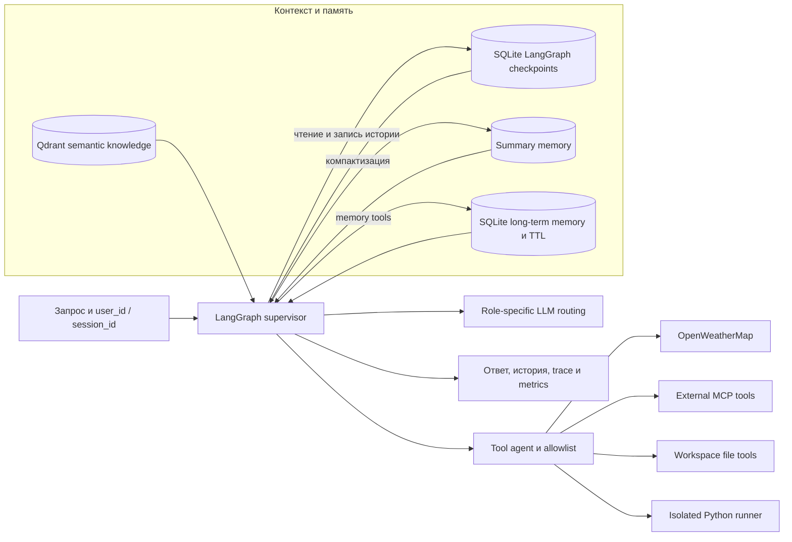

## LangGraph: оркестрация и состояние

Сравнение LangGraph, CrewAI и AutoGen приведено в разделе «Выбор фреймворка мультиагентной оркестрации». Практическая реализация использует `StateGraph`: координатор декомпозирует запрос, specialist-роли выполняют задания, критик проверяет результат, а координатор синтезирует ответ. Состояние содержит задания, результаты, lifecycle, историю сообщений, routing LLM и usage; переходы ограничены `max_rounds`, `max_delegations`, timeout и token budget.

Для каждого `user_id + session_id` строится непрозрачный стабильный `thread_id`. `SqliteSaver` из `langgraph-checkpoint-sqlite` сохраняет checkpoint после каждого запуска, поэтому новый HTTP-запрос или перезапуск Python-процесса продолжает тот же диалог. Истории разных пользователей не пересекаются.

Ключевые параметры находятся в `config/profiles/support/multi_agent.yaml`:

```yaml
multi_agent:
  checkpoint_path: data/agent/multi_agent_checkpoints.sqlite
  max_history_messages: 12
  summary_enabled: true
  message_ttl_seconds: 60
  tool_max_iterations: 4
```

`message_ttl_seconds` относится к доставке сообщений по внутренней шине. TTL долговременной записи задаётся отдельно при вызове `save_memory`; истёкшая запись удаляется при чтении или поиске.

## Память, контекст и семантический поиск

В агенте одновременно используются четыре слоя контекста:

- краткосрочная история LangGraph содержит последние `max_history_messages` сообщений текущей сессии;
- summary memory сжимает вытесняемую часть диалога и возвращает её координатору в следующих запросах;
- долговременная SQLite memory хранит global user-scoped записи от `save_memory` и внутренние session-scoped записи, включая теги, importance, TTL и счётчик обращений;
- Qdrant хранит embeddings документов и выполняет семантический поиск для `knowledge_agent` через `search_knowledge_base` и `find_runbook`.

Долговременная память ищется по ключу, значению и тегам; семантический поиск выполняется отдельно по уже построенному Qdrant-индексу. Chat LLM и embedding-модель не обязаны совпадать, но запрос и коллекция Qdrant должны использовать один embedding-профиль и одинаковую размерность vectors.

Проверка диалога с историей выполняется двумя командами с одинаковыми идентификаторами:

```powershell
rag-agent `
  --config config/multi_agent_openai.yaml `
  --multi-agent `
  --message "Запомни: код инцидента ALPHA-731." `
  --user-id engineer-1 `
  --session-id incident-42

rag-agent `
  --config config/multi_agent_openai.yaml `
  --multi-agent `
  --message "Какой код инцидента мы обсуждали?" `
  --user-id engineer-1 `
  --session-id incident-42
```

Посмотреть checkpoint без вызова LLM:

```powershell
rag-agent `
  --config config/multi_agent_openai.yaml `
  --list-multi-agent-history `
  --user-id engineer-1 `
  --session-id incident-42 `
  --json
```

`DELETE /v1/sessions/{session_id}?user_id=...` удаляет session-scoped память и multi-agent checkpoint, но сохраняет глобальные записи пользователя. `GET /v1/sessions/{session_id}` возвращает поле `multi_agent_history` вместе с памятью и инцидентами.

## Tools, API и файловые операции

Capability `tool_execution` направляется в роль `tool_agent`. Роль получает только пересечение общего tool registry и `multi_agent.role_tool_allowlists.tool_agent`, вызывает tools через provider function calling, передаёт результат как `ToolMessage` и завершает цикл не позднее `tool_max_iterations`. Одинаковый успешный вызов блокируется loop guard; повтор после временной ошибки разрешён в пределах лимита.

Базовый allowlist включает калькулятор, дату и время, OpenWeatherMap, чтение workspace и code runner. Внешние MCP tools добавляются тем же способом после discovery, но prefixed-имя нужно явно добавить в role allowlist. Ошибки API, timeout, невалидные аргументы и слишком большой вывод возвращаются агенту как структурированный результат, а secrets редактируются перед логированием.

Файловые tools ограничены каталогом `data/agent/workspace`:

- `list_workspace_files` выводит разрешённые файлы;
- `read_workspace_file` читает только относительный путь допустимого расширения;
- `write_workspace_file` использует атомарную замену, но по умолчанию не создаётся, потому что `allow_write: false`;
- traversal через `..`, абсолютные пути, symlink, скрытые файлы, запрещённые расширения и превышение размера отклоняются.

Для осознанного разрешения записи создайте собственный profile override:

```yaml
file_tools:
  allow_write: true
multi_agent:
  role_tool_allowlists:
    tool_agent:
      - list_workspace_files
      - read_workspace_file
      - write_workspace_file
```

Не добавляйте `.env`, credentials, каталоги моделей или системные пути в `workspace_path`.

## Изолированное выполнение Python

`execute_python` не использует `exec()` внутри процесса агента. Tool отправляет код в отдельный FastAPI code runner, который проверяет AST, разрешает ограниченный набор стандартных модулей, запускает `python -I -S -B` в новом временном каталоге и ограничивает время, число процессов, размер файлов и объём stdout/stderr. Доступ к файлам агента и внешней сети контейнеру не предоставляется.

Для локального запуска в первом терминале:

```powershell
$env:CODE_RUNNER_HOST = "127.0.0.1"
rag-code-runner
```

Во втором терминале:

```powershell
rag-agent `
  --config config/multi_agent_openai.yaml `
  --multi-agent `
  --message "Выполни через execute_python: print(sum(i * i for i in range(5)))" `
  --user-id engineer-1 `
  --session-id calculations-1 `
  --json
```

В `.env` должен быть случайный внутренний секрет:

```dotenv
CODE_RUNNER_API_KEY=replace-with-another-random-secret
```

Это дополнительная защита внутреннего endpoint, а не пользовательский `SUPPORT_SERVICE_API_KEY`. Code runner рассчитан на ограниченные учебные вычисления; его нельзя считать универсальной sandbox для запуска произвольного недоверенного кода в production.

## Docker-интеграция

В `docker-compose.yaml` описаны сервисы Compose. Docker Desktop показывает созданные из
них контейнеры: один service обычно соответствует одному контейнеру, а масштабируемый
worker может иметь несколько экземпляров с числовыми суффиксами. Образ (`image`) является
не запущенным шаблоном контейнера. Набор реально созданных контейнеров зависит от
включённых Compose profiles.

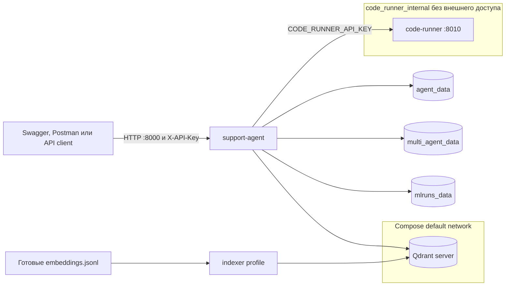

Все сервисы проекта:

| Service в Compose      | Профиль                 | Назначение и ожидаемое состояние                                                                                                                                           | Доступ с Windows host                                                            |
| ---------------------- | ----------------------- | -------------------------------------------------------------------------------------------------------------------------------------------------------------------------- | -------------------------------------------------------------------------------- |
| `qdrant`               | базовый                 | Сервер векторной БД: хранит отдельные collections для выбранных embedding-пространств и обслуживает retrieval. Должен быть `healthy`.                                      | REST `http://127.0.0.1:6333`, gRPC `127.0.0.1:6334`                              |
| `support-agent`        | базовый                 | Основной FastAPI/LLM/RAG/tools/memory сервис. Читает `SUPPORT_AGENT_CONFIG` и работает постоянно.                                                                          | API `http://127.0.0.1:8000`, Swagger `/docs`                                     |
| `code-runner`          | базовый                 | Изолированно выполняет разрешённый Python для tool `execute_python`. Работает постоянно, но доступен только `support-agent` во внутренней Docker-сети.                     | Порт не опубликован намеренно                                                    |
| `indexer`              | `indexing`              | Одноразово запускает `rag-index`, загружает готовые embeddings в Qdrant и завершается. При `docker compose ... run --rm` исчезает после успеха.                            | Публичного endpoint нет                                                          |
| `rabbitmq`             | `orchestration`, `bpmn` | Broker Celery: quorum-очереди, приоритеты, retry и DLQ. Должен быть `healthy`.                                                                                             | AMQP `127.0.0.1:5672`, management UI `http://127.0.0.1:15672`                    |
| `redis`                | `orchestration`, `bpmn` | Хранит orchestration jobs/events, idempotency keys, leases и Celery results. Должен быть `healthy`.                                                                        | `127.0.0.1:6379`                                                                 |
| `orchestration-worker` | `orchestration`, `bpmn` | Celery worker исполняет задания через multi-agent runtime. Может масштабироваться в несколько контейнеров; все реплики должны использовать тот же image/config, что и API. | Публичного endpoint нет                                                          |
| `flower`               | `orchestration`, `bpmn` | Web-монитор Celery workers, активных задач и очередей.                                                                                                                     | `http://127.0.0.1:5555`                                                          |
| `otel-collector`       | `observability`         | Принимает OTLP traces от приложения и перенаправляет их в Jaeger. Это транспортный сервис, не пользовательский UI.                                                         | OTLP gRPC `127.0.0.1:4317`, HTTP `127.0.0.1:4318`                                |
| `jaeger`               | `observability`         | Хранит и показывает распределённые traces запросов и агентных шагов.                                                                                                       | UI `http://127.0.0.1:16686`                                                      |
| `prometheus`           | `observability`         | Собирает `/metrics`, хранит временные ряды и вычисляет alert rules.                                                                                                        | UI `http://127.0.0.1:9090`                                                       |
| `alertmanager`         | `observability`         | Группирует и маршрутизирует сработавшие Prometheus alerts. В учебном контуре получатель задаётся локальной конфигурацией.                                                  | UI `http://127.0.0.1:9093`                                                       |
| `grafana`              | `observability`         | Показывает подготовленные dashboards из Prometheus и Jaeger; логин задаётся `GRAFANA_ADMIN_USER`/`GRAFANA_ADMIN_PASSWORD`.                                                 | UI `http://127.0.0.1:3000`                                                       |
| `camunda-data-init`    | `bpmn`                  | Одноразово подготавливает права именованного volume Camunda. Состояние `Exited (0)` после выполнения является нормальным, а не падением.                                   | Публичного endpoint нет                                                          |
| `camunda`              | `bpmn`                  | Локальный Camunda 8 engine с Operate/Tasklist для детерминированной части BPMN. Должен работать постоянно.                                                                 | Web `http://127.0.0.1:8088`, gRPC `127.0.0.1:26500`, management `127.0.0.1:9600` |
| `camunda-worker`       | `bpmn`                  | External job worker связывает BPMN service task с orchestration/agent runtime. Работает постоянно, публичный порт ему не нужен.                                            | Публичного endpoint нет                                                          |

Именованные записи `qdrant_data`, `agent_data`, `multi_agent_data`, `mlruns_data`,
`rabbitmq_data`, `redis_data`, `camunda_*`, `prometheus_data`, `alertmanager_data` и
`grafana_data` в Docker Desktop являются volumes, а не сервисами или контейнерами. Они
сохраняют данные между обычными `down`/`up`; команда `docker compose down -v` удалит их
безвозвратно и используется только для осознанного полного сброса локального стенда.

Какие контейнеры создаёт каждая команда:

```powershell
# Только базовый API, Qdrant и code runner
docker compose up -d --build

# Одноразовая индексация готовых embeddings
docker compose --profile indexing run --rm indexer

# Базовый контур + RabbitMQ, Redis, Celery worker и Flower
docker compose --profile orchestration up -d --build

# Базовый контур + OpenTelemetry, Jaeger, Prometheus, Alertmanager и Grafana
docker compose --profile observability up -d --build

# Базовый контур + orchestration + Camunda и её worker
docker compose --profile bpmn up -d --build
```

Профили можно объединять, например
`docker compose --profile orchestration --profile observability up -d --build`.
Посмотреть включая завершившиеся one-shot контейнеры можно через
`docker compose --profile indexing --profile orchestration --profile observability --profile bpmn ps -a`;
логи конкретного сервиса выводятся командой `docker compose logs -f <service>`.
Все опубликованные инфраструктурные порты привязаны к `127.0.0.1` и предназначены для
локального стенда, а не для доступа из внешней сети.

`code-runner` подключён только к internal-сети, работает от непривилегированного пользователя, получает read-only root filesystem, `cap_drop: ALL`, `no-new-privileges`, PID/CPU/RAM limits и временный `/tmp`. Его порт не публикуется на Windows host; `support-agent` обращается к DNS-имени `http://code-runner:8010`.

Выберите multi-agent Docker-конфиг и задайте оба service secrets в `.env`:

```dotenv
SUPPORT_AGENT_CONFIG=config/multi_agent_docker_openai.yaml
SUPPORT_SERVICE_API_KEY=replace-with-random-secret
CODE_RUNNER_API_KEY=replace-with-another-random-secret
```

Provider credentials и embedding-профиль зависят от выбранного preset. Например, OpenAI-конфиг требует `OPENAI_API_KEY`, а weather tool требует `OPENWEATHER_API_KEY` только при фактическом вызове погоды.

Запуск и проверка:

```powershell
docker compose up -d --build qdrant code-runner support-agent
docker compose ps
Invoke-RestMethod http://127.0.0.1:8000/ready `
  -Headers @{ "X-API-Key" = $env:SUPPORT_SERVICE_API_KEY }
```

Swagger доступен по адресу `http://127.0.0.1:8000/docs`. Внешний клиент обращается только к support API; endpoint code runner намеренно не является частью публичного интерфейса.

## Практическая проверка модуля

Готовый набор проверяет persistent context, реальный OpenWeatherMap tool, безопасное чтение workspace и изолированное вычисление:

```powershell
rag-agent `
  --config config/multi_agent_openai.yaml `
  --compare-agents `
  --multi-agent-scenarios config/multi_agent_tool_memory_scenarios.yaml `
  --user-id engineer-memory-demo `
  --json
```

Перед запуском должны работать выбранная LLM, Qdrant collection и локальный `rag-code-runner`; для погодного сценария задайте `OPENWEATHER_API_KEY`. Сценарии фиксируют ожидаемые `tool_calls`, термины ответа, usage, latency, качество и артефакты запуска.

Offline-проверка без provider API:

```powershell
python -m pytest `
  tests/test_multi_agent_core.py `
  tests/test_multi_agent_runtime.py `
  tests/test_multi_agent_service.py `
  tests/test_multi_agent_memory_and_tools.py `
  tests/test_filesystem_tools.py `
  tests/test_code_runner.py `
  -q
```

Тесты воспроизводят восстановление истории после перезапуска runtime, изоляцию пользователей, summary при переполнении, очистку checkpoint через API, произвольный внешний tool, ограничения файловой системы, авторизацию code runner, timeout и запрет опасных imports.

# Оркестрация: паттерны, логика и контроль

Этот модуль расширяет существующую мультиагентную систему распределённым контуром выполнения. LangGraph управляет планом и переходами между шагами, Celery передаёт задания через RabbitMQ, Redis хранит состояния и события, Flower показывает нагрузку, а Camunda связывает детерминированный BPMN-процесс с недетерминированным агентным шагом.

## Файлы раздела

| Файл                                                        | Назначение                                                                                          |
| ----------------------------------------------------------- | --------------------------------------------------------------------------------------------------- |
| `src/agent_app/orchestration/__init__.py`                   | Экспортирует orchestration service/models API.                                                      |
| `src/agent_app/orchestration/models.py`                     | Контракты job, plan step, event, status, priority, pattern и execution result.                      |
| `src/agent_app/orchestration/errors.py`                     | Разделяет transient, permanent, backpressure и deadline errors для retry policy.                    |
| `src/agent_app/orchestration/planning.py`                   | Строит sequential/parallel/conditional/quorum/dynamic планы и fallback revisions.                   |
| `src/agent_app/orchestration/synchronization.py`            | Dependency barriers, quorum и упрощённый consensus.                                                 |
| `src/agent_app/orchestration/executors.py`                  | Выполняет plan steps, параллельные группы и provider concurrency leases.                            |
| `src/agent_app/orchestration/engine.py`                     | Управляет состояниями, переходами, deadline, replanning и итоговой агрегацией.                      |
| `src/agent_app/orchestration/store.py`                      | Redis job records, events, idempotency keys, leases и queue counters.                               |
| `src/agent_app/orchestration/queue.py`                      | Конфигурирует Celery/RabbitMQ priority queues, DLQ, routing и worker events.                        |
| `src/agent_app/orchestration/tasks.py`                      | Celery task с retries/backoff, status transitions и late acknowledgements.                          |
| `src/agent_app/orchestration/service.py`                    | Единый submit/get/wait/cancel/status фасад для inline и Celery backends.                            |
| `src/agent_app/orchestration/worker_cli.py`                 | CLI `rag-orchestration-worker` и безопасная загрузка worker config/.env.                            |
| `src/agent_app/orchestration/camunda.py`                    | Deploy/start/status и external job workers Camunda.                                                 |
| `src/agent_app/orchestration/camunda_cli.py`                | CLI `rag-camunda` для BPMN lifecycle.                                                               |
| `bpmn/engineer_support.bpmn`                                | Детерминированный процесс validate/classify/approval/agent/verify/escalate.                         |
| `config/camunda/application-h2.yaml`                        | Локальная Camunda-конфигурация с H2 для учебного Compose.                                           |
| `config/profiles/support/orchestration.yaml`                | Общие patterns, limits, retries, deadlines и inline defaults.                                       |
| `config/profiles/support/orchestration_docker.yaml`         | Celery/Redis/RabbitMQ/Camunda endpoints внутри Compose.                                             |
| `config/multi_agent_docker_openai.yaml`                     | OpenAI orchestration worker/service preset.                                                         |
| `config/multi_agent_docker_gigachat_openai_embeddings.yaml` | GigaChat worker с OpenAI RAG contract.                                                              |
| `config/multi_agent_docker_gigachat_local_embeddings.yaml`  | GigaChat worker с local E5 RAG contract.                                                            |
| `config/multi_agent_docker_local.yaml`                      | Local worker с concurrency=1 для защиты XPU/RAM.                                                    |
| `config/multi_agent_docker_mixed.yaml`                      | Смешанный per-role provider worker.                                                                 |
| `docker-compose.yaml`                                       | RabbitMQ, Redis, worker replicas, Flower и Camunda profiles/healthchecks.                           |
| `tests/test_orchestration.py`                               | Проверяет все patterns, barriers, quorum, retries, idempotency, backpressure, API и BPMN callbacks. |

## Архитектура оркестрации

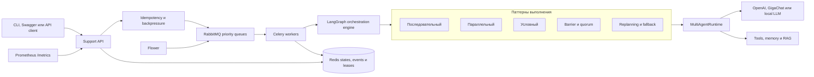

Основные компоненты:

| Задача                     | Реализация                                                      | Файлы                                                        |
| -------------------------- | --------------------------------------------------------------- | ------------------------------------------------------------ |
| Модель задания и состояния | job, plan, step result, event, deadline, priority               | `src/agent_app/orchestration/models.py`                      |
| Планирование               | пять ограниченных сервером шаблонов и fallback-роли             | `planning.py`                                                |
| Исполнение                 | LangGraph, зависимости, ветвления, parallel barrier, quorum     | `engine.py`, `synchronization.py`                            |
| Интеграция агента          | адаптер к существующему `MultiAgentRuntime`                     | `executors.py`                                               |
| Очередь                    | Celery, RabbitMQ priority, retry, DLQ и routing                 | `queue.py`, `tasks.py`                                       |
| Состояние                  | in-memory для локальной отладки, Redis для нескольких процессов | `store.py`, `service.py`                                     |
| HTTP и CLI                 | Swagger endpoints и команды `rag-agent`                         | `service/app.py`, `cli.py`                                   |
| BPMN                       | Camunda SDK, workers и исполняемый процесс                      | `camunda.py`, `camunda_cli.py`, `bpmn/engineer_support.bpmn` |

Жизненный цикл задания фиксируется явно: `queued -> running -> completed/failed/expired`; перед повтором используется промежуточное состояние `retrying`, а пользовательская отмена переводит незавершённое задание в `cancelled`. Каждый переход и каждый шаг сохраняются как `JobEvent` с возрастающим `sequence`.

## Паттерны выполнения

| `pattern`     | Поведение                                                                                  | Практическое применение                           |
| ------------- | ------------------------------------------------------------------------------------------ | ------------------------------------------------- |
| `sequential`  | анализ выполняется после проверки входа, затем формируется результат                       | зависимые шаги и предсказуемый порядок            |
| `parallel`    | диагностика, база знаний и анализ рисков запускаются одновременно, затем ожидается barrier | независимые исследования с меньшей latency        |
| `conditional` | ветка выбирается по `risk_level`; вторая ветка помечается `skipped`                        | разные правила для обычных и опасных операций     |
| `quorum`      | три роли голосуют `approve/reject/abstain`; нужны кворум и согласованное большинство       | проверка критичных решений несколькими ролями     |
| `dynamic`     | временная ошибка вызывает новую версию плана и смену роли по fallback-цепочке              | адаптация к недоступному provider или инструменту |

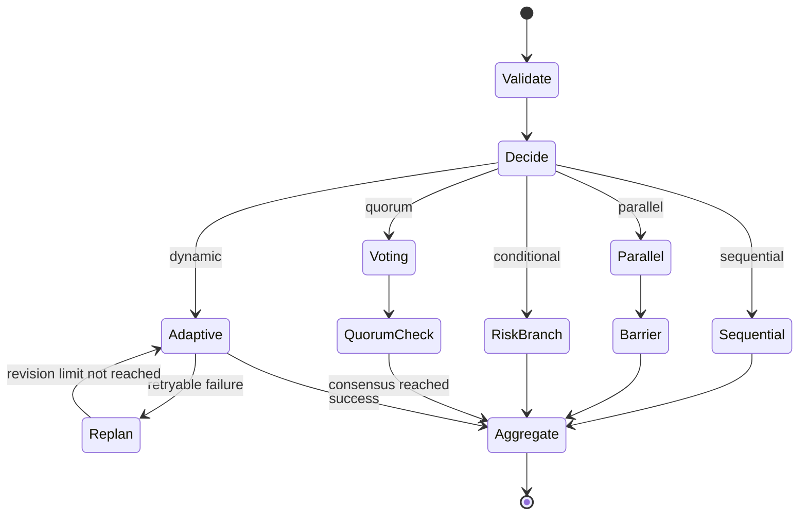

`ExecutionPlan` валидирует уникальность идентификаторов, существование зависимостей и отсутствие циклических или прямых ссылок. Параллельная группа не переходит к агрегации, пока не завершатся все доступные шаги. Для local LLM параллельное выполнение внутри задания отключается, чтобы несколько одновременных копий модели не исчерпали память GPU.

Условное ветвление детерминировано и не делегируется LLM. Кворум считается успешным только при достаточном числе успешных ответов и определившемся большинстве. В динамическом режиме `max_plan_revisions` предотвращает бесконечное перепланирование; исчерпание лимита завершает задание ошибкой.

## Очереди, приоритеты и нагрузка

Распределённый режим использует delivery semantics `at least once`. Поэтому `idempotency_key` обязателен для вызывающей системы, которая может повторить HTTP-запрос после timeout. Ключ scoped по `user_id`: Redis атомарно закрепляет его за первым `job_id`, повтор возвращает исходное задание с `deduplicated: true`, а stale binding на уже удалённую запись атомарно перепривязывается к одному новому job.

RabbitMQ создаёт quorum-очереди `agent.high.quorum`, `agent.default.quorum`, `agent.low.quorum` и DLQ `agent.dead_letter.quorum` с exchange `agent.dead_letter`. Новые имена исключают конфликт миграции с classic queues прежних запусков. Трёхуровневая маршрутизация выполняется отдельными очередями; свойства сообщений `1/5/9` дополнительно соответствуют normal/high классам RabbitMQ 4.x. Celery включает `worker_detect_quorum_queues`, поэтому использует per-consumer QoS вместо deprecated global QoS. Worker подтверждает сообщение после выполнения (`acks_late`), использует `prefetch=1` и возвращает потерянное worker-сообщение в broker. Временные ошибки повторяются с exponential backoff и jitter; после исчерпания retry сообщение отклоняется без requeue и попадает в DLQ. Невосстановимая прикладная ошибка фиксируется как `failed` без бессмысленных повторов. Ограничения quorum priorities описаны в [официальной документации RabbitMQ](https://www.rabbitmq.com/docs/quorum-queues#priorities).

RabbitMQ 4.3 запрещает deprecated transient non-exclusive queues. Celery 5.6 явно настроен на `control_queue_exclusive: true` и `event_queue_exclusive: true`, поэтому remote control, inspector, gossip и Flower используют допустимые exclusive queues без включения устаревшей возможности broker. В Celery 5.7 control queue станет exclusive по умолчанию; до стабильного выпуска 5.7 проект фиксирует последнюю стабильную ветку 5.6.

`max_pending_jobs` реализует admission control: при заполнении API возвращает HTTP `429`, не создавая ещё одно задание. `provider_concurrency_limits` учитывает provider ролей конкретного плана и его fallback-ветвей, а не только базовую `agent.provider`; неиспользуемые LLM-профили не занимают слоты. Распределённые Redis leases продлеваются heartbeat и удерживаются до физического завершения вызова, даже если шаг уже получил статус `timed_out`. `assigned_role` исполняется напрямую и не запускает повторно supervisor-граф с произвольным набором ролей. Deadline проверяется до старта и между шагами; Celery дополнительно применяет soft и hard time limits.

Timeout шага ограничивает latency оркестратора: как последовательный, так и параллельный
шаг возвращает `timed_out` без ожидания `ThreadPoolExecutor.shutdown(wait=True)`.
Синхронный сетевой вызов Python нельзя безопасно уничтожить из другого потока, поэтому
он продолжает занимать provider lease до реального завершения. Для жёсткого прекращения
нагрузки используются отдельный Celery process/container и его hard time limit.

Параметры находятся в композиционных профилях `config/profiles/support/orchestration.yaml` и `orchestration_docker.yaml`:

```yaml
orchestration:
  enabled: true
  backend: celery
  max_pending_jobs: 500
  max_parallelism: 3
  worker_prefetch_multiplier: 1
  max_retries: 3
  retry_backoff_seconds: 5
  retry_backoff_max_seconds: 120
  provider_concurrency_limits:
    openai: 8
    gigachat: 4
    local: 1
```

Host-конфиги `config/multi_agent_openai.yaml`, `multi_agent_gigachat.yaml`, `multi_agent_local.yaml` и `multi_agent_mixed.yaml` используют `backend: inline`. Соответствующие `multi_agent_docker_*.yaml` включают Celery backend. Provider выбирается явно именем конфига, OpenAI не является скрытым значением по умолчанию.

## Локальный запуск и CLI

Новые зависимости устанавливаются в тот же глобальный Python:

```powershell
python -m pip install --upgrade -r requirements.txt
python -m pip install -e . --no-deps
```

Inline-режим не требует RabbitMQ и Redis. Он удобен для изучения графа и отладки одного процесса:

```powershell
rag-agent `
  --config config/multi_agent_openai.yaml `
  --enqueue `
  --message "Проверь недоступность API и предложи порядок восстановления" `
  --pattern parallel `
  --priority high `
  --user-id engineer-1 `
  --session-id incident-42 `
  --idempotency-key incident-42-analysis-v1 `
  --wait `
  --json
```

Для условного, кворумного и динамического сценариев измените `--pattern` на `conditional`, `quorum` или `dynamic`. Дополнительные параметры: `--risk-level high`, `--quorum-size 2`, `--deadline-seconds 300`, `--max-plan-revisions 2`.

В распределённом режиме доступны операции над уже поставленным заданием:

```powershell
rag-agent --config config/multi_agent_docker_openai.yaml --job-status <job-id>
rag-agent --config config/multi_agent_docker_openai.yaml --job-events <job-id>
rag-agent --config config/multi_agent_docker_openai.yaml --cancel-job <job-id>
rag-agent --config config/multi_agent_docker_openai.yaml --queue-status
```

Команды читают `ORCHESTRATION_REDIS_URL` и `ORCHESTRATION_BROKER_URL` из `.env`. Worker при наличии `SUPPORT_AGENT_CONFIG` заново загружает конфиг внутри собственной файловой системы, поэтому абсолютные Windows-пути не передаются в Docker runtime.

При отдельном host-запуске worker путь задаётся явно; команда сначала загружает `.env`, затем создаёт Celery app:

```powershell
rag-orchestration-worker --config config/multi_agent_openai.yaml --concurrency 2
```

## HTTP API и Swagger

Swagger содержит отдельную группу «Оркестрация»:

- `POST /v1/orchestration/jobs` - поставить задание;
- `GET /v1/orchestration/jobs/{job_id}` - прочитать состояние и результат;
- `GET /v1/orchestration/jobs/{job_id}/events` - получить упорядоченный журнал;
- `DELETE /v1/orchestration/jobs/{job_id}` - отменить незавершённое задание;
- `GET /v1/orchestration/queues/status` - проверить Redis, broker и workers.

Пример постановки через PowerShell:

```powershell
$headers = @{ "X-API-Key" = $env:SUPPORT_SERVICE_API_KEY }
$body = @{
  message = "Проверь инцидент с недоступностью API и оцени риски"
  user_id = "engineer-1"
  session_id = "incident-42"
  pattern = "dynamic"
  priority = "high"
  risk_level = "high"
  idempotency_key = "incident-42-dynamic-v1"
  deadline_seconds = 300
} | ConvertTo-Json

$job = Invoke-RestMethod `
  -Method Post `
  -Uri http://127.0.0.1:8000/v1/orchestration/jobs `
  -Headers $headers `
  -ContentType "application/json" `
  -Body $body

Invoke-RestMethod `
  -Uri "http://127.0.0.1:8000/v1/orchestration/jobs/$($job.record.job.id)" `
  -Headers $headers
```

`POST` возвращает HTTP `202`. В inline-режиме запись уже может иметь терминальный статус; в Celery-режиме клиент опрашивает `GET` или читает события. Swagger доступен на `http://127.0.0.1:8000/docs`, OpenAPI JSON - на `/openapi.json`.

## Docker Compose и масштабирование

В `.env` выберите multi-agent Docker-конфиг и задайте отдельные секреты RabbitMQ:

```dotenv
SUPPORT_AGENT_CONFIG=config/multi_agent_docker_openai.yaml
SUPPORT_SERVICE_API_KEY=replace-with-random-secret
CODE_RUNNER_API_KEY=replace-with-another-random-secret
RABBITMQ_DEFAULT_USER=rag
RABBITMQ_DEFAULT_PASS=replace-with-random-secret
ORCHESTRATION_WORKER_CONCURRENCY=2
```

Для GigaChat, local Qwen или смешанного routing используются соответственно `multi_agent_docker_gigachat_openai_embeddings.yaml`, `multi_agent_docker_gigachat_local_embeddings.yaml`, `multi_agent_docker_local.yaml` или `multi_agent_docker_mixed.yaml`. Остальные provider credentials и vector-store профиль должны соответствовать выбранному конфигу.

Запуск распределённого контура:

```powershell
docker compose --profile orchestration up -d --build
docker compose --profile orchestration ps
```

После запуска доступны:

- Support API и Swagger: `http://127.0.0.1:8000/docs`;
- RabbitMQ Management: `http://127.0.0.1:15672`;
- Flower: `http://127.0.0.1:5555`;
- Prometheus exposition: `http://127.0.0.1:8000/metrics`.

Горизонтальное масштабирование worker:

```powershell
docker compose --profile orchestration up -d --scale orchestration-worker=3
```

Для OpenAI/GigaChat число процессов ограничивается provider quota и настройкой `provider_concurrency_limits`. Для Qwen на Intel Arc оставьте `ORCHESTRATION_WORKER_CONCURRENCY=1` и одну реплику worker: каждый процесс загружает собственную модель, поэтому увеличение числа реплик может привести к XPU OOM. SQLite memory, incidents и LangGraph checkpoints используют WAL и `busy_timeout`, но для production с несколькими узлами эти хранилища следует заменить внешней БД.

## Гибридная оркестрация Camunda

Camunda управляет проверяемой бизнес-логикой, а агент получает только тот шаг, где допустимо недетерминированное решение:

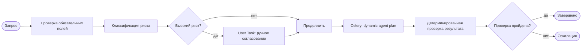

Локальный Camunda 8.9 с H2 предназначен для разработки и оценки, не для production deploy. Запуск всего BPMN-профиля:

```powershell
docker compose --profile bpmn up -d --build
docker compose --profile bpmn ps
```

Для команд с host Python в `.env` нужны:

```dotenv
CAMUNDA_REST_ADDRESS=http://127.0.0.1:8088/v2
CAMUNDA_AUTH_STRATEGY=NONE
```

Развернуть BPMN и запустить экземпляр обычного риска:

```powershell
rag-camunda --config config/multi_agent_docker_openai.yaml deploy

rag-camunda `
  --config config/multi_agent_docker_openai.yaml `
  start `
  --message "Разбери инцидент с timeout API" `
  --user-id engineer-1 `
  --session-id camunda-incident-1 `
  --risk-level medium
```

Operate доступен на `http://127.0.0.1:8088/operate`, Tasklist - на `http://127.0.0.1:8088/tasklist`, локальные учётные данные - `demo/demo`. Для `risk_level=high` процесс остановится на User Task, назначенной пользователю `demo`; после ручного завершения продолжится агентный шаг. Python worker запускается сервисом `camunda-worker` и использует официальный `camunda-orchestration-sdk`.

`orchestration.camunda.poll_request_timeout_seconds` по умолчанию равен `5`: это long-poll ниже инфраструктурного HTTP timeout. Не увеличивайте его до граничного значения reverse proxy, иначе пустой poll может завершаться `503`, хотя сам worker продолжит работу.

Официальные материалы: [Celery configuration](https://docs.celeryq.dev/en/stable/userguide/configuration.html), [RabbitMQ priority queues](https://www.rabbitmq.com/docs/priority), [RabbitMQ transient queue compatibility](https://www.rabbitmq.com/docs/4.2/queues), [Camunda Python SDK](https://docs.camunda.io/docs/apis-tools/python-sdk/), [Camunda job workers](https://docs.camunda.io/docs/apis-tools/python-sdk/job-workers/), [Camunda Docker Compose quickstart](https://docs.camunda.io/docs/self-managed/quickstart/developer-quickstart/docker-compose/).

## Наблюдаемость и воспроизводимость

В Redis сохраняются полная запись задания, терминальный результат, попытки и ограниченный журнал событий. RabbitMQ Management показывает очереди, unacked messages и DLQ; Flower показывает active, reserved и scheduled tasks. `/ready` включает состояние orchestration backend, а `/metrics` экспортирует `support_agent_orchestration_jobs_total` вместе с общими HTTP-метриками.

Воспроизводимость обеспечивают:

- явный YAML-профиль provider и orchestration backend;
- стабильный UUID задания и отдельный `idempotency_key` внешней операции;
- сохранённые версия плана, шаги, роли, revisions, timestamps и ошибки;
- точные версии service dependencies в `requirements-service.txt`;
- фиксированные Docker tags RabbitMQ, Redis и Camunda;
- детерминированные ветвления и явные пределы retry, deadline и replanning.

Ограничение: отмена Celery task выполняется без принудительного завершения процесса. Уже начатый LLM-вызов нельзя безопасно остановить из другого процесса, поэтому worker проверяет сохранённый `cancelled` status перед фиксацией результата. Для жёсткой изоляции долгих jobs нужны отдельные worker pools и инфраструктурное завершение контейнера.

## Проверка модуля

Offline-тесты не вызывают LLM providers, embeddings или погодный API:

```powershell
python -m pytest tests/test_orchestration.py -q
```

Они проверяют последовательный, параллельный, условный, кворумный и динамический паттерны, barrier, consensus, fallback роли, idempotency, backpressure, Swagger API, priority/DLQ конфигурацию и BPMN worker callbacks. Конфигурацию Compose можно проверить без запуска контейнеров:

```powershell
docker compose --profile orchestration --profile bpmn config --quiet
```

# Качество, безопасность и наблюдаемость

Модуль добавляет к существующему single-agent и multi-agent решению проверяемый контур эксплуатации: регрессионную оценку на фиксированном наборе задач, детерминированные guardrails, RBAC, human-in-the-loop, OpenTelemetry tracing, структурированные логи, Prometheus alerts и тестовые симуляции без внешних API.

## Файлы раздела

| Файл                                                              | Назначение                                                                                                |
| ----------------------------------------------------------------- | --------------------------------------------------------------------------------------------------------- |
| `config/evaluation/engineering_support_cases.yaml`                | Фиксированный dataset ожиданий, обязательных/запрещённых фактов, roles, tools и citations.                |
| `src/agent_app/evaluation/__init__.py`                            | Экспортирует evaluation API.                                                                              |
| `src/agent_app/evaluation/models.py`                              | Модели case, execution, metrics, quality gates и report.                                                  |
| `src/agent_app/evaluation/dataset.py`                             | Загружает и валидирует evaluation suite.                                                                  |
| `src/agent_app/evaluation/metrics.py`                             | Считает success, precision/recall/F1, unsupported claims, consistency, latency и cost.                    |
| `src/agent_app/evaluation/runner.py`                              | Выполняет повторы через single/multi-agent runtime и применяет quality gates.                             |
| `src/agent_app/evaluation/exporting.py`                           | Атомарно пишет report/results/manifest в отдельную run directory.                                         |
| `src/agent_app/evaluation/cli.py`                                 | CLI `rag-eval`, вывод metrics и ненулевой exit code при провале gates.                                    |
| `src/agent_app/guardrails/__init__.py`                            | Экспортирует guardrail/audit/review API.                                                                  |
| `src/agent_app/guardrails/models.py`                              | Модели security decision, audit event и human review.                                                     |
| `src/agent_app/guardrails/pipeline.py`                            | Input/context/output prompt-injection, privacy и unsafe-content filters.                                  |
| `src/agent_app/guardrails/audit.py`                               | Append-only SQLite security audit с фильтрацией по пользователю/событию.                                  |
| `src/agent_app/guardrails/reviews.py`                             | Очередь human-in-the-loop review и контролируемые status transitions.                                     |
| `src/agent_app/service/auth.py`                                   | API key/JWT validation, RBAC и user-scope authorization.                                                  |
| `src/agent_app/observability/__init__.py`                         | Экспортирует observability setup API.                                                                     |
| `src/agent_app/observability/logging.py`                          | Structured JSON logs с correlation/run/trace IDs и redaction.                                             |
| `src/agent_app/observability/telemetry.py`                        | OpenTelemetry SDK, OTLP export и FastAPI/httpx2/Celery instrumentation.                                   |
| `observability/otel-collector.yaml`                               | Принимает OTLP и маршрутизирует traces/metrics.                                                           |
| `observability/prometheus.yaml`                                   | Scrape targets и подключение alert rules.                                                                 |
| `observability/alerts.yaml`                                       | Latency, error, readiness, guardrail и queue alert expressions.                                           |
| `observability/alertmanager.yaml`                                 | Локальный receiver/routing алертов.                                                                       |
| `observability/grafana/provisioning/datasources/datasources.yaml` | Автоматически подключает Prometheus и Jaeger к Grafana.                                                   |
| `observability/grafana/provisioning/dashboards/dashboards.yaml`   | Провиженит каталог dashboard JSON.                                                                        |
| `observability/grafana/dashboards/support-agent.json`             | Dashboard HTTP/LLM/RAG/tool/orchestration/security метрик и traces.                                       |
| `config/profiles/support/security_jwt.yaml`                       | Централизованно включает HMAC JWT, RBAC и user scope для защищённых Docker-профилей.                      |
| `config/profiles/support/observability_docker.yaml`               | Наследует JWT-политику и включает OTLP и structured logs в Docker presets.                                |
| `.github/workflows/quality.yaml`                                  | Ruff/tests/JUnit и Docker smoke без платных API.                                                          |
| `.github/workflows/live-api.yaml`                                 | Ручная реальная проверка OpenAI, GigaChat, OpenWeatherMap и HF auth.                                      |
| `.github/workflows/container-release.yaml`                        | Публикует support/code-runner images в GHCR с SBOM/provenance.                                            |
| `.github/dependabot.yml`                                          | Проверяет Python, Actions и Docker dependency updates.                                                    |
| `.gitignore`                                                      | Исключает `.env`, runtime SQLite/vector data, MLflow, модели, отчёты и агентные служебные файлы из Git.   |
| `scripts/check_live_integrations.py`                              | Безопасно выполняет выбранные live API checks и редактирует секреты в ошибках.                            |
| `tests/test_agent_quality.py`                                     | Unit/property/regression проверки метрик, gates и evaluation exports.                                     |
| `tests/test_agent_security.py`                                    | Prompt injection, privacy, RBAC, audit и human-review тесты.                                              |
| `tests/test_agent_observability.py`                               | Проверяет tracing/logging/metrics setup без внешнего collector.                                           |
| `tests/test_currency_conversion.py`                               | Проверяет RUB-конвертацию расходов, официальный XML-контракт, кэш и отсутствие смешивания валют.          |
| `tests/test_docstrings.py`                                        | Проверяет наличие, русский язык и содержательность docstring и комментариев в `src`, `scripts` и `tests`. |

Prometheus получает `SUPPORT_SERVICE_API_KEY` через Docker secret `support_service_api_key` и передаёт его в `X-API-Key` при каждом scrape `/metrics`. Значение берётся Compose из локального `.env`, не записывается в `observability/prometheus.yaml` и не попадает в Docker image. У service API key должна быть роль `service` или другая роль с разрешением `metrics:read`.

### Как создавались docstring

Документирование выполнялось в несколько этапов:

1. Через модуль `ast` был собран полный список модулей, классов, обычных и асинхронных функций в `src/`, `scripts/` и `tests/`. Это позволило найти недокументированные области независимо от способа форматирования исходного кода.
2. Для каждого объекта описание формировалось по контексту реализации: учитывались модуль и класс, тело функции, ветвления, возвращаемые значения, изменяемое состояние и используемые зависимости. Основная пакетная обработка выполнялась через OpenAI `gpt-4.1`, а оставшиеся после ограничения частоты запросов описания — через `gpt-4.1-mini`.
3. Docstring описывает назначение объекта, публичный контракт, существенные ограничения или побочные эффекты. Пересказ имени и шаблоны вида «реализует операцию `<имя>`» не считаются документацией.
4. После пакетного формирования проводился семантический аудит. В частности, вручную удалялись неподтверждённые обещания атомарности и другие гарантии, которых фактически не обеспечивает реализация.
5. Код был повторно проверен через AST, `ruff`, `compileall` и полный набор `pytest`.

Docstring создавались как одноразовая часть разработки исходного кода, а не генерируются при импорте или запуске приложения. Для каждого объекта сначала определялись его роль в потоке данных, входные инварианты, наблюдаемый результат, исключения и побочные эффекты. Поэтому описание вроде «реализует `load_config`» считается недостаточным: для загрузчика должно быть указано, откуда берётся конфигурация, как разрешаются относительные пути и на каком этапе отклоняются несогласованные параметры. Для endpoint важно описать не только тип ответа, но и проверяемое разрешение, user scope и случаи отказа.

Правила закреплены в `tests/test_docstrings.py`. Проверка требует русский docstring для каждой области, отклоняет прежние фиктивные шаблоны и запрещает подменять описание повторением имени документируемого объекта. Обычные комментарии также должны быть русскоязычными; технические директивы `# type:`, `# noqa` и `# pragma:` исключены из языковой проверки.

Запустить проверку отдельно:

```powershell
python -m pytest tests/test_docstrings.py -q
```

## Архитектура модуля

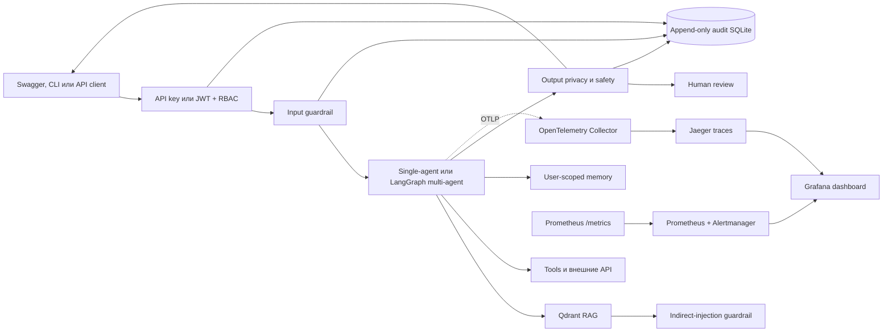

## Оценка качества

Evaluation case задаёт пользовательский запрос и только проверяемые ожидания: обязательные и запрещённые факты, tools, роли и необходимость citations. Один кейс выполняется `evaluation.repeats` раз, поэтому отчёт показывает не только среднее качество, но и устойчивость поведения.

Рассчитываются:

- `task_success_rate` - доля запусков, в которых выполнены все условия кейса;
- `fact_precision`, `fact_recall`, `fact_f1` - совпадение ответа с явно заданными фактами;
- `unsupported_claim_rate` - доля обнаруженных запрещённых утверждений;
- `consistency` - согласованность фактов, tools, ролей и результата между повторами;
- `average_latency_ms`, `p95_latency_ms` - средняя и p95 длительность;
- `average_cost_rub`, `total_cost_rub` - сопоставимая оценочная стоимость в RUB; исходные расходы каждого выполнения остаются в `costs_by_currency`, а иностранные тарифы пересчитываются по курсу ЦБ РФ с датой и источником;
- `currency_conversion_complete`, `unconverted_cost_count` - признак полноты конвертации; quality gate не проходит, если стоимость иностранного API не удалось перевести в RUB;
- `human_reviews_pending` - число ожидающих ручного решения ответов.

Это детерминированная проверка, а не LLM-as-a-judge. Она не доказывает истинность произвольного текста, поэтому критические кейсы должны содержать достаточно полный набор `expected_facts` и `forbidden_facts`. Для субъективной оценки остаётся human review.

Запуск реального multi-agent evaluation:

```powershell
rag-eval `
  --config config/multi_agent_openai.yaml `
  --suite config/evaluation/engineering_support_cases.yaml
```

Для GigaChat, local Qwen или смешанного routing явно выберите `multi_agent_gigachat.yaml`, `multi_agent_local.yaml` или `multi_agent_mixed.yaml`. Команда повторно использует существующие RAG embeddings и Qdrant, не пересчитывает векторы. При провале хотя бы одного quality gate процесс возвращает exit code `1`, что позволяет включить команду в CI.

Каждый запуск атомарно сохраняет:

```text
data/evaluation/runs/<run_id>/
├── report.json
├── results.jsonl
└── manifest.json
```

`report.json` содержит provider, model, hash конфигурации, метрики, решения output guardrail и результаты gates; абсолютные локальные paths в ответах редактируются. `manifest.json` фиксирует SHA-256 артефактов. Те же метрики и файлы записываются в MLflow experiment `rag-agent-quality`.

Пороги настраиваются в общем provider-конфиге:

```yaml
evaluation:
  repeats: 2
  min_task_success_rate: 0.75
  min_fact_f1: 0.70
  min_consistency: 0.70
  max_p95_latency_ms: 120000
  # Рубли после конвертации по официальному курсу ЦБ РФ.
  max_average_cost: 1.0
```

## Guardrails, приватность и human review

Pipeline выполняет четыре независимых этапа:

1. `input` блокирует явные русские и английские инструкции по отмене системных правил, подмене ролей и раскрытию system prompt;
2. `context` очищает аналогичные инструкции внутри извлечённых RAG chunks, поэтому текст источника не получает полномочия developer/system сообщения;
3. `tool_output` считает ответы HTTP/MCP/filesystem/code tools недоверенными данными,
   удаляет управляющие инструкции и только после этого возвращает очищенный результат LLM;
4. `output` удаляет API keys, Bearer/Basic credentials, email, телефон, номер банковской карты и абсолютные host/container paths; подозрение на раскрытие скрытых инструкций удерживает ответ для human review. Поле `source` в структурированных citations очищается отдельно.

Поиск секретов объединяет явные сигнатуры OpenAI, Hugging Face, GitHub, GitLab,
Slack, AWS, Google, JWT, Bearer/Basic и high-entropy detector из `detect-secrets`.
Одинаковая функция применяется ко входу, tool output, ответу и записи памяти, поэтому
standalone-токен нельзя сохранить только из-за отсутствия префикса `token=`.

При `action=review` клиент получает безопасное уведомление и `review_id`, а исходный очищенный ответ доступен только роли `operator`, `admin` или `service`:

- `GET /v1/reviews?review_status=pending` - очередь проверки;
- `POST /v1/reviews/{review_id}/decision` - approve/reject с комментарием;
- `GET /v1/security/audit` - append-only журнал решений и отказов доступа.

Regex guardrails являются первым детерминированным рубежом, а не полной защитой от всех форм prompt injection. Для production к ним добавляются provider moderation, DLP организации, минимальные tool permissions, изоляция code runner и ручное подтверждение операций высокого риска. В журнал не записывается полный пользовательский текст или секреты.

## API key, JWT и RBAC

`X-API-Key` остаётся сервисной аутентификацией и получает роль из `security.api_key_role`. HMAC JWT предназначен для пользовательской авторизации: сервер проверяет подпись, срок действия, issuer, audience и затем применяет RBAC. Observability-пресеты включают его через общий `config/profiles/support/security_jwt.yaml`; в остальных пресетах JWT остаётся выключенным до явного подключения этого слоя.

```yaml
security:
  require_api_key: true
  api_key_env: SUPPORT_SERVICE_API_KEY
  api_key_role: service
  jwt_enabled: true
  jwt_secret_env: SUPPORT_JWT_SECRET
  jwt_algorithm: HS256
  jwt_issuer: rag-support
  jwt_audience: rag-support-api
  enforce_user_scope: true
```

В `.env` задайте независимый случайный secret длиной не менее 32 байт. Это ключ сервера для подписи и проверки Bearer JWT, а не готовый токен пользователя; его нельзя передавать клиентам или сохранять в Git:

```dotenv
SUPPORT_JWT_SECRET=replace-with-at-least-32-random-characters
```

Сгенерировать значение можно стандартным криптографическим генератором Python:

```powershell
python -c "import secrets; print(secrets.token_urlsafe(48))"
```

JWT выпускает доверенный компонент аутентификации, используя тот же secret. `X-API-Key` и Bearer JWT являются альтернативными способами входа: первый удобен для service-to-service запросов, второй сохраняет идентичность пользователя и его роли. Значения `SUPPORT_SERVICE_API_KEY` и `SUPPORT_JWT_SECRET` должны быть разными.

Если JWT включён, но переменная из `security.jwt_secret_env` отсутствует или пуста, `/ready` возвращает `503` и `details.security.jwt_secret_configured=false`. Это позволяет обнаружить ошибку развёртывания до первого защищённого запроса.

JWT должен содержать `sub`, `roles`, `iat`, `exp`, `iss=rag-support` и `aud=rag-support-api`. Swagger показывает две альтернативные схемы: `SupportApiKey` и `SupportBearer`. При `enforce_user_scope: true` роли `viewer`, `engineer` и `operator` не могут передать чужой `user_id`; межпользовательский доступ разрешён только `admin` и `service`.

Проверка выполняется не только на уровне типа операции. Сохранённые multi-agent runs,
orchestration jobs/events/cancel и A2A tasks сверяются с owner конкретного объекта;
знание чужого `run_id`, `job_id` или `task_id` не даёт доступ к данным. Прямые chat,
multi-agent и protocol LLM-вызовы дополнительно ограничены user-scoped token bucket;
при исчерпании квоты API отвечает `429` и заголовком `Retry-After`.

Роли и доступ:

| Роль       | Основные разрешения                                 |
| ---------- | --------------------------------------------------- |
| `viewer`   | чтение сессий, runs, orchestration status и metrics |
| `engineer` | диалог, своя память/сессия, запуск и чтение jobs    |
| `operator` | права инженера и human review                       |
| `admin`    | все API, включая security audit                     |
| `service`  | machine-to-machine доступ ко всем операциям         |

## OpenTelemetry, Prometheus и Grafana

Host-конфиги не отправляют telemetry без явного включения. Для Docker выберите observability-вариант того же provider-профиля. Примеры:

```dotenv
SUPPORT_AGENT_CONFIG=config/multi_agent_docker_openai_observability.yaml
GRAFANA_ADMIN_USER=admin
GRAFANA_ADMIN_PASSWORD=replace-with-random-secret
```

`GRAFANA_ADMIN_USER` и обязательный `GRAFANA_ADMIN_PASSWORD` создают локальную учётную запись администратора Grafana при первом старте нового `grafana_data`. Compose намеренно завершает запуск ошибкой, если пароль не задан, и не подставляет демонстрационный `admin`. Они не связаны с `SUPPORT_SERVICE_API_KEY` или `SUPPORT_JWT_SECRET` и используются только для входа на `http://127.0.0.1:3000`. Для уже существующего volume изменение `.env` само по себе не меняет сохранённый пароль. Запустите `pwsh -File scripts/rebuild_docker.ps1`: скрипт передаёт новый пароль Grafana CLI через stdin и сохраняет существующие dashboards и volume.

Grafana использует только provisioned Prometheus/Jaeger datasource и dashboard проекта. Поэтому `GF_PLUGINS_PREINSTALL_DISABLED=true` отключает ненужную фоновую установку bundled plugins; каталоги `provisioning/alerting` и `provisioning/plugins` присутствуют явно, чтобы startup не выдавал ложные ошибки об отсутствующей конфигурации.

Доступны также:

- `multi_agent_docker_gigachat_openai_embeddings_observability.yaml`;
- `multi_agent_docker_gigachat_local_embeddings_observability.yaml`;
- `multi_agent_docker_local_observability.yaml`;
- `multi_agent_docker_mixed_observability.yaml`;
- соответствующие `support_agent_docker_*_observability.yaml` для single-agent сервиса.

Запуск:

```powershell
docker compose --profile observability up -d --build
docker compose --profile observability ps
```

Обновление пароля в уже созданном volume без его удаления:

```powershell
$grafanaPassword = (Get-Content .env | Where-Object { $_ -like 'GRAFANA_ADMIN_PASSWORD=*' }) -replace '^[^=]+=', ''
docker compose --profile observability exec grafana `
  grafana cli admin reset-admin-password $grafanaPassword
Remove-Variable grafanaPassword
```

Проверить учётную запись можно входом в Grafana или запросом `GET /api/user` с Basic Auth. Для JWT/RBAC проверяются четыре независимых случая: корректный `admin` JWT получает `200` на `/v1/security/audit`, роль без `audit:read` получает `403`, токен с неверной подписью получает `401`, запрос без credentials получает `401`.

Для распределённой очереди и BPMN профили комбинируются:

```powershell
docker compose `
  --profile observability `
  --profile orchestration `
  up -d --build
```

Интерфейсы после запуска:

- Swagger: `http://127.0.0.1:8000/docs`;
- Grafana: `http://127.0.0.1:3000`;
- Jaeger: `http://127.0.0.1:16686`;
- Prometheus: `http://127.0.0.1:9090`;
- Alertmanager: `http://127.0.0.1:9093`;
- raw metrics: `http://127.0.0.1:8000/metrics`.

FastAPI и исходящие HTTP-вызовы инструментируются автоматически. Celery worker включает instrumentation до создания Celery app, поэтому W3C trace context переносится через broker. При JSON logging записи содержат UTC timestamp, level, logger, event, request/job identifiers и активные `trace_id`/`span_id`; известные credentials редактируются до вывода.

Prometheus загружает правила `SupportAgentHighErrorRate`, `SupportAgentHighP95Latency`, `SupportAgentPromptInjectionDetected` и `SupportAgentHumanReviewBacklog`. Локальный Alertmanager использует пустой receiver и предназначен для демонстрации; production receiver для email, PagerDuty или webhook задаётся организацией отдельно.

## Тестирование

Новые тесты не вызывают LLM, embeddings, Qdrant или внешние API:

```powershell
python -m pytest `
  tests/test_agent_quality.py `
  tests/test_agent_security.py `
  tests/test_agent_observability.py `
  tests/test_multi_agent_core.py `
  tests/test_multi_agent_runtime.py `
  -q
```

Проверяются unit-контракты метрик, property-based диапазоны precision/recall/F1, prompt injection, privacy redaction, JWT RBAC, user isolation, audit, provider-профили, артефакты evaluation и уже существующая симуляция двух и более агентов с mock LLM/tools. Полная регрессия и инфраструктурная валидация:

```powershell
python -m pytest -q
ruff check src tests
python -m pip check
docker compose --profile observability --profile orchestration config --quiet
```

CI требует не менее 80% line coverage по исполняемому Python-ядру. Настройка находится
в `[tool.coverage.run]` и `[tool.coverage.report]` файла `pyproject.toml`. Из числовой
метрики исключены только CLI-обёртки, callback процесса Celery и ветки реальной
загрузки/generation/training LLM; сами файлы не исключены из `pytest`, Ruff или Docker
проверок. CLI проверяются отдельными `--help`/exit-code тестами, Celery и контейнеры -
Docker smoke и orchestration tests, а реальные OpenAI/GigaChat/OpenWeather/Hugging Face
интеграции - ручным workflow `live-api.yaml`. RestrictedPython runtime, chunk splitter,
pipeline-фасады, Prefect tasks, lineage, embeddings metadata и Qdrant vector integrity
исполняются непосредственно в обычном test suite.

## CI/CD и контроль поставки

Репозиторий содержит три независимых GitHub Actions workflow:

- `.github/workflows/quality.yaml` запускается для pull request, push в перечисленные в нём ветки и вручную. Он проверяет зависимости, Ruff, агентные и оркестрационные тесты, сохраняет JUnit-отчёт, собирает Docker-образы и выполняет реальный HTTP smoke test контейнеров;
- `.github/workflows/live-api.yaml` запускается только вручную и выполняет реальные запросы к выбранным внешним интеграциям через проектный код: OpenAI и GigaChat через `AgentRunner`, OpenWeatherMap через `get_weather`, Hugging Face через проверку токена Hub;
- `.github/workflows/container-release.yaml` при теге `v*` или ручном запуске публикует `support-agent` и `code-runner` в GitHub Container Registry. Образы получают version/latest tags, BuildKit cache, SBOM и provenance attestation;
- `.github/dependabot.yml` еженедельно проверяет Python-зависимости, GitHub Actions и базовые Docker-образы.

Все сторонние Actions закреплены полными commit SHA, а рядом указан проверенный release tag. Обычный CI не использует рабочие API-ключи и не расходует токены: `config/support_agent_docker_openai_smoke.yaml` сохраняет OpenAI backend, но отключает RAG, multi-agent и orchestration до сетевого вызова. Smoke test проверяет `/health`, Swagger/OpenAPI, обязательный API key и блокировку prompt injection.

Реальные интеграции проверяются отдельно, чтобы pull request или автоматический push не создавали расходы. Выберите правильный тип секретов: откройте репозиторий GitHub → **Settings → Secrets and variables → Actions → Repository secrets** и добавьте значения с точными именами:

| Actions secret        | Для чего используется                                            | Когда обязателен                       |
| --------------------- | ---------------------------------------------------------------- | -------------------------------------- |
| `OPENAI_API_KEY`      | Один реальный ответ OpenAI через `AgentRunner`                   | `target=core`, `openai` или `all`      |
| `GIGACHAT_AUTH_KEY`   | Один реальный ответ GigaChat через `AgentRunner`                 | `target=core`, `gigachat` или `all`    |
| `OPENWEATHER_API_KEY` | Реальный запрос погоды для Екатеринбурга через tool              | `target=core`, `openweather` или `all` |
| `HF_TOKEN`            | Проверка аутентификации в Hugging Face Hub без скачивания модели | Только `target=huggingface` или `all`  |

`HF_TOKEN` не нужен для `core` и не участвует в вызовах OpenAI, GigaChat или OpenWeatherMap. Он нужен проекту при скачивании закрытых/ограниченных моделей и для повышенных лимитов Hub; в live workflow проверяется только по явному выбору.

Разделы **Agents**, **Codespaces** и **Dependabot** хранят другие, изолированные типы секретов. Workflow из `.github/workflows/*.yaml` читает именно **Actions secrets**; секрет из Agents/Codespaces/Dependabot автоматически ему недоступен. Не добавляйте реальные ключи в `.env.example`, YAML workflow, логи или артефакты.

Официальная документация: [использование секретов в GitHub Actions](https://docs.github.com/en/actions/how-tos/write-workflows/choose-what-workflows-do/use-secrets), [различия Actions, Codespaces и Dependabot secrets](https://docs.github.com/en/code-security/reference/secret-security/secret-types), [ручной запуск workflow](https://docs.github.com/en/actions/how-tos/manage-workflow-runs/manually-run-a-workflow) и [переменная `HF_TOKEN`](https://huggingface.co/docs/huggingface_hub/en/package_reference/environment_variables).

GitHub регистрирует ручной `workflow_dispatch`, только когда соответствующий файл уже
присутствует в default branch репозитория. После этого в **Actions → Run workflow** поле
**Use workflow from** позволяет запускать тот же workflow для любой доступной ветки.
`quality.yaml` автоматически работает для веток из `on.push.branches`; проверки реальных
API и публикация контейнеров намеренно остаются ручными, чтобы обычный push не создавал
расходы и не перезаписывал GHCR-тег `latest`.

Параметр `target` workflow **Проверка реальных API** выбирает объём проверки: `core`
вызывает OpenAI, GigaChat и OpenWeatherMap; отдельные значения вызывают один API; `all`
дополнительно проверяет `HF_TOKEN`. Тот же безопасный скрипт можно выполнить локально:

```powershell
python scripts/check_live_integrations.py --target core
```

Workflow и локальный запуск сохраняют `artifacts/live-api-report.json`. В отчёт попадают только статусы, длительности, модели и обезличенные признаки ответа; значения секретов и полный текст ответа не сохраняются. Полная оценка качества с реальными LLM по-прежнему запускается осознанно командой `rag-eval`, потому что требует provider secret, готовую Qdrant collection и создаёт больше расходов.

Release-тег создаётся только после успешных обязательных checks:

```powershell
git tag v0.1.0
git push origin v0.1.0
```

В настройках GitHub branch protection для `main` следует сделать обязательными jobs `Python и конфигурации` и `Docker smoke test`. Публикация использует встроенный `GITHUB_TOKEN`; отдельный registry password не нужен. Для production deployment следующий environment-specific шаг должен ссылаться на immutable digest опубликованного образа, а не на `latest`.
