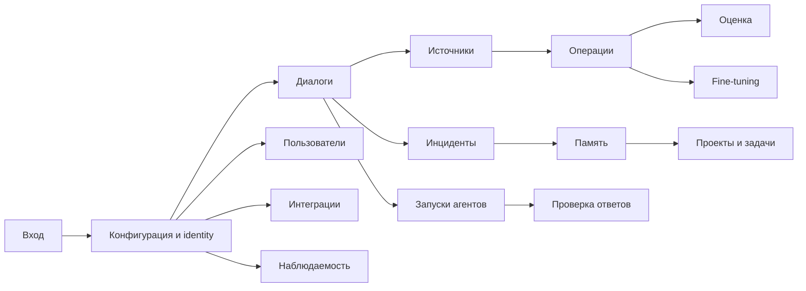

# Frontend: карта сценариев и контракт экранов

## Назначение и границы этапов

Документ фиксирует user scenario/map этапа 1 и контракт scaffold этапа 2 для
инженерного web-клиента. Источник истины для HTTP-моделей и разрешений — OpenAPI
работающего backend, а не вручную описанные TypeScript-типы.

Важно различать готовность слоёв:

- **Backend реализован:** браузерная сессия и RBAC, пользовательские ресурсы,
  источники знаний, очередь длительных операций, артефакты, preview и журналы.
- **Frontend этапа 2 реализован как scaffold:** вход, общий layout, навигация по
  feature flags и permissions, read-only списки с loading/empty/error состояниями.
- **Frontend этапов 3+:** формы, карточки деталей, чат, фильтры, пагинация,
  мутации, потоковые обновления, dashboards и observability. Эти возможности ниже
  являются контрактом развития, а не заявлением о готовом UI.

Design references и визуальная полировка выполняются после стабилизации сценариев и
API-контрактов. На этапе 2 не следует маскировать универсальную таблицу под готовый
предметный интерфейс.

## Пользователи и цели

| Роль | Основная цель | Типичный путь |
| --- | --- | --- |
| `engineer` | Получить подтверждённый источниками ответ, вести свой инцидент, память и проект | Вход → диалог → источники/ответ → инцидент → проект или запуск агентов |
| `operator` | Подготовить корпус, запустить управляемую обработку или оценку, проверить результат | Вход → источники → операция → журнал → артефакт → evaluation/fine-tuning |
| `admin` | Управлять доступом и контролировать состояние установки | Вход → пользователи → интеграции → observability → проблемный ресурс |
| `viewer` | Просматривать разрешённые ресурсы и состояние без изменений | Вход → доступный список → будущая карточка детали |

Серверный RBAC остаётся обязательным даже для скрытого пункта меню. Базовая матрица:

| Возможность | viewer | engineer | operator | admin |
| --- | --- | --- | --- | --- |
| Диалог, `chat:write` | — | да | да | да |
| Сессии, запуски, оркестрация — чтение | да | да | да | да |
| Память и инциденты — изменение | — | да | да | да |
| Источники знаний — изменение | — | — | да | да |
| Операции — запуск и отмена | — | — | да | да |
| Проверка ответов — чтение и решение | — | — | да | да |
| Метрики | да | — | да | да |
| Пользователи и аудит | — | — | — | да |

`engineer`, `operator` и `viewer` видят только owner-scoped данные. Наличие права в
клиенте не разрешает подменять `user_id`; backend повторно проверяет scope. Роль
`service` предназначена для API/worker, но не назначается браузерным аккаунтам.

## Карта основного сценария



## Общий shell и доступ

1. Клиент публично получает `GET /v1/app/config`: provider/model, feature flags,
   доступные способы аутентификации и безопасные лимиты без секретов и путей.
2. Если `browser_session_enabled=true`, клиент восстанавливает cookie через
   `GET /v1/auth/session`, хранит выданный CSRF только в памяти вкладки и получает
   проверенные роли/permissions через `GET /v1/auth/me`.
3. Неавторизованный пользователь перенаправляется на `/login?next=...`; `next`
   принимается только из известного списка маршрутов.
4. Sidebar строится по пересечению feature flags и permissions. Запрещённый маршрут
   ведёт на `/unavailable?reason=forbidden`, неизвестный — на страницу 404.
5. Pinia хранит только состояние приложения и сессии: bootstrap, principal,
   display name и CSRF. TanStack Vue Query хранит серверные ресурсы, отвечает за
   cache key, отмену запроса, stale/refetch и последующую invalidation после мутаций.

Cookie содержит случайный токен, а не identity. На сервере хранится только его hash;
пароли длиной не менее 12 символов хешируются Argon2id. Cookie имеет `HttpOnly`,
`SameSite=Lax`, host-only scope и фиксированный TTL. `Secure=false` допустим только
для loopback HTTP. За HTTPS обязательно задать `SUPPORT_COOKIE_SECURE=true`.
Изменяющие cookie-запросы требуют `X-CSRF-Token`; login дополнительно проверяет Origin
и `Sec-Fetch-Site`. Existing API key/JWT authentication продолжает поддерживаться
для API-клиентов. Серверные ключи, JWT secret и ключи провайдеров запрещено помещать
в `VITE_*`; frontend bundle не должен содержать секреты.

## Контракт экранов

### Диалоги

- **Маршрут этапа 2:** `/conversations`; **будущий:** `/conversations/:sessionId`.
- **Цель:** инженер находит свой диалог, затем продолжает его или проверяет историю,
  ответ, citations, retrieval diagnostics и связанные review/incident.
- **Данные:** сейчас `GET /v1/sessions?user_id=<subject>`; для детали уже есть
  `GET /v1/sessions/{session_id}`. Chat API реализован через `POST /v1/chat`,
  `/v1/chat/stream`, `/v1/multi-agent/chat` и `/v1/multi-agent/compare`.
- **Действия этапов 3+:** новый/продолжить диалог, отправить сообщение, остановить
  визуальное ожидание stream, открыть citation, создать инцидент, удалить сессию.
- **Права:** `session:read`, для сообщения `chat:write`, для удаления
  `session:delete`; owner scope обязателен.
- **Ошибки:** завершение сессии, rate limit, недоступная LLM/RAG, ошибка SSE,
  неподтверждённый ответ и запрос на human review показываются раздельно.

### Источники и база знаний

- **Маршрут этапа 2:** `/knowledge`; **будущий:** `/knowledge/:sourceId`.
- **Цель:** оператор видит входной корпус, инженер проверяет происхождение ответа.
- **Данные:** `GET /v1/knowledge/sources`; имя, размер, SHA-256, время создания.
  Загрузка: `POST /v1/knowledge/sources`; скачивание/удаление: `GET`, `DELETE
  /v1/knowledge/sources/{source_id}`; тест retrieval — `POST /v1/knowledge/search`.
- **Действия этапов 3+:** загрузить PDF/TXT/HTML/CSV, скачать, удалить, выбрать
  источники для `prepare`, проверить поиск. Лимит размера берётся из backend.
- **Права:** чтение `knowledge:read`; загрузка/удаление `knowledge:write`; поиск
  дополнительно требует `chat:write`.
- **Ошибки:** неподдерживаемое имя/формат, неверный PDF header, 413, нарушение hash,
  удаление источника активной операции, отсутствие embedding provider.

### Инциденты

- **Маршрут этапа 2:** `/incidents`; **будущий:** `/incidents/:incidentId`.
- **Цель:** инженер связывает проблему с диалогом и проводит её по статусам.
- **Данные:** список и карточка `GET /v1/incidents[/{id}]`; title, description,
  priority, component, status, session и timestamps.
- **Действия этапов 3+:** создать инцидент и изменить статус через `POST /v1/incidents`
  и `PATCH /v1/incidents/{id}`, фильтровать по статусу, перейти к диалогу.
- **Права:** `incident:read`/`incident:write`, только данные текущего владельца.
- **Ошибки:** 404 не раскрывает чужой ID, 422 фиксирует неверный переход/ввод.

### Запуски агентов и оркестрация

- **Маршруты этапа 2:** `/runs`, `/orchestration`; **будущие:** `/runs/:runId`,
  `/orchestration/:jobId`.
- **Цель:** инженер видит план, роли, состояние, citations, usage, стоимость и ошибки
  multi-agent run; оператор контролирует broker job и очередь.
- **Данные:** `GET /v1/multi-agent/runs`, `GET /v1/multi-agent/runs/{run_id}`,
  `GET /v1/orchestration/jobs`, существующие detail/status/cancel endpoints.
- **Действия этапов 3+:** фильтры, drill-down по role/task, повторный запуск,
  постановка и отмена orchestration job.
- **Права:** `run:read`, `orchestration:read`; изменения —
  `orchestration:write`; owner scope.
- **Ошибки:** feature disabled/503, недоступный broker, timeout/dead letter,
  незавершённый или не принадлежащий пользователю run.

### Проверка ответов

- **Маршрут этапа 2:** `/reviews`; **будущий:** `/reviews/:reviewId`.
- **Цель:** оператор разбирает ответы, остановленные guardrails, и фиксирует решение.
- **Данные:** `GET /v1/reviews`, существующий endpoint решения review; prompt/answer,
  reason, status, session и безопасная диагностика.
- **Действия этапов 3+:** фильтровать pending, открыть контекст и citations,
  approve/reject с обязательным подтверждением.
- **Права:** `review:read`/`review:write`; engineer и viewer раздел не получают.
- **Ошибки:** уже обработанный review — конфликт, отсутствующий — 404, изменение
  состояния другим оператором требует refetch.

### Память и проекты

- **Маршруты этапа 2:** `/memory`, `/projects`; **будущие:** `/memory/:memoryId`,
  `/projects/:projectId`, `/projects/:projectId/tasks/:taskId`.
- **Цель:** инженер проверяет долговременный контекст и ведёт проекты/задачи между
  диалогами.
- **Данные:** `GET /v1/memories` с cursor/session/type и `GET /v1/projects`;
  тип, key/value, tags, importance, TTL, session и project/task status.
- **Действия этапов 3+:** создать, изменить, удалить память; создать проект/задачу и
  изменить статус через реализованные `/v1/memories`, `/v1/projects` и
  `/v1/projects/tasks`.
- **Права:** `memory:read`/`memory:write`; owner scope и серверная secret policy.
- **Ошибки:** истёкшая/чужая запись выглядит как 404; секрет или неверный TTL — 422.

### Операции

- **Маршрут этапа 2:** `/operations`; **будущий:** `/operations/:operationId`.
- **Цель:** оператор запускает только зарегистрированную backend-операцию и наблюдает
  её до результата независимо от вкладки и перезапуска API.
- **Данные:** `GET /v1/operations/profiles`, `GET/POST /v1/operations`,
  `GET/DELETE /v1/operations/{id}`, `/artifacts`, `/preview/{artifact_id}`, `/logs`.
  Состояния: `queued`, `running`, `cancel_requested`, `cancelled`, `completed`,
  `failed`, `interrupted`.
- **Действия этапов 3+:** выбрать профиль, только разрешённые параметры и подходящие
  source/upstream/baseline, отправить idempotency key, отменить, читать журнал с
  offset, preview JSON/JSONL и скачать artifact.
- **Права:** `operation:read`/`operation:write`; обычный пользователь не читает
  чужую операцию. UI не принимает shell command или путь к config.
- **Ошибки:** worker не готов — 503, очередь полна — 429 с `Retry-After`, повторный
  ключ с иным payload — 409, неверная цепочка этапов/параметр — 422.

Операция сохраняется в БД, а worker запускает subprocess из фиксированного списка CLI.
Каталог `config/web_operations.yaml`/Docker override регистрируется backend: браузер
передаёт только profile ID, числовые/булевы разрешённые параметры и непрозрачные ID.
Произвольные shell-команды и config paths не принимаются. Отмена running job сначала
становится `cancel_requested`, затем worker завершает дерево процесса. Execution logs
удаляются через 30 дней; результаты экспериментов сохраняются отдельно.

#### Замороженный контракт операций

При постановке backend загружает доверенный профиль, применяет только разрешённые
параметры, валидирует итоговую конфигурацию штатной Pydantic-моделью и сохраняет в БД
snapshot профиля, конфигурации и suite. Worker выполняет этот snapshot: изменение YAML
после постановки не меняет команду или параметры уже созданной операции.

| Профили | Вид | Разрешённые параметры |
| --- | --- | --- |
| `prepare` | `prepare` | нет |
| `chunk-openai`, `chunk-local` | `chunk` | `chunking.chunk_size`, `chunking.chunk_overlap`, `chunking.max_chunk_tokens` |
| `embed-openai`, `embed-local` | `embed` | `embedding.batch_size`, `embedding.normalize` |
| `index-openai`, `index-local` | `index` | нет |
| `evaluate-openai`, `evaluate-gigachat` | `evaluation` | `evaluation.repeats` |
| `evaluate-local` | `evaluation` | нет |
| `scenarios-openai` | `scenarios` | нет |
| `tuning-inspect`, `tuning-validate`, `tuning-baseline`, `tuning-evaluate`, `tuning-compare` | соответствующий `tuning-*` | нет |
| `tuning-train` | `tuning-train` | `training.learning_rate`, `training.num_train_epochs`, `training.per_device_train_batch_size`, `training.max_steps`, `peft.r`, `peft.lora_alpha`, `peft.lora_dropout` |

Это полный публичный allowlist текущего каталога. Внутренний backend allowlist также
знает `chunking.min_chunk_tokens` и `embedding.max_batch_tokens`, но браузер не может
изменять их, пока конкретный профиль явно не опубликует эти поля. Тип, минимум,
максимум и текущее значение каждого опубликованного поля приходят в
`parameter_schema` ответа `GET /v1/operations/profiles`; UI не фиксирует диапазоны
самостоятельно. Docker-каталог наследует тот же allowlist и меняет только выбранные
пути к Docker-конфигам для index/evaluation/scenarios.

Цепочки входов закрыты: `prepare → chunk → embed → index`;
`tuning-train → tuning-evaluate`, затем `tuning-baseline` и `tuning-evaluate` подаются
в `tuning-compare`. `source_ids` разрешены только для `prepare`. Все upstream и
baseline должны принадлежать текущему пользователю и иметь статус `completed`.

Web-индексация всегда инкрементальная: worker принудительно устанавливает
`recreate_collection=false` и `prune_stale_points=false`. Оператор публикует результат
в общую коллекцию базы знаний, поэтому UI обязан явно показывать целевую коллекцию и
не представлять index как изолированный preview пользователя.

Ограничения по умолчанию и границы серверной конфигурации:

| Ограничение | По умолчанию | Допустимая конфигурация |
| --- | ---: | ---: |
| Размер одного source | 20 МиБ | 1 КиБ–100 МиБ |
| Wall timeout операции | 3600 с | 10–86400 с |
| Активные операции в общей очереди | 100 | 1–10000 |
| Lease worker | 60 с | 15–300 с |
| TTL браузерной сессии | 8 часов | 300–2592000 с |
| Source IDs в запросе | 100 | фиксировано API-схемой |
| Параметры в запросе | 20 | фиксировано API-схемой |
| Idempotency key | 8–128 символов | фиксировано API-схемой |

Журнал одного subprocess записывается максимум до 20 МБ и очищается через 30 дней.
Очередь при переполнении возвращает `429` и `Retry-After: 10`; неготовый профиль
возвращает `503`. Capability определяется свежим heartbeat и установленными модулями,
а не одним наличием записи в каталоге.

### Evaluation и fine-tuning

- **Будущие маршруты:** `/evaluation`, `/evaluation/:operationId`, `/fine-tuning`,
  `/fine-tuning/:operationId`. Отдельных страниц этапа 2 пока нет.
- **Цель:** оператор сравнивает качество сценариев и baseline/adapter; тяжёлое
  обучение запускает осознанно с видимыми входами, стоимостью и hardware readiness.
- **Данные/API:** это специализированные представления тех же operation profiles:
  `evaluation`, `scenarios`, `tuning-inspect`, `tuning-validate`, `tuning-baseline`,
  `tuning-train`, `tuning-evaluate`, `tuning-compare`.
- **Действия этапов 3+:** запуск suite, выбор upstream/baseline, просмотр метрик и
  сравнения, скачивание отчёта/adapter. Перед train требуется явное подтверждение.
- **Права и ошибки:** `operation:read`/`operation:write`; отсутствие тяжёлых
  зависимостей означает `worker_ready=false`, а не обещание запуска. Большие модели
  автоматически не скачиваются: пользователь устанавливает их вручную отдельным
  PowerShell-сценарием.

### Пользователи

- **Маршрут этапа 2:** `/users`; **будущий:** `/users/:username`.
- **Цель:** admin создаёт аккаунт, назначает `viewer/engineer/operator/admin`,
  блокирует доступ или сбрасывает пароль.
- **Данные/API:** `GET/POST /v1/admin/users`, `PATCH /v1/admin/users/{username}`;
  username, display name, roles, active. Hash и session tokens не возвращаются.
- **Действия этапов 3+:** создать, изменить роли, active и пароль. Изменение отзывает
  активные сессии; UI требует подтверждение потенциальной блокировки.
- **Права:** только `admin:write`. Нельзя снять у себя admin или заблокировать себя.
- **Ошибки:** занятое имя/самоблокировка — 409, пароль короче 12 или роль `service` —
  422, неизвестный пользователь — 404.

### Интеграции

- **Маршрут этапа 2:** `/integrations`; **будущий:** `/integrations/:integrationId`.
- **Цель:** инженер/оператор понимает, какие LLM, tools, MCP и role profiles
  настроены сервером.
- **Данные:** `GET /v1/integrations` возвращает безопасный каталог без credentials и
  credential-bearing URL: provider/model, enabled tools, MCP name/transport, roles.
- **Действия этапов 3+:** только диагностика доступности и переход к документации;
  редактирование секретов и произвольных endpoints из браузера не планируется.
- **Права:** authenticated endpoint; текущая навигация дополнительно требует
  `chat:write`. Ошибки подключения должны показывать компонент без секрета.

### Наблюдаемость

- **Будущие маршруты:** `/observability`, `/observability/requests/:requestId`.
  Страницы этапа 2 нет.
- **Цель:** admin/operator связывает UI error с backend log/trace, viewer может
  читать метрики согласно текущему RBAC.
- **Данные/API:** `/health`, `/ready`, защищённый `/metrics`, `GET /v1/audit` для
  admin, ссылки на Grafana/Prometheus/Jaeger задаются deployment, а не Vite-secret.
  Клиент может отправить только категорию, route и request ID в
  `POST /v1/telemetry/browser`, без текста диалога и токенов.
- **Действия этапов 3+:** readiness компонентов, метрики, поиск по request ID,
  переход во внешний dashboard. Логи приложения и операций хранятся не более 30 дней.
- **Права:** `metrics:read`, `audit:read` только admin, browser telemetry —
  `chat:write`. Ошибка observability не должна ломать рабочие сценарии.

## Общие состояния и ошибки

Каждый экран обязан иметь skeleton/loading, empty, stale/refetch, forbidden,
unavailable и retry состояния без сдвига layout. Пользователь видит безопасное
сообщение и `X-Request-ID`, но не traceback, SQL, локальный путь или provider secret.

| HTTP | Поведение UI |
| --- | --- |
| 401 | Очистить principal/CSRF, отменить и очистить query cache, открыть login |
| 403 | Показать «Нет доступа»; не повторять запрос автоматически |
| 404 | Показать «Не найдено или недоступно», не раскрывая owner mismatch |
| 409 | Сообщить об изменившемся состоянии и предложить refetch |
| 413 | Показать лимит/предложить скачивание вместо preview |
| 422 | Привязать безопасные validation details к полям формы |
| 429 | Заблокировать повтор до `Retry-After` |
| 500 | Показать request ID для диагностики |
| 503 | Показать недоступный component/feature и возможность повторить |

## Scaffold этапа 2

Назначение компонентов по группам:

- `src/app`: router, sidebar shell, единая проверка feature/permission и базовые стили;
- `src/features/auth`: bootstrap, login/logout, восстановление cookie и CSRF в Pinia;
- `src/features/resources`: типизированные Vue Query loaders и таблица списков с обновлением, загрузкой, пустым результатом и ошибками;
- `src/shared/api`: `openapi-fetch`, единая безопасная ошибка и сгенерированная schema;
- `src/shared/lib`: общий QueryClient без привязки к предметным ресурсам;
- `src/pages`: тонкие route-компоненты этапа 2, без ложных форм и detail UI.

Требуется Node.js 24 (`frontend/.node-version`) и TypeScript 5.9: эта связка закреплена
из-за peer-контракта OpenAPI toolchain. Из корня репозитория перейдите в `frontend`:

```powershell
Set-Location frontend
npm ci
npm run api:generate
npm run check
npm run build
```

`npm run dev` запускается отдельно и занимает терминал до `Ctrl+C`; backend-команды
после `Set-Location ..` выполняются во втором терминале.

`npm run api:generate` запускает backend OpenAPI export через безопасный
`config/web_contract.yaml`, не поднимает lifespan/БД/LLM и обновляет
`src/shared/api/schema.d.ts`. После изменений backend-контракта генерация должна
предшествовать `npm run check`. `npm run dev` слушает loopback и проксирует `/v1`,
`/health`, `/ready` на `API_PROXY_TARGET`; `VITE_API_BASE_URL` остаётся публичным URL.

## Backend и worker

Создать первого администратора на host; пароль вводится скрыто через `getpass`:

```powershell
rag-web --config config/support_agent_openai.yaml create-user admin `
  --name "Администратор" `
  --role admin
```

Запустить worker операций:

```powershell
rag-web --config config/support_agent_openai.yaml worker
```

Docker worker использует профиль `web-operations`, общую с API PostgreSQL БД и
разделяемые volumes `web_data`/`logs_data`:

```powershell
docker compose --profile web-operations up -d support-agent web-worker
docker compose --profile web-operations logs -f web-worker
```

Docker API и `web-worker` должны использовать одну PostgreSQL и одинаковые volumes:
в snapshot сохраняются пути, доступные внутри контейнера. Для полного prepare/chunk
на host запускайте host worker вместе с API на host-профиле и с тем же корнем путей.
Одной общей PostgreSQL недостаточно для смешивания host worker и Docker API, поскольку
пути snapshot в этих средах различаются.

Heartbeat публикует только реально доступные profiles. Текущий Docker image не имеет
`unstructured` и `llama_index`, поэтому `prepare` и оба `chunk-*` корректно имеют
`worker_ready=false`. Для остальных heartbeat подтверждает только наличие зависимостей:
доступность моделей, данных и ключей проверяется при выполнении. Для полного host worker установите
`requirements.txt`. Расширять Docker image тяжёлыми data-зависимостями необязательно:
API честно блокирует профиль без необходимых компонентов. Наличие профиля в
`web_operations.yaml` само по себе не является обещанием запуска.

Проверка реальной интеграции уже поднятых API и SQL worker без LLM:

```powershell
python scripts/check_web_integrations.py --base-url http://127.0.0.1:8000
```

Параметр `--browser-url http://127.0.0.1:5173` дополнительно запускает Playwright
live smoke. Скрипт проверяет login/cookie/CSRF, ресурсы, idempotency, настоящий
`tuning-inspect`, журнал и отзыв сессии; временные аккаунты деактивируются.
